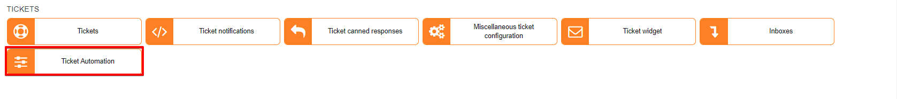
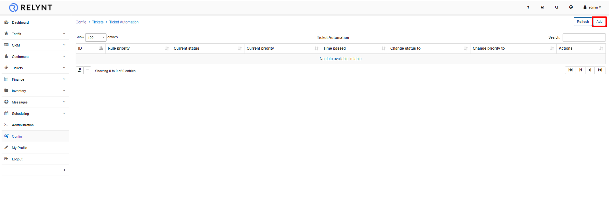
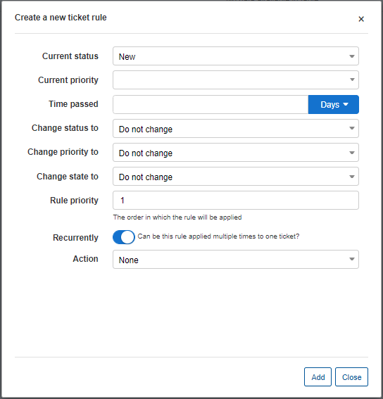
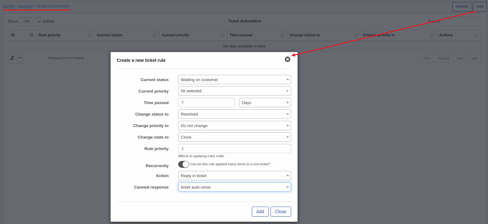

Ticket automation
=============

This feature has been developed for the convenience of administrators who deals with tickets. With automation administrators can create rules to execute automatic functions for tickets, minimizing manual interventions related to tickets and aiding in achieving a more time efficient, effective and professional support system.

To add a new rule simply click on the *Add* button at the top right of the page:

Parameters:

* **Current status** - select a status of tickets this rule will apply to
* **Current priority** -select a priority of tickets this rule will apply to
* **Time passed** - specify a time period for the condition to apply the rule once reached in days, hours or weeks
* **Change status to** - select a status to apply to tickets once the time period has been reached
* **Change priority to** - select a priority to apply to tickets once the time period has been reached
* **Change state to** - select a state to apply to tickets once the time period has been reached
* **Rule priority** - specify a priority of this automation rule in relation to other automation rules
* **Recurrently** - specify if the rule can be applied recurrently to the same tickets
* **Action** - specify an action to apply additionally once the rule is applied, options are: "Add a note in the ticket", "Reply in the ticket", "Send email". Depending on the selection, etiher a canned response will have to be selected or the email parameters (send email to: admin/customer, subject, template)

**Example:** We want to close tickets automatically, and send a [canned response](tickets/ticket_canned_responses/responses.md) to a customer if a ticket has been in a status of "Waiting on customer" for more than 7 days.

The following rule can be used to achieve this:

According to the configuration of this rule, all tickets with a "Waiting on customer" status with a period of the last update being more than 7 days ago will be closed automatically and the customer will receive an email with the text that this ticket was closed due to lack of activity for more than 7 days (a canned response containing this text must be created first).

##### Pay special attention to the "Recurrently" option because if the logic of the rule is incorrect, it can apply to all tickets, even if it is "Closed".
