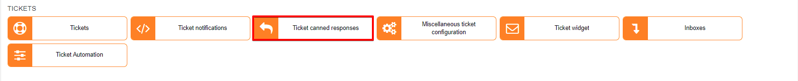
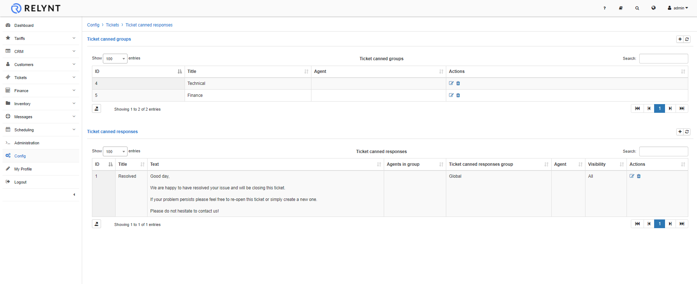
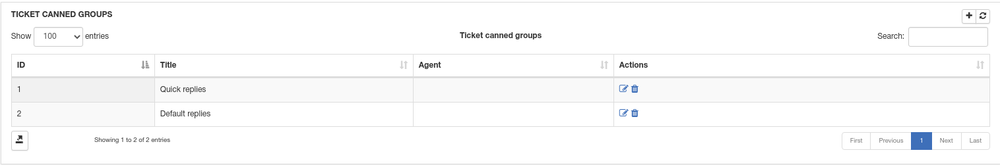
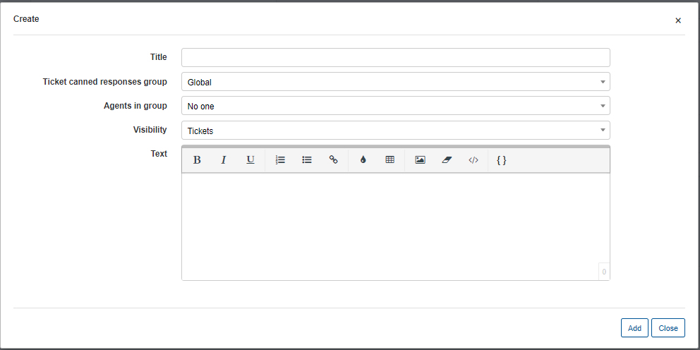
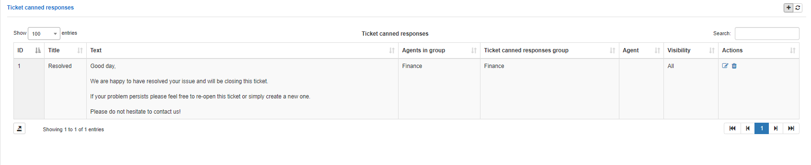
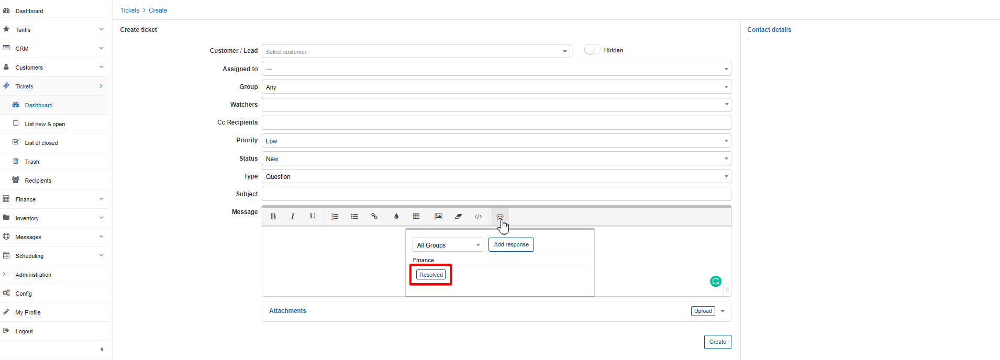

Ticket canned responses
=============

Quick replies for tickets can be added here. Specific text which you use frequently can be added to canned responses and by clicking on just 2 buttons, this text will be loaded to the ticket message.

Canned responses are organized and stored in groups. Using groups can help you, sort responses by topics/departments for faster and easier locating of canned responses. Grouping can also be used to separate canned responses available for ticket groups on the system.

Simply click on the `"+"` icon on the canned groups section to add a new group.

If you do not create any groups or select groups when creating canned responses the response will automatically be grouped in the "Global" group of the system.

After creating groups, we can then create canned responses.

Simply click on the `"+"` icon on the canned responses tab to add a new response.

**Parameters**

* **Title** - specify a name for the response
* **Ticket canned responses group** - select a group for the response
* **Agents in group** - select the ticket group for the response
* **Visibility** - select where the response will be available to use
* **Text** - type the desired text

After adding a response, you will see it in your of list responses.

Thereafter these canned responses can be used in ticket replies and/or messages according to your Visibility selection:

By clicking on a canned response, it will load the content of the canned response which will save you valuable time.
