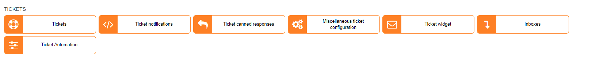

Tickets
=============

In this section we can modify the configuration for tickets, ticket notifications, incoming emails configurations and the automation of tickets.

* [Ticket widget](configuration/tickets/ticket_widget/ticket_widget.md)

* [Miscellaneous ticket configuration](configuration/tickets/miscellaneous_ticket_configuration/miscellaneous_ticket_configuration.md)

* [Inboxes](configuration/tickets/inboxes/inboxes.md)

* [Ticket automation](configuration/tickets/ticket_automation/ticket_automation.md)

* [Ticket canned responses](configuration/tickets/ticket_canned_responses/ticket_canned_responses.md)

* [Ticket notifications](configuration/tickets/ticket_notifications/ticket_notifications.md)

* [Tickets](configuration/tickets/tickets/tickets.md)
