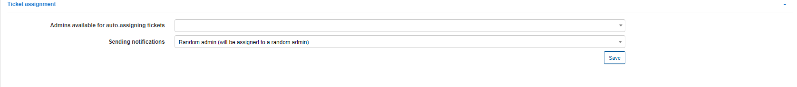

Tickets
=============

This is the global configuration for tickets on the system.

## TICKETS

In this module you can configure the sender details for [ticket notifications](configuration/ticket_notifications/tickets_notifications.md).

**Please note that email sending must be configured under [Config->Main->Email](configuration/main_configuration/email_config/email_config.md) first.**

**Send emails** - if this option enabled, Splynx will send notifications when tickets are updated;

**Send attachments to emails** - if this option enabled, attachments in ticket messages  will also be sent in the notifications;

**Sender name** - name of sender;

**Sender email** - email address of sender. Email sending for this address must be configured under [Config->Main->Email](configuration/main_configuration/email_config/email_config.md);

**Copy email** - send copies of all emails to this address(if set);

**Send notifications to the admin panel(if online)** - if this option enabled, admins will receive a notification when they are online on the admin page.

**Limit of additional fields** - specify a limit to the number of additional fields to show in the tickets module that are not hidden.

**Enabled scheduled auto-assigning** - enables/disables auto-assigning tickets to admins for tasks that are scheduled.

**Select project from scheduling** - select the project from which scheduled tasks will be used to auto-assigning admins to tickets *Please create task(s) and schedule it for admin/group to select this admin/group to auto-assignment by scheduled time*

**Default admins for auto-assigning tickets via the schedule** - select admins available for auto-assignment for scheduled Tasks.

## TICKET ASSIGNMENT

Admins for auto-assigning tickets can be configured here.

**Admins available for auto-assigning tickets** - select an admin or admins available for auto-assigning;
**Sending notifications** - there are 2 options available:
  * Random admin(will be assigned to a random admin) - notification will only be sent to the admin who receives the ticket(admin from available list) and the ticket will be assigned to this admin;
  * All available admins(will not be assigned to anyone) - all admins will receive a notification but the ticket will not be assigned to anyone.

## TICKETS LINK STATUS WITH ACTION

The configuration of ticket statuses based on an action/condition. Custom statuses can be added/removed under [Miscellaneous ticket configuration](configuration/tickets/miscellaneous_ticket_configuration/miscellaneous_ticket_configuration.md)

**On creating** - sets the status to "New" when a ticket is created;
**On opening** - when the ticket was closed, and re-opened, it sets the status to "Work in progress";
**On closing** - when a ticket is closed, it sets the status to "Resolved";
**On customer reply** - when a customer replied to a ticket, it sets the status to "Waiting on agent";
**On agent reply** - when an admin replied to a ticket, it sets the status to "Waiting on customer".

## DEFAULT TICKET TYPE

The configuration of default ticket types after creation. Custom ticket types can be added/removed under [Miscellaneous ticket configuration](configuration/tickets/miscellaneous_ticket_configuration/miscellaneous_ticket_configuration.md)

## DEFAULT TICKET GROUP

The configuration for default group assignments for tickets created via API or the customer portal. Ticket groups can be configured under [Miscellaneous ticket configuration](configuration/tickets/miscellaneous_ticket_configuration/miscellaneous_ticket_configuration.md)

