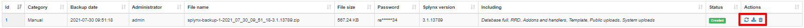
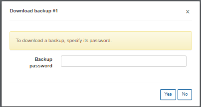
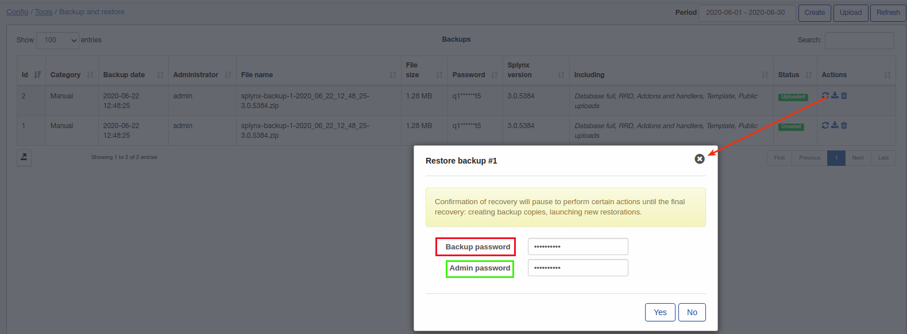

Backup and restore
====

With the use of this tool, backups can be done directly from the admin page and also, backups can be restored from the admin page using the same tool.

This tool can be really useful if you are planning a mass update of Relynt settings and you are afraid of making any errors - simply make a backup and start applying changes, in case of any failures, you can easily restore the previous state of Relynt.

To create a backup click on "Create" or if you already have a backup(previously done using this tool), it can be uploaded by clicking on "Upload":

### Creating a backup

* Step 1 - select items which will be included in the backup:

**Database critical** - will be included automatically, contains all main info of Relynt(config, finances, services, networking, customers etc);

**Database full** -  entire database with structure of tables, critical info and customer's statistics and logs;

**RRD** - statistic graphs(ping, customer statistic graphs etc);

**Addons and handlers** - addons folder + folder with handlers(voice, finance etc);

**Template** - all templates;

**Public uploads** - documents, photos which were uploaded into Relynt.

* Step 2 - create and confirm a password for this backup

* Step 3 - click on "Create" to begin the backup creation process.

Once backup has been created there are 3 actions available to interact with it: **Restore, Download or Delete**.

**To download the backup** click on the "Download"  Icon in the *Actions* column and provide the backup password:

**To restore a backup** click on the "Restore"  icon in the *Actions* column:

When restoring s backup, you have to provide the backup password + the admin password. Then you will have to confirm the restore once more by providing the backup + admin passwords:

Then you will see the process of the restoration:

#### during the restore process an error can occur on the current tab - in this case just re-login to the Relynt web page.

After a backup restore we will have a Relynt state with no backup available (as it was before creating the first backup).

### Recommendation: do not store tons of unnecessary and old backups, simply for the purpose of saving disk space. 
