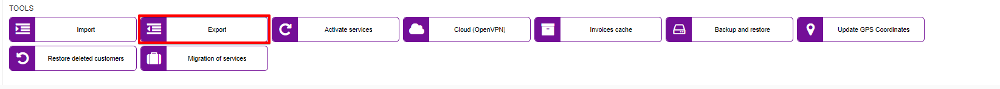
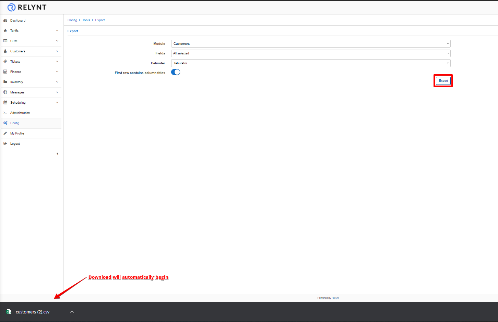

Export
======

This tool can be used to export data from the system from all the available modules.

Simply select the Module, Fields within the module and the Delimiter. You can also select whether or not the first row will contain column titles

Example: If we need to export our customers, choose your delimiter and click on the Export button, it was never this easy before.

How to export and update your Customer Database can be viewed in our video tutorial
<iframe frameborder=0 height=270 width=350 allowfullscreen src="https://www.youtube.com/embed/LbDj8zmeF-Y?wmode=opaque">Video on youtube</iframe>
