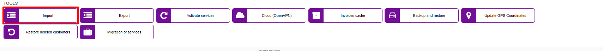
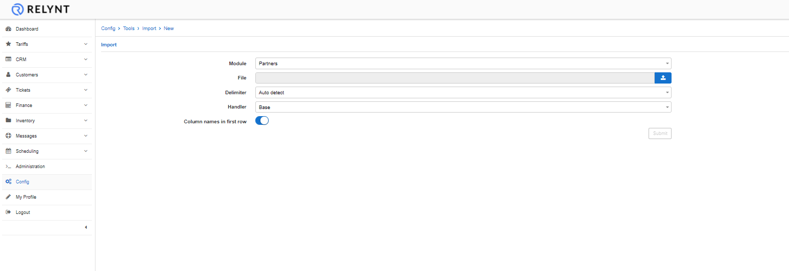
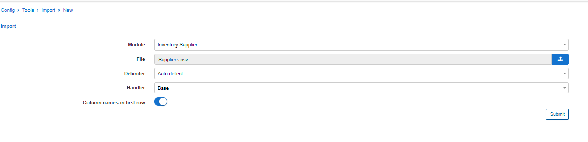
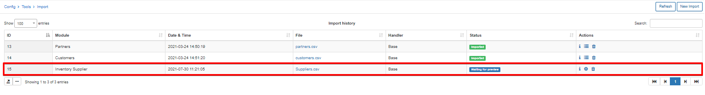
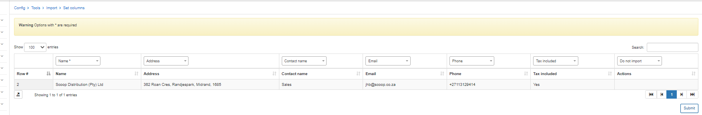
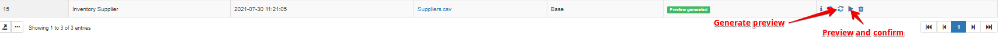
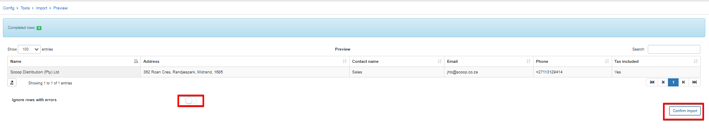
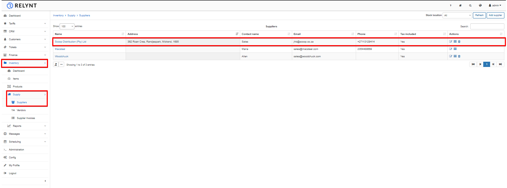

Import
======

When you are migrating to Relynt, Importing your customer database and/or other data is probably needed as this will be the fastest and easiest way to add your data to the system, instead of manually adding everything manually

We've provided the service to Import your data as a part of support for paid licenses. However, you can also check how the Import is implemented in our system if you wish to import data yourself.

We strongly recommend contacting support for assistance with importing data to avoid any issues.

##How to import data

1. select a module based on the data you wish to import

2. upload a csv/excel file

3. select a delimiter options are "Auto detect", "Tabulator", "Comma", or "Semicolon"

4. select a handler, this field is set to base by default, but you can contact support to create a custom external handler.

5. enable or disable using the first row as column names

After submitting the parameters, the upload will be found in the list of import history

You will find historical imports with the option to view the parameters selected when the upload was submitted, for completed imports you will be able to view the import summary or the option to delete the import. For newly submitted uploads, you are required to set the columns as fields in the system with the gear icon in the actions tab:

Simply click on submit after pairing the columns of the file with fields in the system.

You will then have the options to generate a preview or show the preview and confirm the import:

Simply click on show preview to display the result and click on confirm import if all is well, you also have the option to ignore any rows with errors:

After clicking confirm import you will be prompted to proceed or cancel the import, once imported, you can navigate to the relative module and view the data imported (in our example we imported a supplier to the inventory module):

How to import Customer Databases is also shown in our video tutorial:  

<iframe frameborder=0 height=270 width=350 allowfullscreen src="https://www.youtube.com/embed/pJJHfAv8bPo?wmode=opaque">Video on youtube</iframe>
