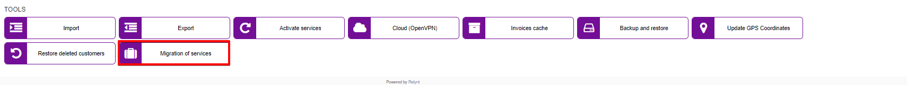
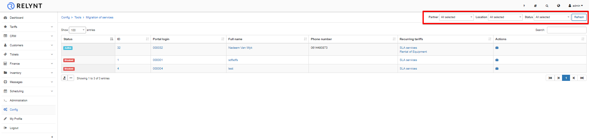
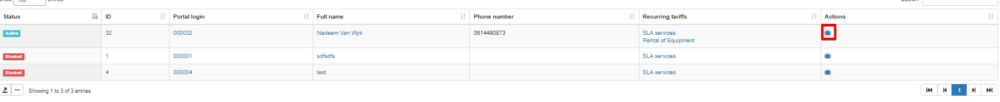
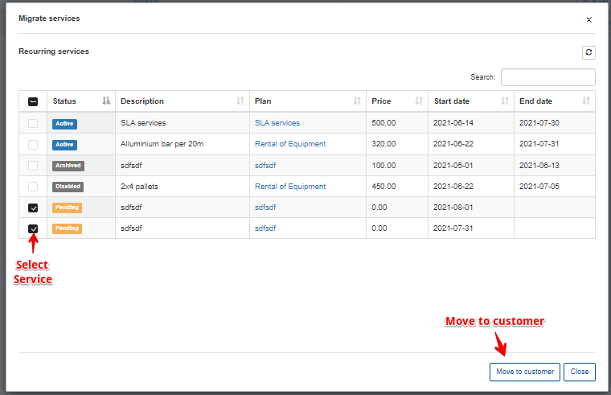
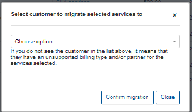
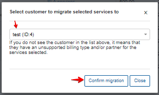
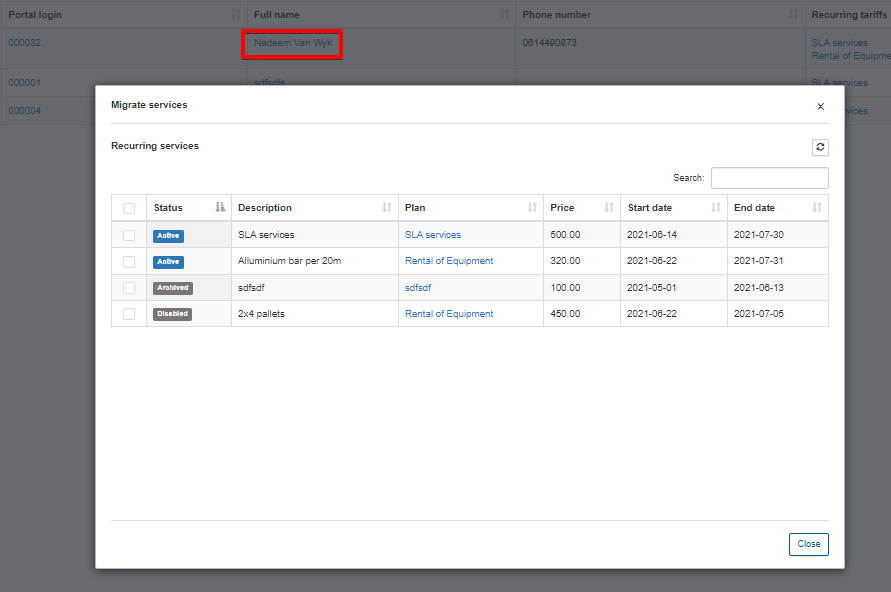
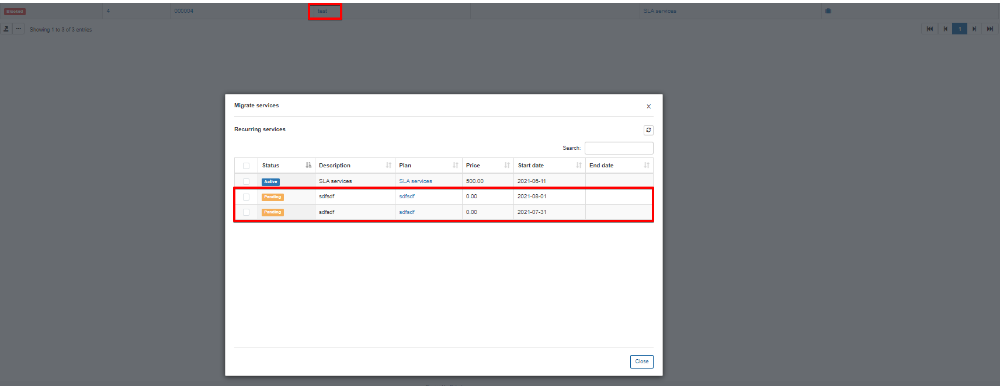

Migration of Services
=================

This tool is used to move/migrate services from one customer account to another.

This section will display all customers with services and can be filter by Partner, Location or Customer status:

To migrate services of a customer, simply click on the migrate icon in the actions column within the line of the customer:

You will be presented with the following window, to select the services from all services in the selected customers account, once you select services, you can then click on move to customer:

The following window will appear for you to select a customer to migrate the services to:

*Note - If you do not see the customer in the list above, it means that they have an unsupported billing type and/or partner for the services selected.*

Select a customer and confirm the migration:

After the migration, the services will be moved from the customer selected to migrate services from, to the customer selected to move them to:

Selected to Migrate from:

Selected to move to:

