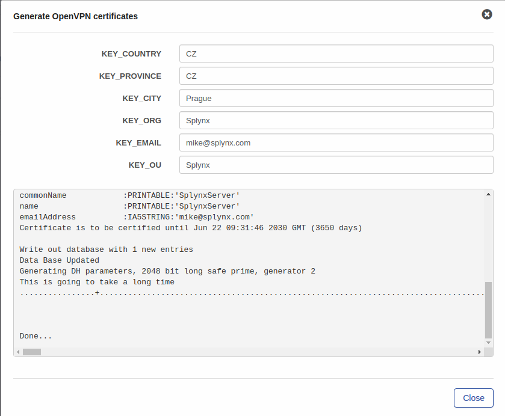
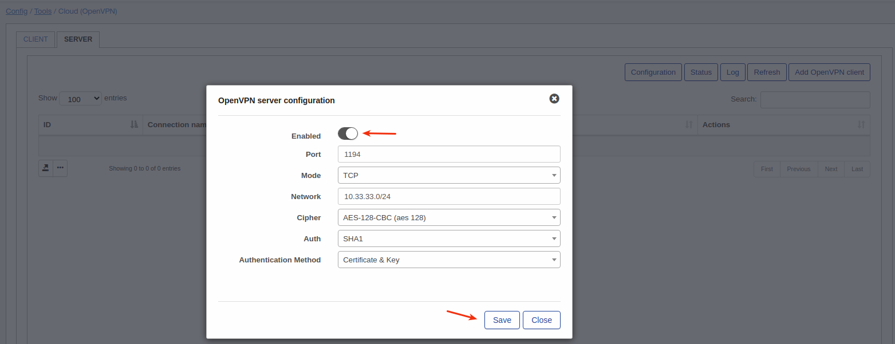
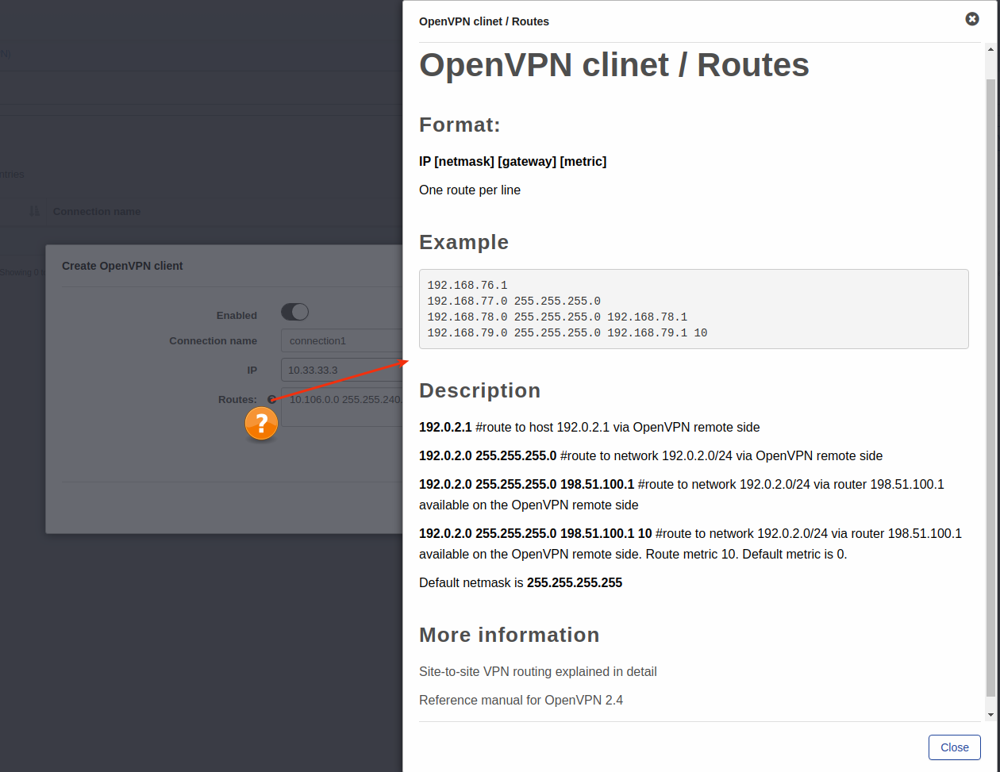
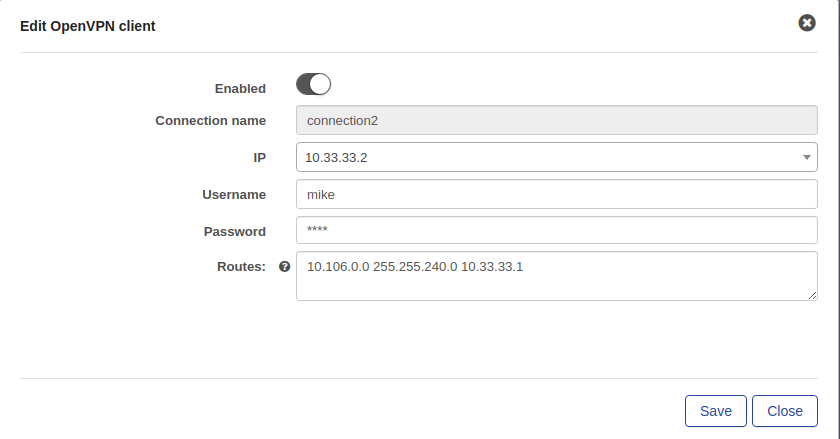
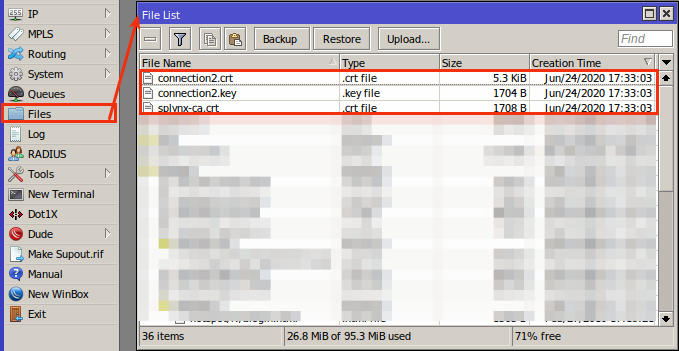
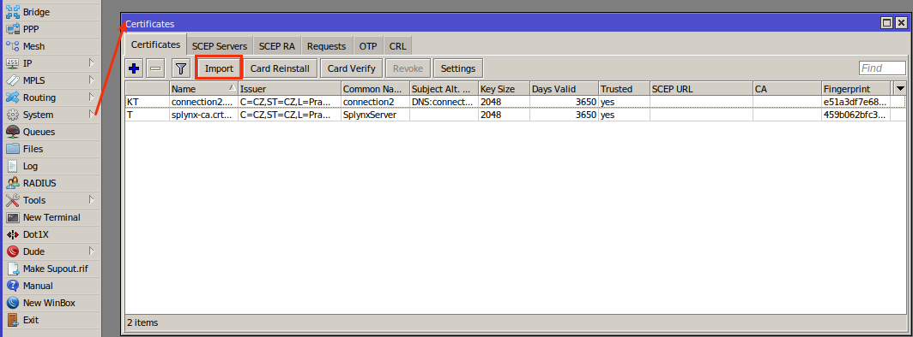
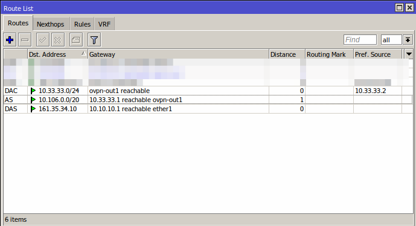
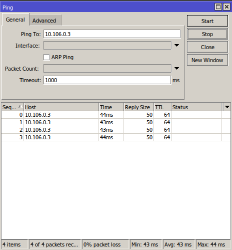
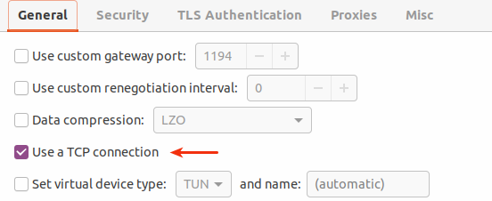
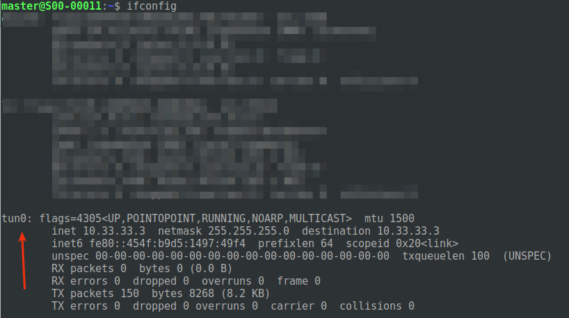

OpenVPN
====

If an OpenVPN server isn't configured yet the page will look as follows:

By clicking on "Generate certificates" OpenVPN server certificates will be generated and you will be able use it.

The following parameters need have to be specified here:

**Country** - This field contains the 2-character ISO format country code. For example, GB is the valid country code for Great Britain, and US is the valid code for the United States. To locate a specific country code, you may take a look at the following page [Country Codes](https://www.nationsonline.org/oneworld/country_code_list.htm);

**State/province** - U.S. and Canadian customers must enter a State or Province name. Do not abbreviate. In the United States, if your organization is incorporated, for instance, in the state of Delaware, but is operating within California, use California;

**City/Locality** - Mandatory field usually denotes the city in which the organization is located. Do not use abbreviations. For example, spell "Saint Louis", instead of "St. Louis". If the organization is registered only locally, for example, its business license is registered with the City Clerk; the Locality/City field must contain the name of the city where it is registered. International customers must enter either a City/Locality or a State/Province field;

**Organization** - The Organization Name (corporation, limited partnership, university, or government agency) must be registered with some authority at the national, state, or city level. Use the legal name under which your organization is registered. Do not abbreviate or use any of these symbols: ! @ # $ % ^ * ( ) ~ ? > < / ;

**Email** - email address of organization;

**Organization Unit** - Mandatory field to differentiate between divisions within an organization, for example, "Electronic Commerce Pilot" or "Human Resources". If your organization is doing business as (DBA) a trade name, you may specify the trade or DBA name in this field.

Source: https://knowledge.digicert.com/solution/SO16317.html

After specifying the needed parameters here click on "Generate" and wait:

Now the OpenVPN server has to be configured and enabled:

The port, mode(TCP or UDP), network, cipher, auth(hash function SHA1 or MD5) and authentication method can be configured here.

Once the server is configured, let's add a client.

Specify the connection name, IP and routes if needed. By clicking on the "?" next to *Routes* a list with the syntax of routes will appear:

Once the client connection is created, let's download credentials:

With this action a "zip" archive will be downloaded with following files:

We're going to create a VPN connection between Splynx (with OpenVPN server) and a desktop using Ubuntu.

### VPN client configuration on Mikrotik router

Let's add a new client and configure a Mikrotik router as an OpenVPN client.

Once added and files are downloaded, we have to upload the certificates onto the Mikrotik under **Files**:

Once the files are uploaded to the Mikrotik, we have to import these certificates under **System - Certificates**:

More detailed information on how to import certificates can be found on the following page:

[Mikrotik wiki](https://wiki.mikrotik.com/wiki/Manual:Create_Certificates)

After all certificates are imported, let's create an OpenVPN client interface:

Once the interface has been added, this should be sufficient to establish a link between Splynx and the Mikrotik router.

#### Pay Attention!

Sometime it is necessary to add default routers using the OpenVPN client interface, in that case, you can enable the option to "Add default route" under the interface but make sure that it is entirely needed before you enable this, as it can break/cause problems in your routing. If you do enable this option, new routes will be created under **IP - Routes**

A PPP profile on the Mikrotik should be used that's not already used by another service (in case it has an IP assigned, it will use this IP from the profile and will not receive the correct IP from the server)

The next step is also necessary in only some cases, therefore, please ensure that this is needed before creating the NAT rule, as this too can break/cause problem in your routing.

If you need this NAT rule, we can add it under **IP - Firewall - NAT** with a "srcnat" chain and "Out.Interface" = your OpenVPN client interface:

and "Action" = masquerade

    

Now you can ping the network that was unreachable before:

After a connection has been established to Splynx, the status of the connection will change to "Connected":

And by clicking on "Status" you can see details about active connections:

By clicking on "Log", the logs of the VPN server can be checked.

### VPN client configuration on Ubuntu
Let's add the VPN connection in Ubuntu:

Here we can specify the gateway(IP of server), type and certificates + keys which are required. User key password in this setup can be skipped. The next step is to click on "Advanced":

Here we specify TCP connection (depending on the server configuration).

And here we have to specify the Cipher(depending on the server configuration).

Once that's done, let's enable the VPN connection and test it:

The interface with given IP was created.

And the network what was specified in routes(when we configured client) is accessible.
