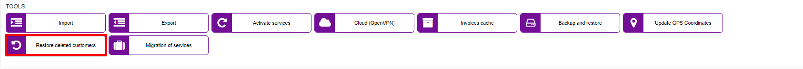
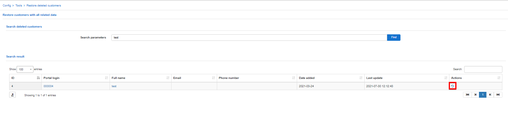
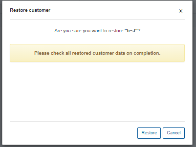
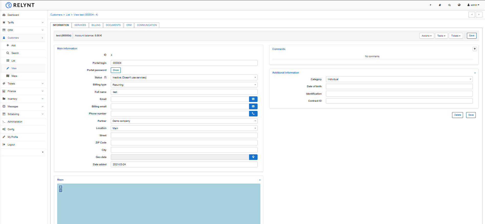

Restore deleted customers
==============

This tool can be used to restore any customers that were previously deleted from the system.

Simply search for the customer by their ID, Login, Name, Email, or Phone number in the Search parameter field. If the searched parameter used matches any deleted customer in the database, it will appear in the result, and you will have the ability to restore the customer:

After restoring the customer, a new window will automatically open directing you to the customers account, where you can then check/change their details, services, etc.

