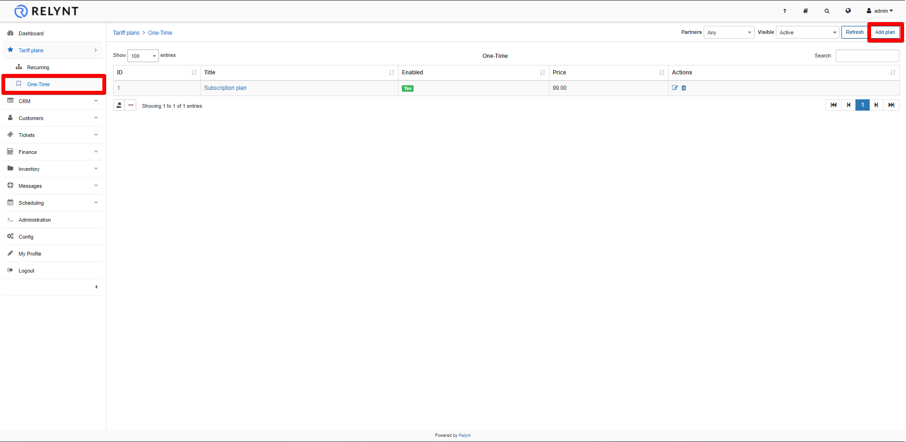
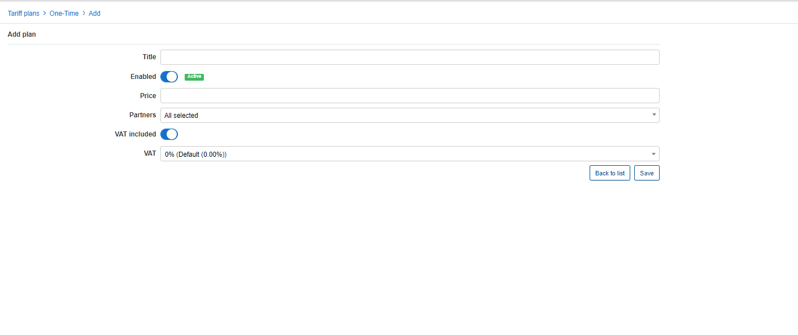
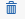
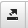
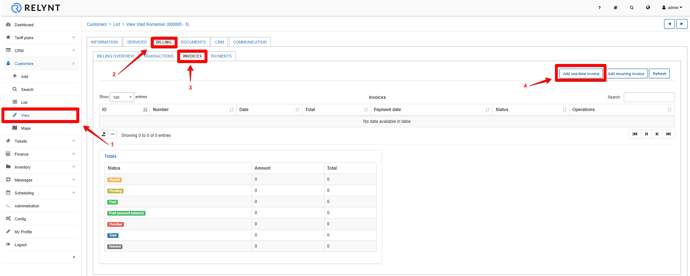
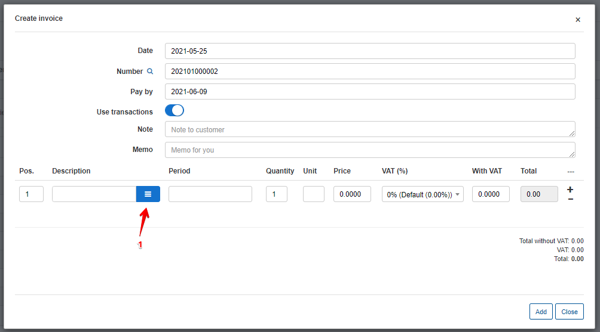
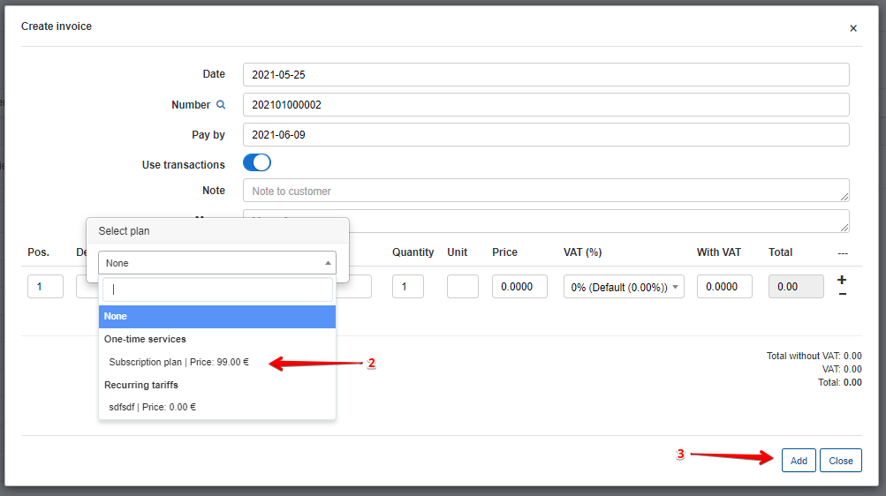

One-Time plans
==============
One-time plans are non-recurring charges used regularly which can include any services that are charged once off.

To create One-Time plans, navigate to _Tariff plans → One-time_ and click on the Add plan button.

Upon clicking the button the add plan page will appear where you can specify the following parameters to create a new one-time plan.

* **Title** - specify the name of the tariff in the One-Time Tariffs list/table.
* **Price** - specify the price for the service.
* **Partners** - specify the partners that this plan will be available to.
* **VAT Included** - select whether VAT is included in the price of the plan or not.
* **VAT** - specify the percentage of the VAT.

Once one-time plans have been created, you can always edit or delete them by using the icons found in the actions column of the One-time plans table.  <icon class="image-icon"></icon> or <icon class="image-icon"></icon>

Like all tables in Relynt, it is possible modify the appearance of the content, the content you wish to display, and to export the table into Excel, CSV or PDF formats. You can also choose to copy or print the table. This is done with the use of these <icon class="image-icon"></icon>  icons which can be found at the bottom left of each table. The <icon class="image-icon"></icon> icon can be used to export and the   <icon class="image-icon"></icon> icon to re-arrange the appearance and content of the table.

After the creation One-Time plans, it is applicable to:

**1. Add one-time invoice**

On the customer's "_Billing - Invoices_ tab" is an option to add One-time invoices:

In the One-time invoice creation here you are able to select One-time plans as items and all data pertaining to the selected plan will auto-filled as depicted in the image below:

It is also applicable when editing invoices created automatically by the system.
