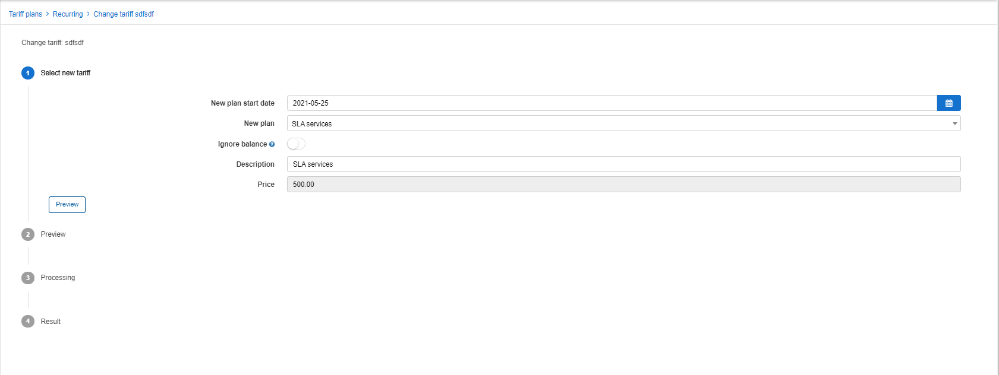

Tariff Change
========

This feature has been created to change a tariff on the system, regardless of how many customers are subscribed to it. The feature is used for mass changes to a tariff plan which will change the service for all customers subscribed to it, with the service that is selected in the process.

The concept is similar to that of the ["Change service"](finance/change_service/change_service.md) button found in "Customer services", only here, this button applies the change to all customers subscribed to the plan.

The feature can be used by clicking on the "Change plan" button in the *Actions* column of the recurring tariffs table:

You will be presented with the following window:

You then need to select the following parameters:

* **New plan start date** - select the date to apply the change of plan for all customers using this plan.

* **New plan** - select the new plan to change to from the list of available plans in the drop down list, if desired, plans can be created prior to using this feature.

* **Ignore balance** - enabling this option will ignore the balance of the current plan for each of the customers registered to this plan.

Upon specifying these parameters, the plan description and price will appear, and the "Preview" button will become available.

Simply click on the "Preview" button to display the preview of results found for all customers using this plan, in this case there is only one customer subscribed to this plan:

To confirm the action, simply click on "Change tariff" or click on back to the first step if you need to change anything.

When clicking on "Change tariff", you will be presented with the following window:

Simply click on "Confirm" to proceed with the action.

Now we can move on to the next step and display the results of the Change plan action, this will display a list of all customers the change plan has been executed on and the result of the action in the form of a "Status":

In the event that you receive an error, if it states that the plan can only be changed at a certain date, this is because the service has been accounted for, for the period - an invoice has already been generated. Simply cancel the charge on the customers account or specify a corresponding date in the first step of the process.
