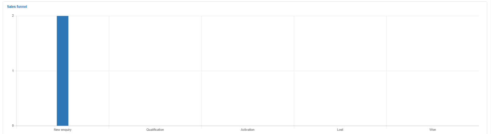

CRM Dashboard
===
The CRM dashboard provides useful information in relation to all activities of sales in conveniently summarized charts, tables, and information boxes.

The dashboard displays informative and real time data statistics for each contributing header. Presenting the total number of tasks for the day, active and new leads, as well as deals created, filtered by the owner/responsible agent and date range.

The data of each header is summarized into totals and represented in informational boxes with quick access links to the full lists of each header respectively.

More summarized information in relation to the activities on the system and progression of leads is represented by means of the following:

A table displaying all **Tasks** created for leads.

A real time list of  **Recent Activities** displaying information of all actions applied to the leads in the system.

A chart representing all **New leads** which can be filtered to display data relevant to the day, week or month.

A chart displaying the **Sources** of leads obtained filtered by All sources, leads, and converted leads, with a legend provided displaying the totals of each source.

A chart displaying a **Sales Funnel** of the total number of leads in each of the different pipeline statuses for leads.

Tables representing the **Total number of leads** and **New leads** on the system,

A chart displaying the total number of **Leads per owner** in each of the pipeline statuses.

