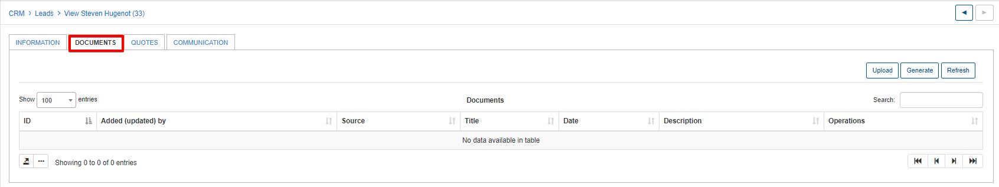
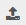
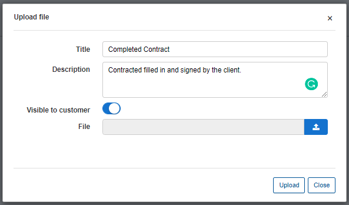
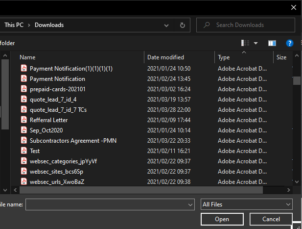
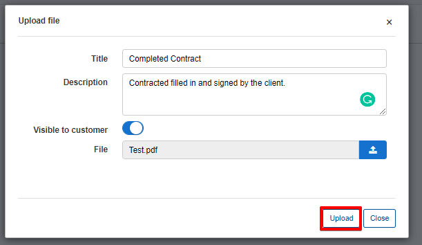
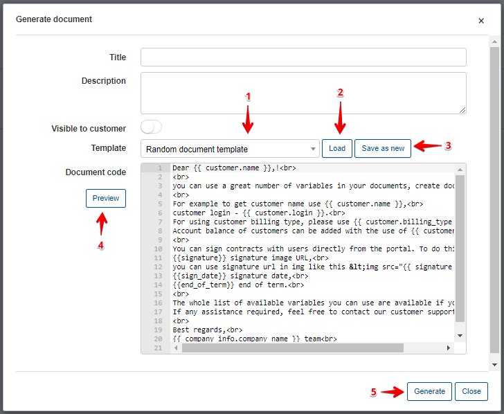
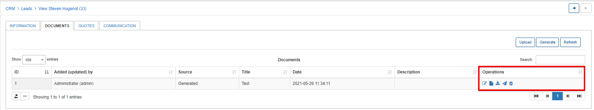

Documents
=====
The documents section of leads is where you can upload, generate and interact with any documentation like contracts, agreements, customer identification documents, etc.

Documents can either be uploaded or generated directly on the system.

1. Uploading documents - simply click on the upload button - Specify a title and an optional description for the document. Select whether the document should be visible to the customer within their portal and select the file from the local workstation by clicking the File upload button 

A browse window will appear for you to locate and select the file:

Complete the process by clicking on upload.

2. Generate documents - Documents can be generated from predefined templates configured and stored on the system, by selecting the template from the dropdown list and **loading** it. Alternatively, you can create a new document in HTML format which can be **saved as a new** template.Once created or loaded, we can **preview** the document before finally generating it. (For more information on templates click [here](configuration/system/templates/templates.md))

Once a document has been uploaded or generated, we can interact with it by using the Operations button available. We are able to **Edit**, **View**, **Download**, **Send** or **Delete** a document.

