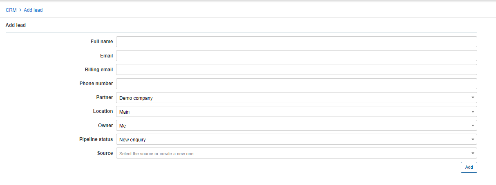

Leads
=======
Leads are people or business who may potentially become a customer of your services. they are the central part of the CRM module which all features revolve around.

Leads can be created manually by an administrator or generated automatically from the CRM Sign-up widget.

To **Add a new lead** - you have to specify all the details pertaining to the prospective customer (Owner, CRM Status and Source). The information added here, will also be used when converting from a lead to a customer.

**Full name** - Names and surname of the lead 
**Email** - Email address(es) of the lead, multiple addresses supported and separated by comma "," 
**Billing Email** - Email address(es) of the lead used for billing purposes, multiple addresses supported and separated by comma "," 
**Phone number** - contact number(s) of the lead, multiple numbers supported and seperated by comma "," 
**Partner** - the partner the lead will belong to in the list of partners 
**Location** - the location the lead will be categorized in on the list of locations 
**Owner** - the administrator that will be responsible for the lead 
**Pipeline status** - the progressive status of the lead (stage in the process of becoming a customer) 
**Source** - where/what/how the lead was obtained/received/gained interest from 

 The signup widget can be added to your company website and people interested in your services can sign up directly on the form generated by the widget code. Upon completion of the form the pupil will automatically be added to the list of leads with the information they have provided.

The leads list is will display leads which the current administrator is responsible for by default, however, the list can be filtered by a specific administrator, the lead condition, and/or Pipeline status of leads.

We also have the option to filter leads according to several fields in the filter tab 

Summarized totals for leads can be found at the bottom of the list.

To view a lead, simply click on their full name/ID - this will open the lead page, displaying all the details relevant to the lead.

In the leads information page, all details will be entered as per a normal customer except information related to a service.

 All changes made to the selected lead can be viewed in the recent activities tab at the bottom of the page.

The Comments Tab can also be found at the bottom of the page where comments can be added to the lead profile with a scheduled date and time, nature/type of comment, and a status for the comment.

At the top of the lead page in the right corner, we can interact with the lead using the following functions:
- Create a message to send to the lead (can be created with preconfigured templates)
- Delete the lead
- Tasks - Create a task or view tasks related to the lead
- Tickets - Create a ticket or view the list of tickets relating to the lead.
- Convert the lead - Convert the lead into a customer (See conversion process below)
- Save - saves any changes applied to the lead profile.

## Converting a lead to a customer

The main goal of the CRM module is to achieve converting prospective customers into subscribers of your services.

Clicking on the Convert function on the lead page will initiate the conversion of a lead into a customer on the system.

The process consists of the following steps:

1. **Select the quote/s** - quotes that will be used to create the customer's services. (The services quoted and agreed upon).

2. **Customer information** - choose which type of conversion we want to use, `create active customer and invoice` or `create inactive customer and proforma invoice` and comfirm the customers details.

We can choose to complete the conversion within this step by clicking *convert now*, skipping the services step, or continue to the services step to confirm the service details.

3. **Services** - The final step, allowing us to edit the service details of the quote we selected in step 1.
Once all details have been confirmed, we can complete the process by clicking on *convert to customer*.

