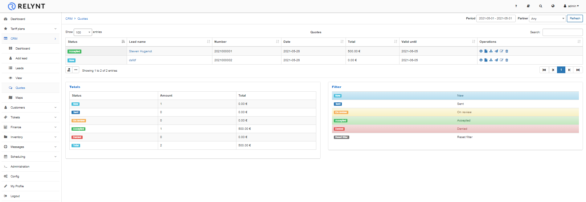
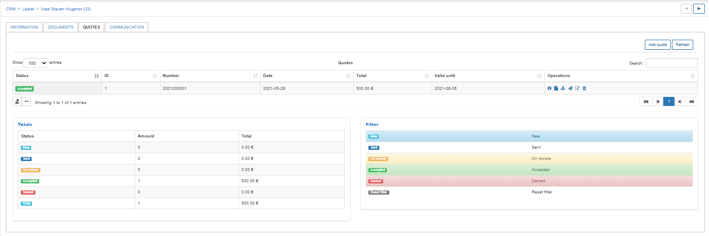
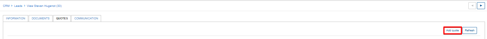
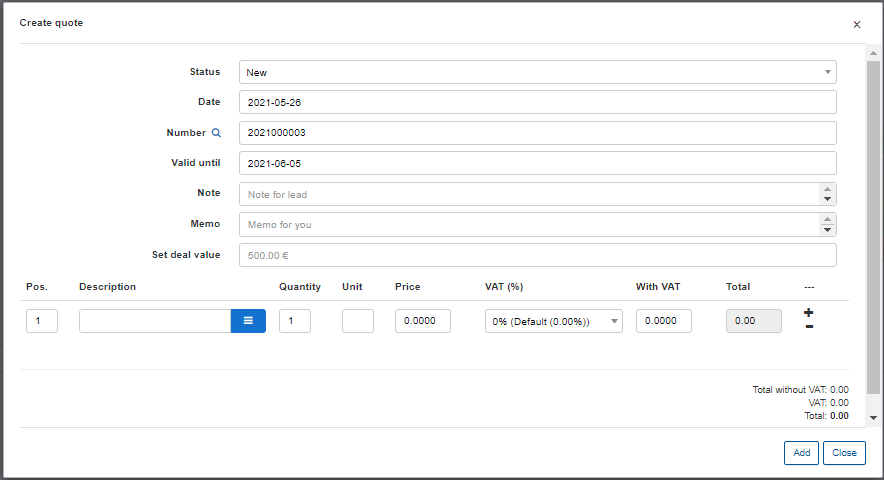

Quotes
=======
Quotes are documents provided to a lead to inform them of the cost of a service/s in order for them decide if they would like to purchase it.

The full list of quotes can be viewed by clicking on the Quotes menu in the sidebar under the CRM module. The details for each quote and the operations column with multiple actions to execute to each quote will be displayed - *view*, *view PDF*, *download PDF*, *send*, *edit* or *delete*.

Quotes for a specific lead can be accessed by navigating to the Quotes tab on the leads page. The list of all quotes generated for the selected lead will be shown, displaying a summary of the total value of the quotes and a filter section at the bottom of the page, used to display quotes of a specified status.

You can add a quote by clicking on the `Add quote` button in the top right-hand corner of the quotes tab under a selected lead's page.

When adding a quote you are presented with following window:

- **Status** - New, Sent, On review, Accepted or Denied.
- **Date** - creation of the quote
- **Quote number** - number for referencing quotes (Pattern/format can be changed under Config / CRM / Finance)
- **Valid till** - The period of the quote's validity calculate from the day of creation to the valid till date. Default is set to 10 days (Can be changed under Config / CRM /Finance)
- **Note** - Note directed to the lead
- **Memo** - Personal note for the administrator
- **Set deal value** - specify the total value of the deal with the lead. This value will be displayed on the information page of the lead and will be represented as the total value of the lead. You can simply leave this value empty to automatically use the total of the Quote itself.

By clicking on the  icon we can choose a tariff/service to add to the quote. It is possible to add multiple services by selecting the "+" icon. Services can conveniently be re-ordered on the quote by dragging and dropping the services to the selected position of priority. You can also select the appropriate VAT percentage from the drop-down list in the VAT field.

Once we have created a quote, we can navigate to the operations column on the table of quotes. Where multiple actions can be performed - *view*, *view PDF*, *download PDF*, *send*, *edit* or *delete*.

When sending quotes to leads, it is possible to use templates to format the content in a preferred layout to display the quote.

Information on editing or creating Quote templates can found [here](configuration/system/templates/templates.md)
