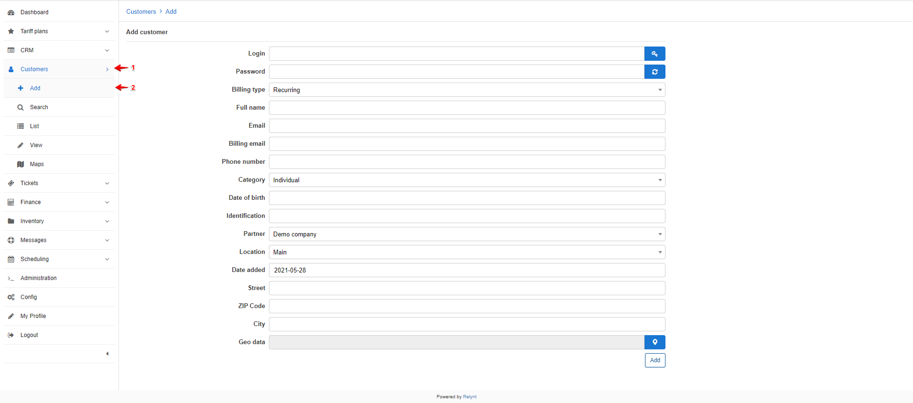
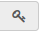
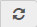
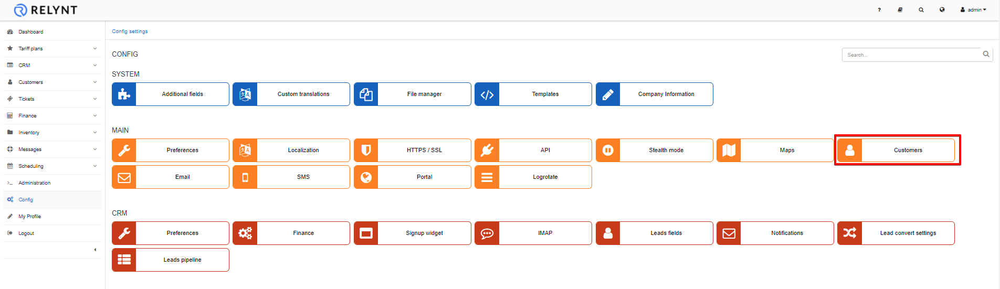
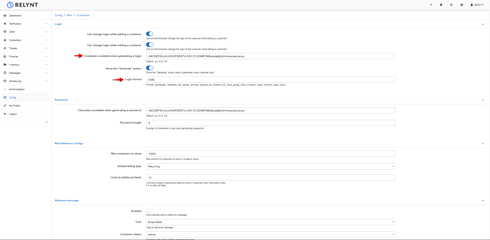
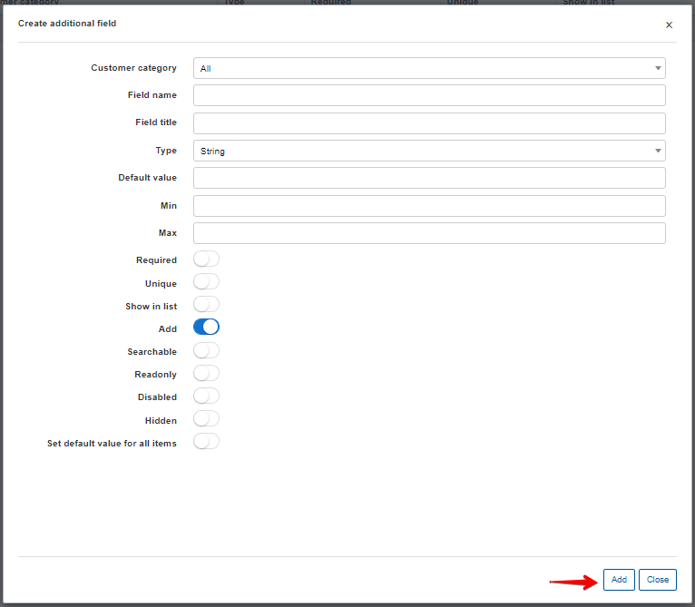

Adding a new customer
===================

You can add a new customer by navigating to _Customers → + Add_. The "add customer" window will appear where you can fill in the customer's details in the provided fields:

* `Login and Password` - Login's and Passwords can either be automatically generated or you may choose to manually create them . The <icon class="image-icon"></icon> button is used to automatically generate a new login and<icon class="image-icon"></icon> for passwords.
* `Billing type` - method in which you will bill the customer (prepaid or recurring)
* `Full name` - full name and surname of the customer
* `Email` - email address of the customer (Multiple supported separated by comma ",")
* `Billing email` - email address of the customer used for billing purposes (Multiple supported separated by comma ",")
* `Phone Number` - phone number of the customer (Multiple supported separated by comma ",")
* `Category` - if customer is an individual or a business.
* `Date of birth` - birthday of the customer
* `Identification` - Identification number of the customer
* `Partner` - partner the customer belongs to
* `Location` - location the customer belongs to
* `Date added` - the date when the customer has been added
* `Street` - Street of the customer address
* `ZIP code` - ZIP code of the customer address
* `City` - city of the customer address
* `Geo Data` - physical coordinates of the customer

**Customer status**

The status of your customers plays a significant role in the system with regards to services and accounting. The status of a customer influences whether the system will account for the customer's services in a billing perspective and whether the customers service are active, suspended(blocked) or stopped.

Here are descriptions of the different customer statuses for you to understand how this influences the system:

* **New (Not yet connected)** - This is the status given to newly added customers by default.
* **Active** - This status allows the customer access to their services and the system to account for their services based on their _Billing settings_.
* **Inactive**(Doesn't use services) - This status stops the system from accounting for the services. It is the status given to customers' automatically when they've reached there _Deactivation period_. This status is given to customers who will no longer use your services and enables the deletion of customers
* **Blocked** - This status suspends customers services due to non-payment/failed to make payment on time, while the system still accounts for customer services in a billing perspective.  

Automatically generated login's and password's are created based on randomized characters. These characters and the pattern can be modified to your preference.

To define these characters and pattern , click on _Config → Main→ Customers_.

It is also possible to personalize a customer's parameters with the _Additional field_ function found in _Config → System → Additional fields_. These are custom fields you require for any given informational data within the system for your customers.

When you creating an additional field for a customer, select _Add_ to get the parameter in the "add customer window" as well as the customer's profile by default.

