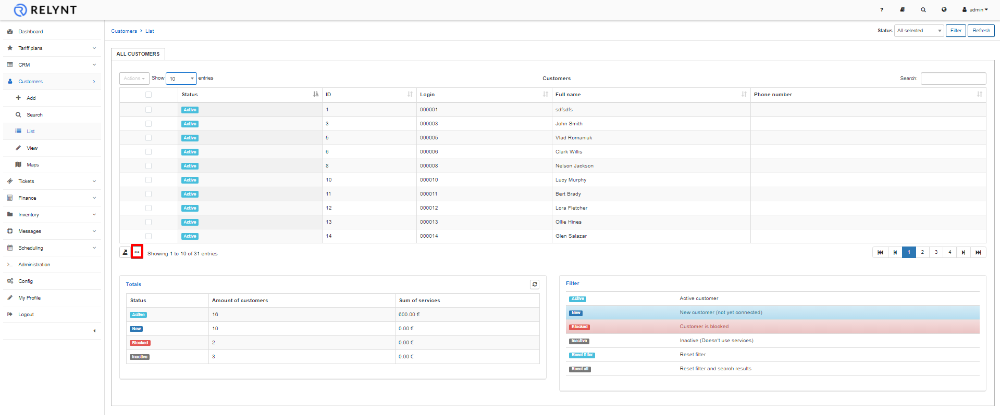
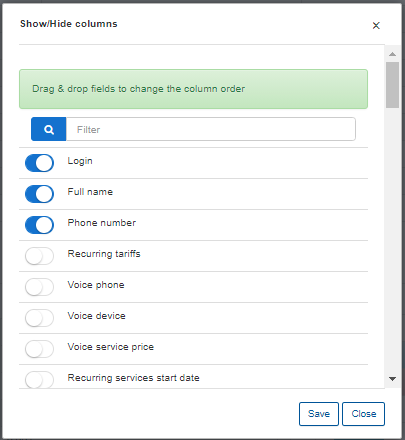
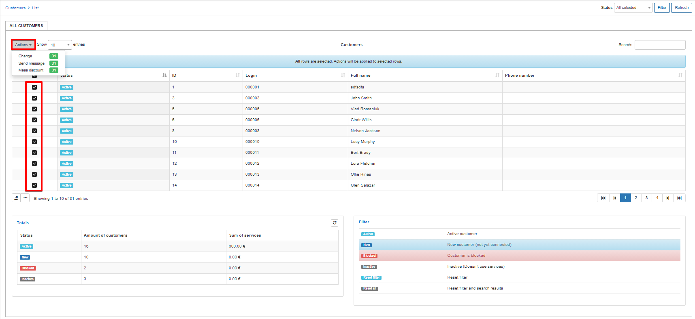
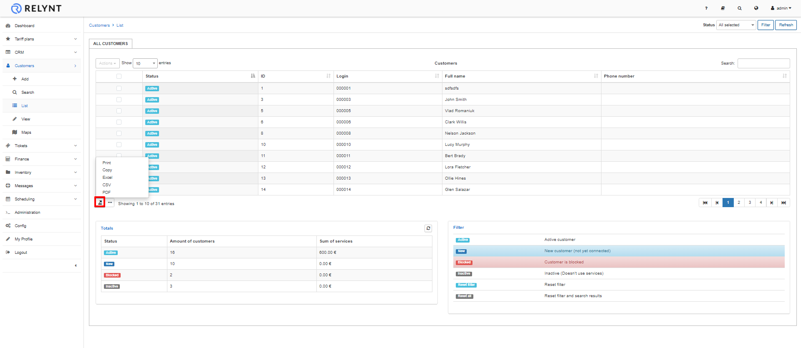

Modifying the table
==========

All tables in Relynt are customizable to view the content you prefer and in the order you prefer to see it.

By clicking on the modify <icon class="image-icon"></icon> icon below the table then simply dragging and dropping fields you can rearrange the order thereof in a preferred layout. You can also enable or disable the fields/columns you want to display on the table.

You can select multiple customers via the checkboxes to make mass changes to them (change status, location, partner, type etc.) or send messages to selected customers.

In addition, by clicking on the export icon <icon class="image-icon"></icon> it's possible to print, copy or export a table in Excel, CSV or PDF formats.

These actions apply to all tables in all modules of Relynt where the Modify and Export icons are found.
