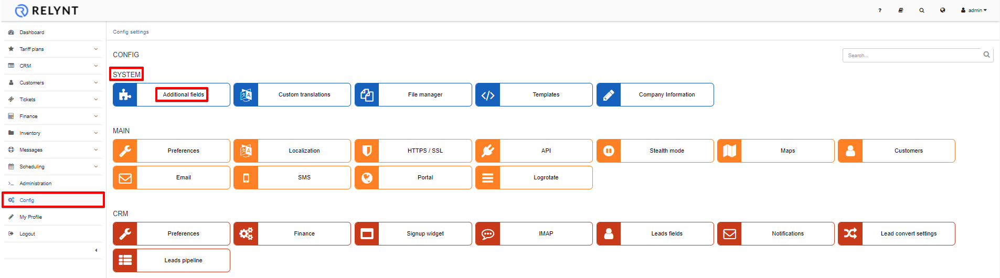

Custom additional fields
==========

We have developed the ability to add additional fields to any of the modules in Relynt to collect, insert, classify or simply record any type of data in a field specially provided therefore. That is if the field is not on the system by default. 

Adding additional fields to the system can be done under Config in the System section:

Simply select the module where you'd like to add an additional field to, and click on the *Add button*.

You will be presented with a form to create an additional field.

* **Required** - Make the field mandatory in order to save.
* **Unique** -  unique value for this field.
* **Show in list** - shows in the list of the selected module as a column.
* **Add** - add to the entry of every module.
* **Searchable** - field will show up in searches.
* **Readonly** - field will have a read-only value.
* **Disabled** - field will be disabled.
* **Hidden** - field will be hidden.
* **Set default value for all items** - set as a default value for every field.

Example:

When the new field is created, it's possible to see the new field in the Additional Field table and in the Customer Information view:

