Customer billing
==========
The home of finance for each individual customer. This is where you can customize your customer's billing to adhere to agreements and unique terms finalized with the respective customer in specific relation to how they will be billed for the services your render to them.

The Customer Billing tab is divided into 5 sub-tabs:

* **Billing Overview** - The main configuration page of the selected customer's billing.
* **Transactions** - All transactions of the customer can be found and interacted with here.
* **Invoices** - All invoices of the customer can be found and interacted with here.
* **Payments** - All payments made by or on behalf  of the customer can be found and interacted with here.
* **Proforma Invoices** - A list of all proforma invoices is kept for future reference and be interacted with here.

## Billing Overview

Billing Overview displays 5 main sections:

* Billing Settings
* Proforma Invoice Settings
* Payment Accounts
* Billing Address
* Reminders Settings

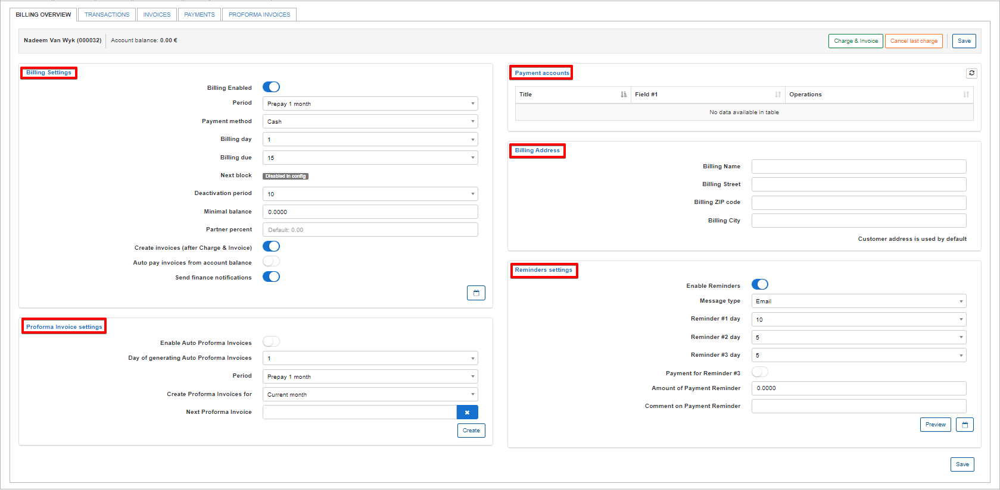

**Billing settings**

This is the configuration page of the **selected** customer's billing.

The **global** settings for all customers can be configured in `Config → Finance → Settings`).

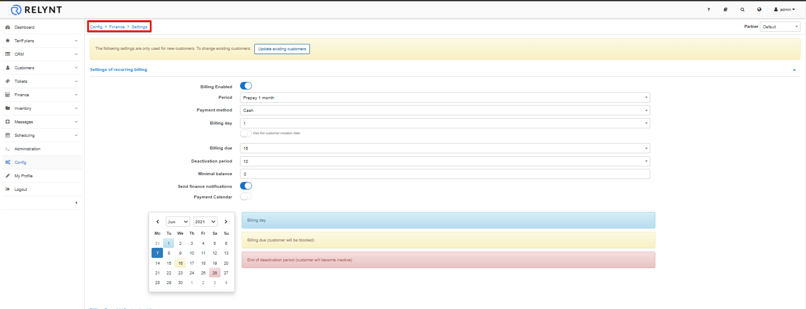

## Billing Settings:.
* **Billing Enabled** - enables or disables billing for customer (whether the system should take customer into account or not)
* **Period** - period the customer will be billed for
* **Payment Method** - means in which client will make payments; credit card, cash, etc.
* **Billing day** - when the customer will be charged and invoices will be generated
* **Billing due** - when the customer needs to make payments before being blocked
* **Next Block** - will display how many days is left until the customer will be blocked, with a ability to extend the period.
* **Deactivation Period** - when the customer's services will be marked as inactive, client no longer uses services and the system no longer accounts for it
* **Minimal balance** - minimal balance required in the customer account to avoid being blocked
* **Partner Percent** - used to record a percentage of commission that will be granted to the sub-contracting partner responsible for this customer.
* **Create invoices** (after Charge & Invoice) - creates a physical invoice automatically after using the charge & invoice button <icon class="image-icon">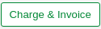</icon>.
* **Auto pay invoices from account balance** - select whether the system should automatically allocate funds to account for services and change the status of invoices.
* **Send finance notifications** - select whether or not to issue any financial notifications to the customer (invoices, proformas, payment receipts, reminders)

## Payment Accounts

These accounts are added and only apply to a system that has been integrated with a payment system or accounting platform for payment processing

 The accounts of the customer recorded can then be used to make payments on the system.

 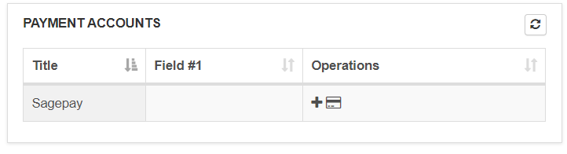

 You can edit the available accounts to add customers accounts details with the "**+**" icon.

 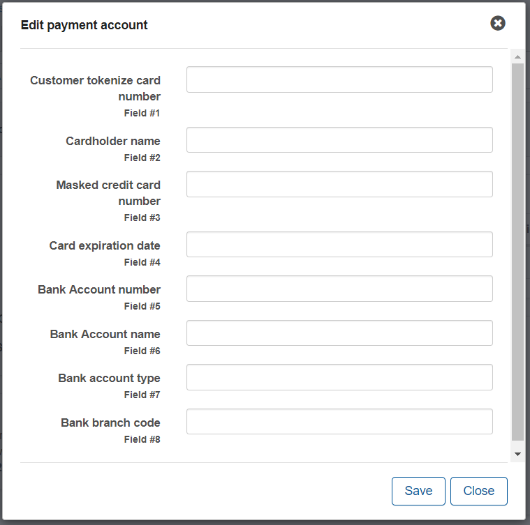

## Billing address

Billing addresses can be configured here if it is different to the address on the Main Information tab of the customer. By default, it is left empty and the address is taken from the Main Information table of the customer.

Specific billing addresses can be set here if the customer uses a different address for billing from that in the *Main Information* page. If left blank, the customers address is used by default

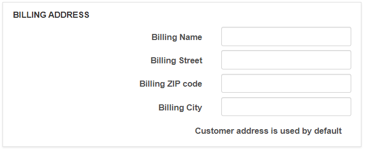

## Actions section

 The actions section provides quick access to tools used to generate elements of accounting that charges or to discard of the last generated elements of accounting relative to a charge.

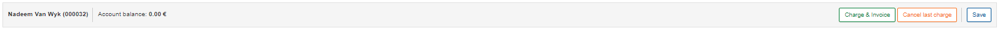

**Charge & Invoice**

<icon class="image-icon"></icon>

You can charge **manually** with the use of the `Charge & Invoice` button. 
Simply click the button, the charge & invoice window will appear where you can select the date and period of charging, then click on `Preview` to view services description and click on `Charge & Invoice` to manually charge the customer.

The system will automatically charge the customer and create a new transaction(s) which can be viewed in the Transactions tab.

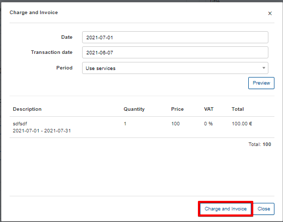

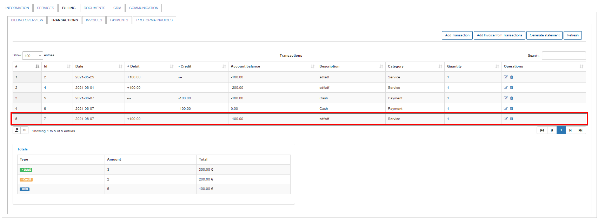

Please note that if you are charging a customer **manually**, the new invoice will only be created if the **Create invoices** (after Charge & Invoice) option is enabled in `Customer's Billing → Billing Overview → Billing settings`.

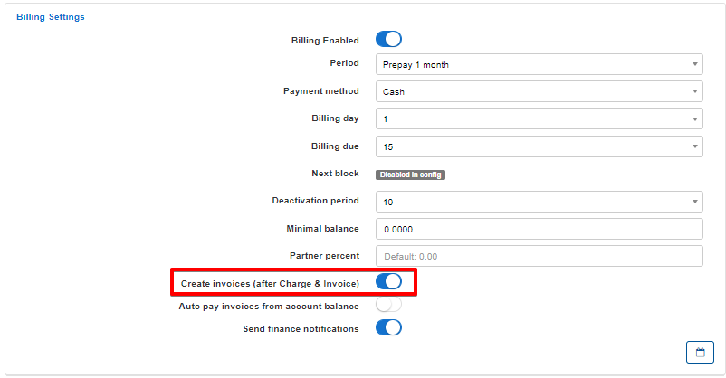

While charging customers, if an arrangement was made, discounts can be added to customer services. Discounts are applied in the settings of the customers services.

Navigate to the customers services tab and select the desired service to apply the discount to, click on Edit icon <icon class="image-icon"></icon>.

The edit service window will appear where you can apply the discount according to the parameters provided for discounts.

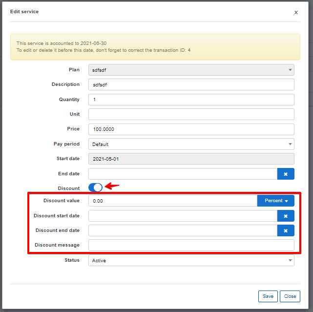

Discounts can be added by percentage or as a fixed value:

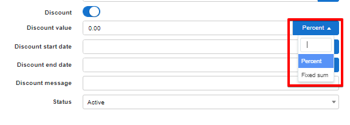

 After a discount has been configured, it will appear in the <icon class="image-icon"></icon> window with the total automatically calculated accordingly to the discount applied.

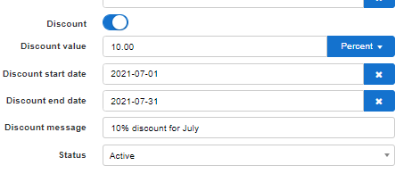

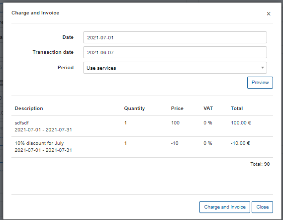

**Payment Calendar**

<icon class="image-icon">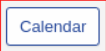</icon>

 You can generate a payment calendar for the customer with the use of templates.

By default payment calendar generating is disabled. To enable it you need to activate it in `Config -> Finance -> Settings`.

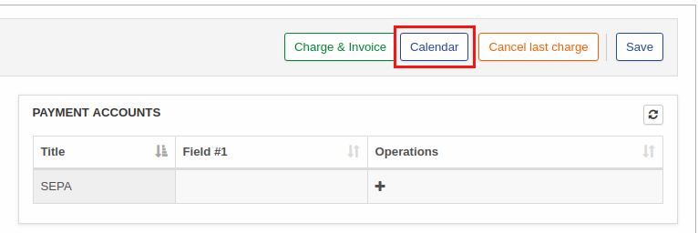

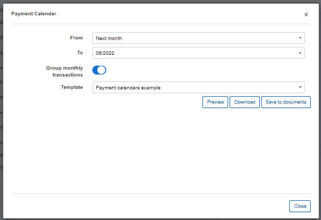

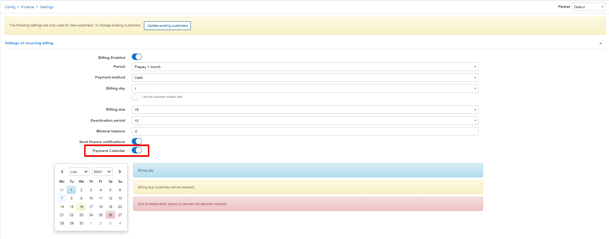

**Cancel last charge**

<icon class="image-icon">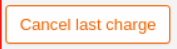</icon>

This button can be used to cancel the previously generated charge of a customer. This feature ensures that charges are cleared appropriately in the system by deleting the invoice and transaction pertaining to the charge.

**Save**

<icon class="image-icon">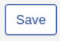</icon>

Save any change made in the customer billing tab.

In **Proforma Invoice settings** is where we configure the parameters for the automation of proforma invoice creation.

**Parameters**
* Enable Auto Proforma Invoices - enables/disables automatic proforma invoice genration
* Day of generating Auto Proforma Invoices - select which day to create proformas each month
* Period - specify the period of which to charge for on the proforma
* Create Proforma Invoices for - Select which month to create the proforma for
* Next Proforma Invoice - if deterring from the day of generation, select when to create the next proforma

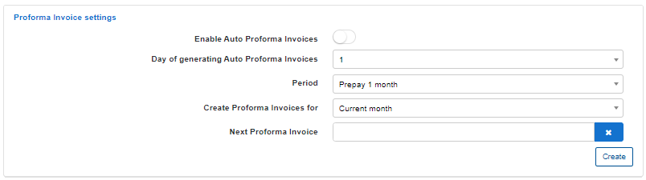

In **Reminders settings** you can enable and configure automatic sending of reminders for customers to pay for their services/issued invoices. It is also possible to enable a payment option for the last reminder and set an amount on the reminder payment with a comment on it.

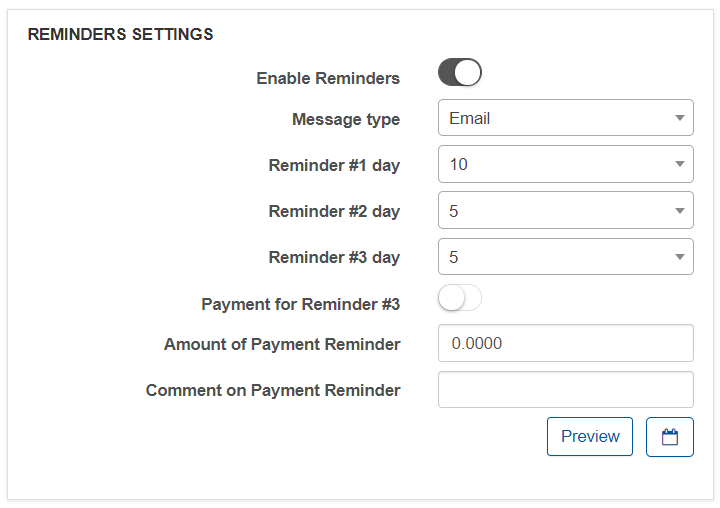

## Transactions

Transactions are divided into 2 types, namely, **Debit transactions** and **Credit transactions**

**Debit transactions** - transaction added to customers accounts with amounts to be paid. (decreases customers account balance) 
**Credit transactions** - transaction added to customers accounts after making payments. (increases customers account balance) 

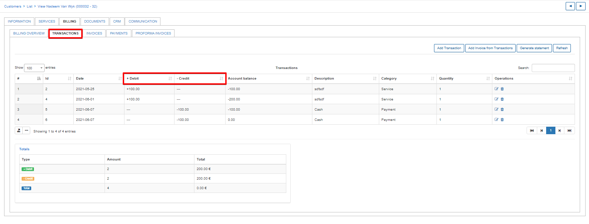

All transactions can be edited and/or deleted.

The option to print, copy or save the customer's transactions list, in either CSV, Excel or PDF formats can be found at the bottom of the table.

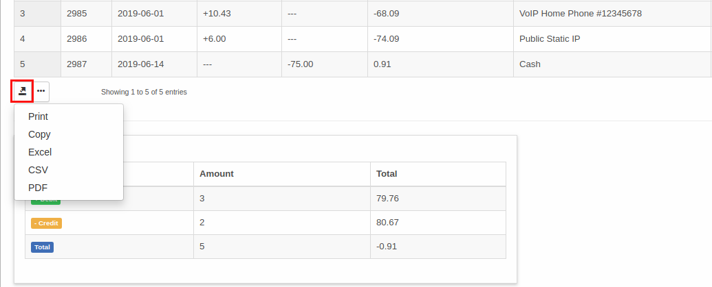

We can also customize the transactions table by enabling/disabling fields or drag&drop fields in a preferred method of displaying.

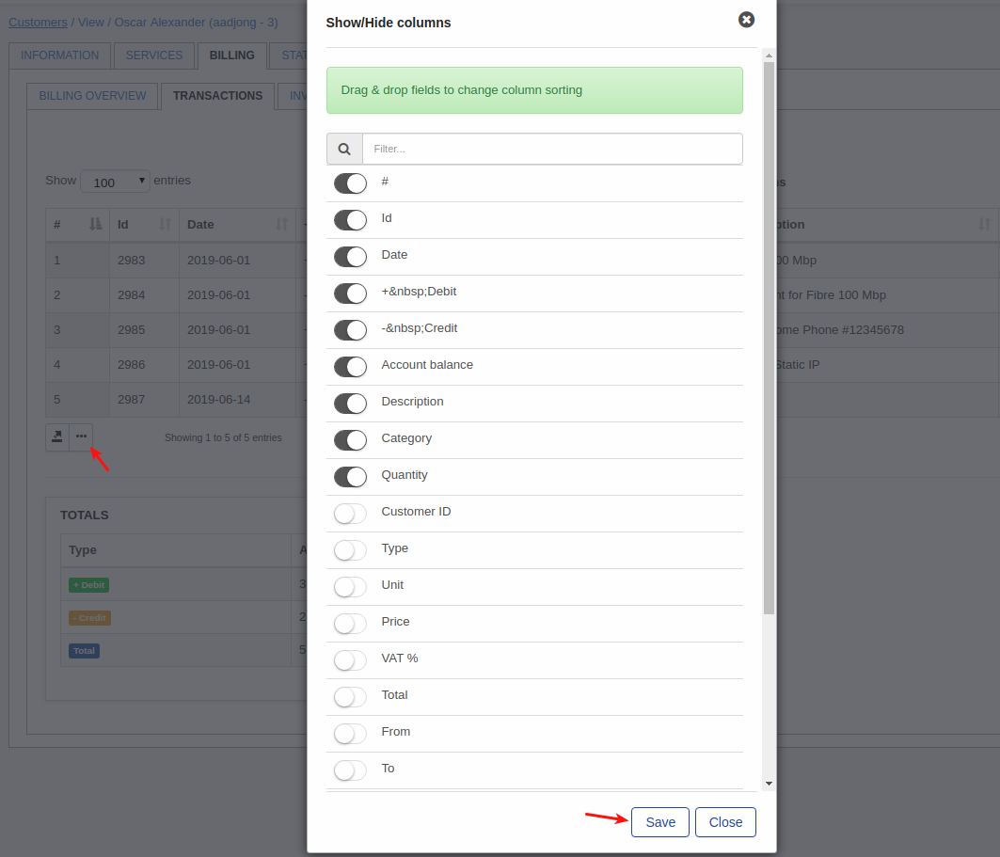

For more information on transactions, please navigate to the transactions manual - [Transactions](finance/transactions/transactions.md).

## Invoices

All invoices generated/created for the selected customer can be viewed and interacted with in the invoices table. It displays the invoice number, date of issuing, payment date and status of payment.

Just as with transactions table the option to export or customize the data presented is also available

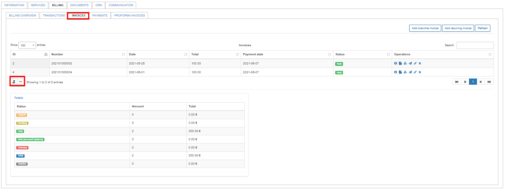

The invoices table also has an operations column with tools to interact with each invoice. Invoices can be paid or marked as unpaid, edited(if not paid), viewed as on the Web UI or as PDF's, sent to the customer or deleted. Payments of paid invoices can be deleted directly from the operations of invoices as well.

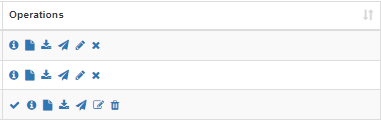

The function of each button in operations can be found by simply hovering over the icons.

Detailed descriptions and an explanation of invoicing can be found here -  [Invoices](finance/invoices/invoices.md)

## Payments

The Payments table contains all payments related to the selected customer, providing a table that displays the date of payments, payment types, amounts, invoice numbers and comments on the payments.

Just as with transactions table the option to export or customize the data presented is also available.

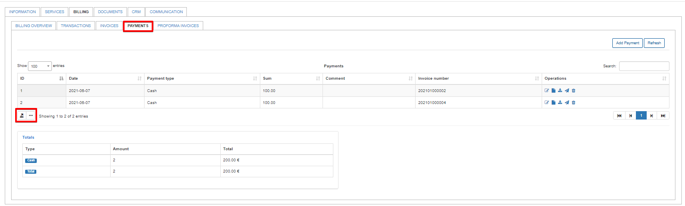

More information about Payments can be found here -  [Payments](finance/payments/payments.md)

## Proforma invoices

The table of all Proforma invoices related to the customer can be viewed here, displaying invoice numbers, date of invoices, total amounts, payment dates and statuses (if it's paid, unpaid or overdue).

The option to export the data or customize the data presented is also available.

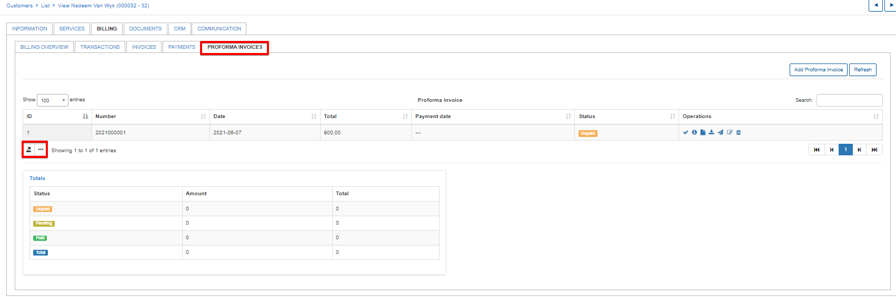

Detailed information about Proforma invoices and the creation thereof  can be found here - [Proforma invoices](finance/proforma_invoices/proforma_invoices.md)

**Totals** tables for the transactions, invoices, proforma invoices and payments tabs can be found at the bottom of each section. Providing totals for relevant data of the table within the tab.

Transactions tab total table:

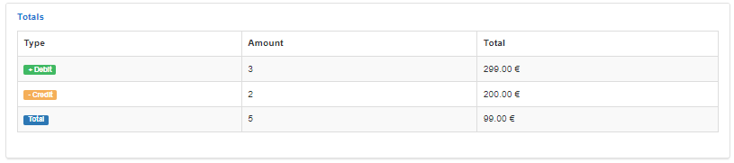
