Customer documents
==========

All companies with multiple customers, offering various services often have agreements and contracts signed by both parties. That means copies of all of the contracts and agreements for each client is either saved in files and folders, or kept in boxes and storage rooms. Which is quite inefficient, ineffective and as we know it, not the eco-friendly way of doing it. That is history! We have digitalized this very necessary form of keeping records for you on our platform for you to save or even create the necessary documents.

Our documents section allows you to upload any format of a document, giving you a secure, neat, easily manageable and quite literally better method of storing your documents. Need more? Our document section can also generate documents according to templates you create for it! Digitalizing the entire process and achieving hassle free storage of customer records.

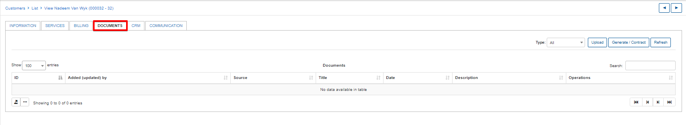

## How to upload a document to Relynt.

To upload a document click on the <icon class="image-icon">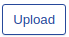</icon> button on the top right corner of the tab and a pop-up window *Upload file* will appear. Here you can specify the Title of the document, a short description (optional) and choose if you'd like this document to be visible to a customer in the portal. You then have the option to click on the File upload icon <icon class="image-icon"></icon> and choose the document to be uploaded.

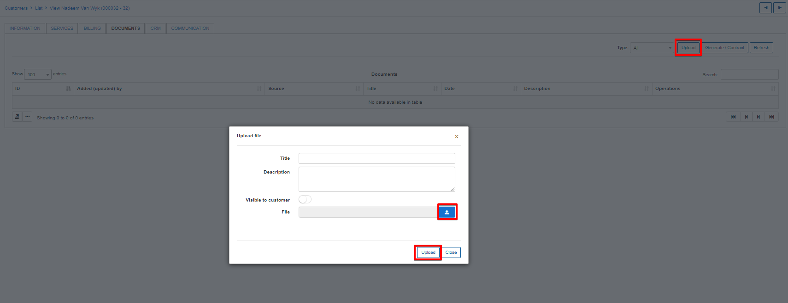

A soon as the file is uploaded, it will immediately appear in the list of Documents.

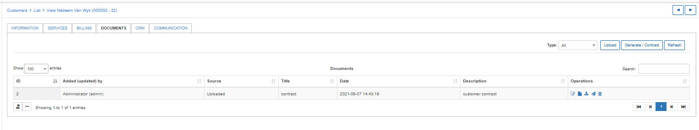

In the Operations column of the table you'll find possible actions relating to the file, such as `Edit` , `View` , `Download` , `Send to a customer` and `Delete` <icon class="image-icon">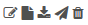</icon>.

If you have uploaded the file and enabled the `Visible to customer` option in the upload process, the file will be visible to the customer in their portal under the documents section.

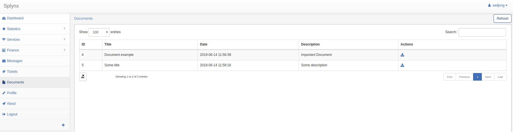

The customer can download and view the file from here by clicking on the Download icon <icon class="image-icon"></icon> on the right side of the table.

## Generating a document in Relynt.

Let's take a look at generating a document within Relynt.

To generate a document, click on the <icon class="image-icon">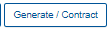</icon> button on the top right corner of the tab, this will bring up a *Generate document* pop-up window. Where you can specify the Title of document, a short description (optional) and choose if you'd like the document to be visible to the customer. When generating a document you can also choose to give it a format of a contract which you simply do by enable the sign contract toggle. Then you will be able to stipulate if it has a term of validity and specify the term in months.

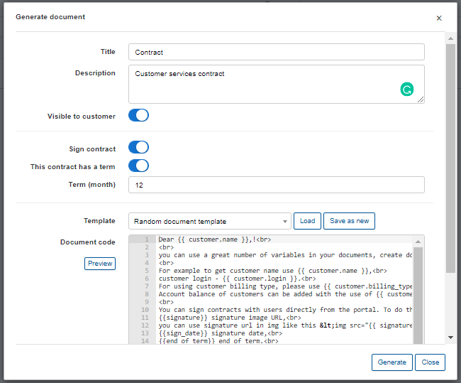

There are two options to generate the body of the document:

* Option 1 - simply type the desired content in the text window and then click on `Generate` or `Save as new` template (option to save the manually generated content as a template can be found above the text area).

* Option 2 - we can use a Template to create/generate a document by clicking on the Template drop-down list, selecting a Template and then clicking on the <icon class="image-icon"></icon> icon. This will populate the text area with preconfigured content from the template. You then have to enter a *Title* for the document, give a short description (optional), choose whether or not to make it visible to the customer and complete the process by clicking on Generate.

  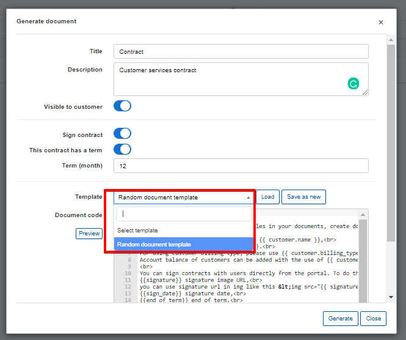

As mentioned before, it will appear in the list of documents once completed and based on the selection for the "visible_to_customer" field, it may or may not be available for downloading in the customer portal.

Below is an example of the documents menu in the Customer portal.

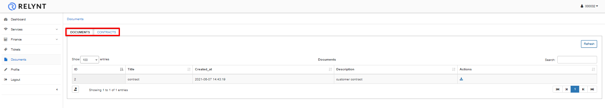

As you can see, Documents and contracts are separated accordingly.

Before using Templates it is necessary to **configure** them first  in `Config → System → Templates`:

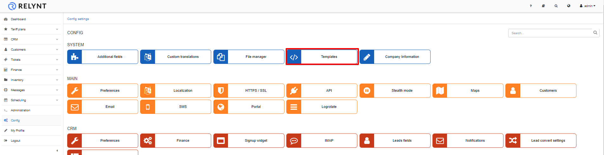

More information on creating templates can be found here - [Templates configuration](configuration/system/templates/templates.md)
