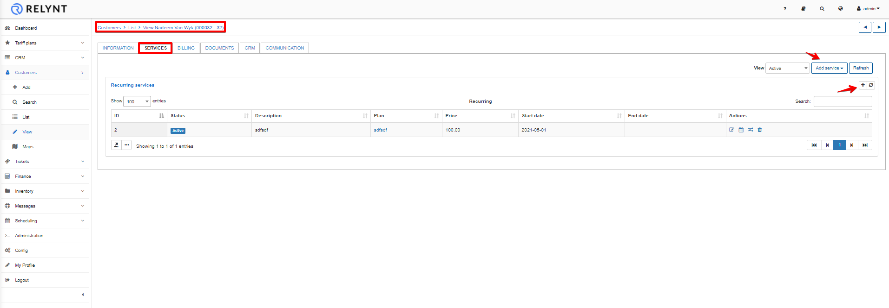
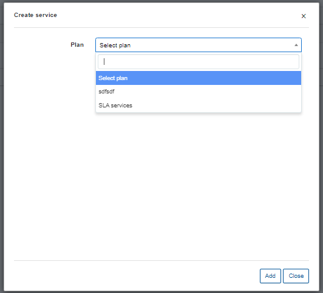
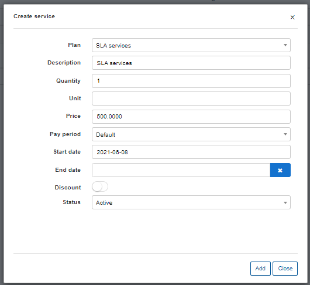
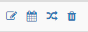
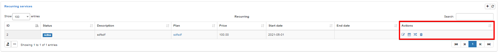

Customer services
==========
The customer service tab is where all products/services supplied can be added or edited on the customers account. This is where you control all services for a client which will influence the bill they receive.

We can add multiple recurring services to customers relevant to that which we supply to them.

In order **to add a new service** for the customer, select the customer from the *Customer list*, click on the services tab, then simply click `Add service` or on the `+` sign above the service table on the left.

After clicking the "add service" or "+" button, the window will appear for you to select a service from the list of existing tariffs you have created on the system.

* **Plan** - the tariff selected/list of tariffs available to select (`Internet`, `Voice`, `Custom`)
* **Description** - a description of the tariff (optional)
* **Quantity** - the multiple of plans for the selected service
* **Unit** - a unit of measurement (if using for invoices - for example: m, ft, etc.) (Optional)
* **Price** - the price of the tariff (custom prices can be set that differs from service price in the tariff configuration)
* **Pay period** - period of which to charge for this service
* **Start date** - when the system will start accounting for the service in billing perspective.
* **End date** - when the service will end, changed to a stopped status and the system will stop accounting for it in a billing perspective.
* **Discount** - enabled the ability to set a discount with parameters of a percentage or fixed amount, within start and end dates of the discount, please note that these dates refer to the period of which the discount will be applied.
* **Status** - the options are `Active`, `Disabled`, `Stopped`, `Pending`, `Archived`.
  * **Active** - service is active/ready for use and will be accounted for.
  * **Disabled** - when applied manually it ends accounting of the service to the date specified in the end date parameter. This is also the status given to customers who have reached their deactivation date, assuming they longer use your services.
  * **Stopped** - Used to temporary disable the service when a customer is blocked, accounting still continues for the service in this state. The status will also be set automatically to the new service generated when a client is marked as Inactive, when the customer is activated, the service's status will automatically change to Active with the start date of the day of activation.
  * **Pending** - Status of the new service during the waiting period of a planned service change. Between the end date of the old service and the start date of the new.
  * **Archived** - status for services archived for future reference. Accounting diregards archived services

You can **edit** a service, **schedule a future change**, **change** the plan, or **delete**  the service by these icons <icon class="image-icon"></icon>, located in the actions column of the service table.

