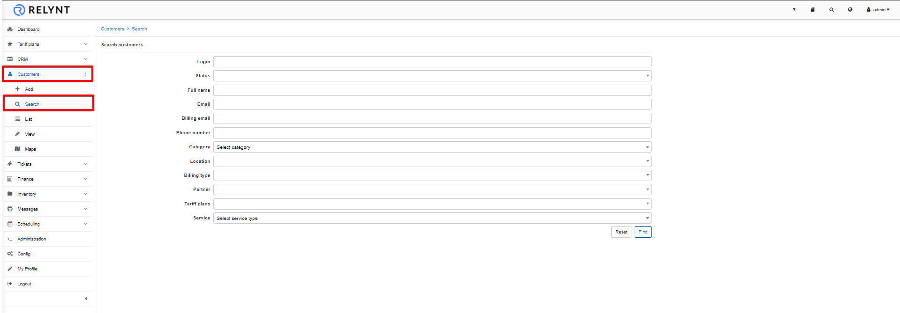
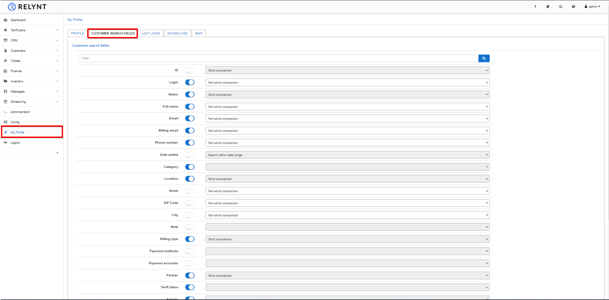
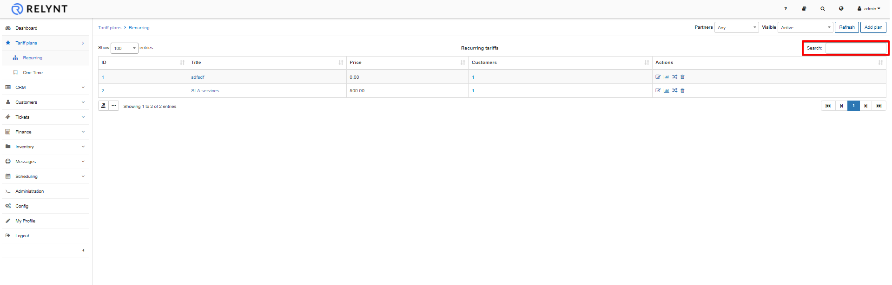
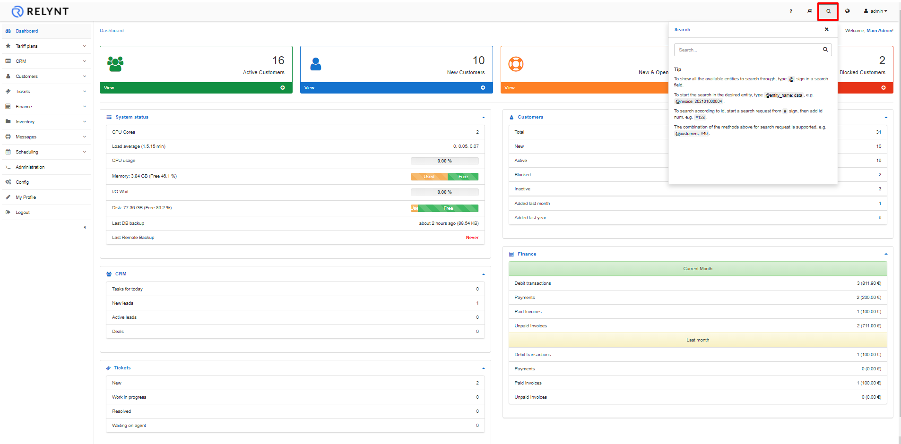

Search
==========

TWith convenience in mind we've added the Search function in the customer module as an additional means of searching for customers by specific parameters

## Customer search

To search for a customer, navigate to `Customers Menu → Search`. In the search window you can  perform a customized search that will query the customer database based on the specified parameters.

Here you will be able to use different parameters for searching, such as:

* **Login** - the login of the customer
* **Status** - the options are: New (not yet connected), Active, Inactive (doesn't use services), Blocked, Select all (to select all options).
* **Full name** - full name of the customer
* **Email** - email of the customer.
* **Billing email** - email used for billing of the customer.
* **Phone Number** - phone number of the customer.
* **Category** - the options are: Private person,  Company, Select all (to select all options).
* **Location** - location of the customer.
* **Billing type** - it can be Recurring Payments, Prepaid, Select all (to select all options).
* **Partner** - one of the partners created or all of them.
* **Tariff plans** - the tariff created
* **Service** - the options are: Internet, Voice, Custom.

For a more customizable search, you can navigate to `My Profile Menu → Customer` search fields and select different fields to search for in the customer search function.

## Search within a table

We can search for particular data inside any table in Relynt.
Use the search bar of every table and get the complete view as a result.

## Search in the whole system

Lastly we can also do a full text search in the system using the main search bar as shown below:

