Customer Portal
==========

The customer portal is the home of access to each customer's private accounts. Containing information on their services and hardware, financial aspects of provided services and much more.

Customers can also check their profile, latest news and updates, important documents including financial documents, contracts etc, as well as all messages received or tickets submitted for support in the customer portal.

The navigation pane in the customer portal can display the following Modules:

* **Dashboard** -  displays general information about the customers current balance, unpaid invoices or proforma invoices, new messages, new tickets and latest news.
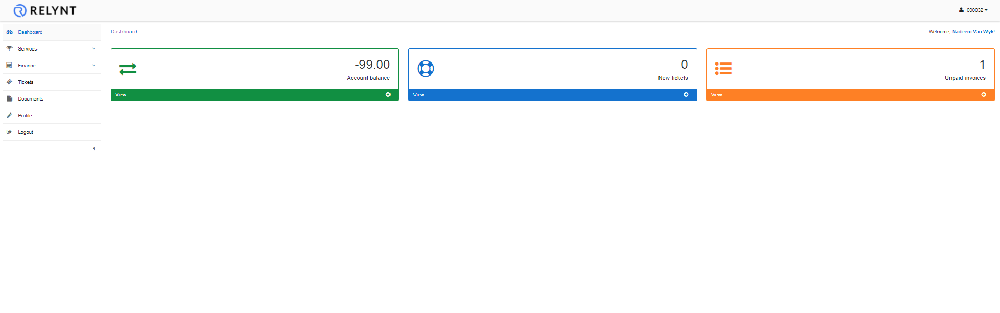

* **Services** - displays all the customer's recurring services and hardware if any has been assigned rented or sold to them.

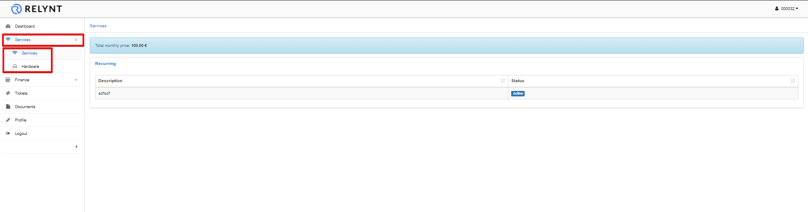

* **Finance** - displays financial information such as Invoices and Payments. Customer's can view the contents or the PDF version of the invoices, or download invoices and payments by clicking on the actions buttons provided in the Operations column of the relevant tables.

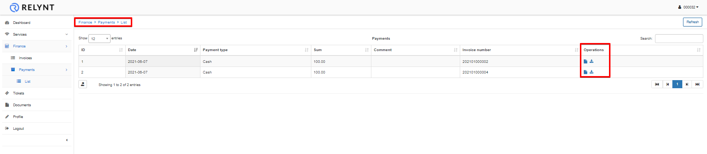

* **Messages** - displays all messages that has been sent to the customer via the Customer portal.
By clicking on the title of the message, customers can read their messages.

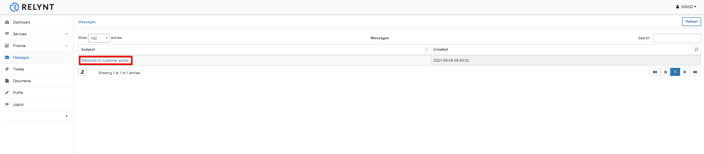

* **News** - displays latest news and updates for the customer.

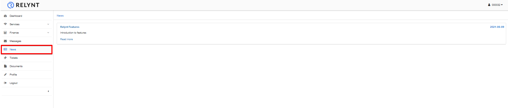

* **Tickets** - displays all tickets submitted by and for the customer, for technical support. By clicking on the *View* icon <icon class="image-icon">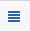</icon> in the Actions column, customers can read  and respond to their tickets.
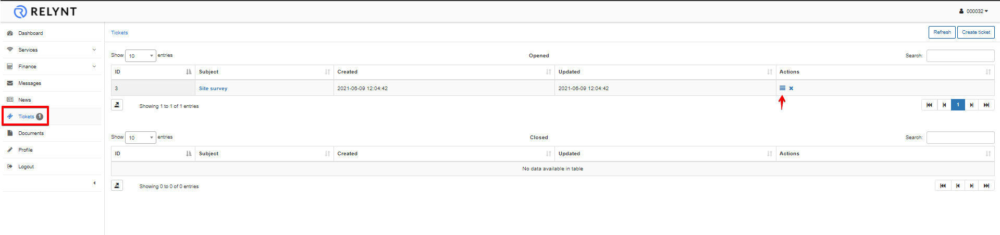

Customers can also create and submit new tickets by clicking on the button on the top-right corner of the page. The "Create ticket" window will appear, where customers can type the Subject of the ticket, choose a Priority, and type a message for their query. The ability to upload any files if necessary is available too.
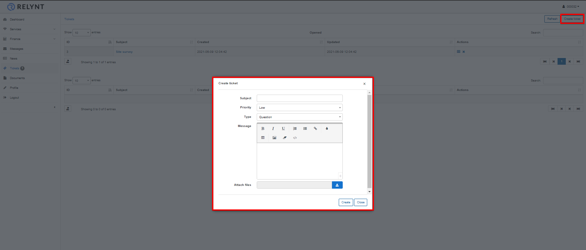

* **Documents** - contains any documents which can be important for a customer, such as Agreements, Additional Agreements, Certificates etc. Documents is divided into 2 sections, *Documents* and *Contracts*. Each header is relative to its meaning and legally binding properties. an Arrangement can be a document but when it contains legally binding terms and conditions which are to be agreed upon by each part with signatures, the document becomes a contract.
 Customers can view and download these documents from here by clicking on the *Download* icon <icon class="image-icon">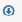</icon> in the Actions column of the table.

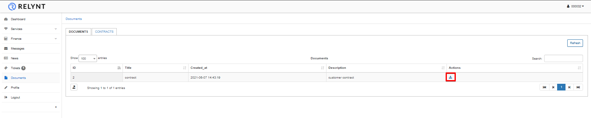

* **Profile** - displays the customer's main contact and access information.  If fields are marked in white, customers can change information provided in those fields, if they are dimmed, customers can only view that information.
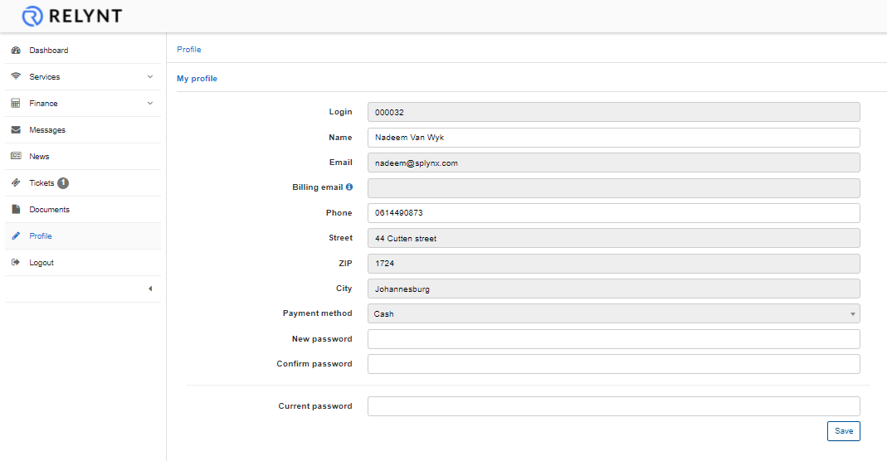

* **About** - Splynx contact information
* **Logout** - Logout from the customer portal

The **customer portal can be configured** according your preferences and your company needs. This can be done by navigating to `Config → Main → Portal`. The Portal confi is divided into two mennuas *General settings* and *Per Partner settings* The main sections that are configurable for the portal specifically are:

1. Main
2. Menu
3. Dashboard
4. Profile
5. Services
6. Tickets
7. Finance
8. Documents

For more information about configuring the Customer Portal please read our [Customer Portal](configuration/main_configuration/portal/portal.md) tutorial page.
