Bank statement processing
==========
The bank statement processing feature enables you reconcile payments receivable with invoices issued by paring them, so you can process multiple payments. Bank payment transactions are automatically processed by Relynt handlers – small modules created for each bank file format.

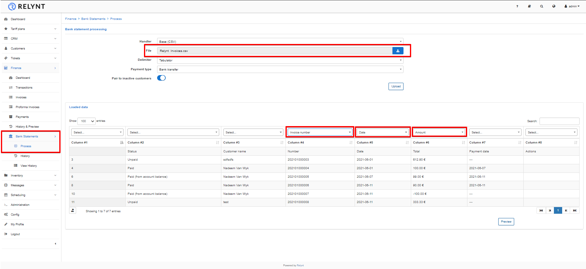
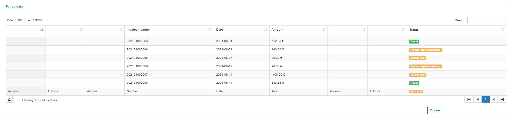

---
Bank statement processing begins by **importing bank statement format files** into Relynt and for each bank, a different handler can be used. We can also connect your bank to email processing bank statements.

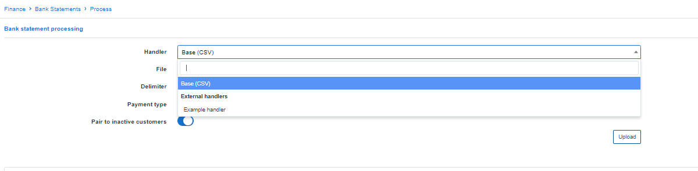
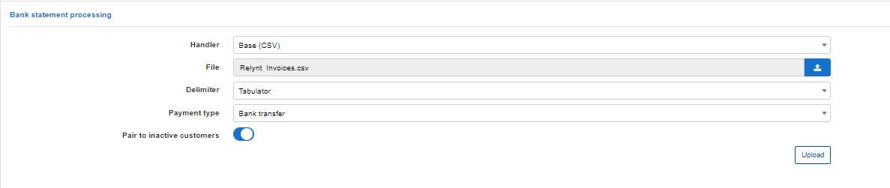

---
Once the file's been uploaded the next step is **to set up matching criteria** for the processing of the bank statement, then click on *Preview*.

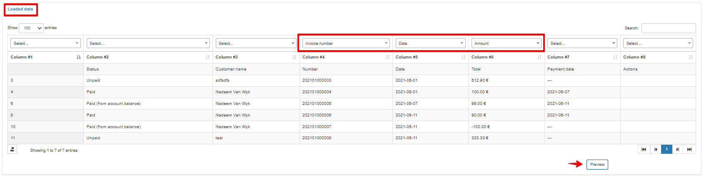

---
The table with paired data will appear where we can **check all matches** with payments and invoices. To finish the processing of multiple payments click on the Process button below the table.

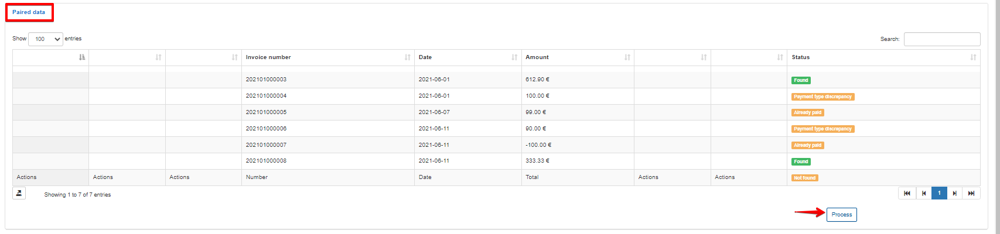

---
The message will appear that payments **paired successfully**. Then, in Bank Statements History (`Bank Statements → History`) you will be able **to check the downloaded file** with information in the table about the status of the bank statement importing, records, processed payments, and errors.

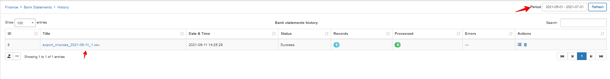

You can view processed payments from a particular bank statement more detailed. If you click on the View option <icon class="image-icon"></icon> in Actions or on a title of each file in the Title column, a window will appear with a description of every status of processed payment.

Payments with an Error or Ignored status can be checked and **paired manually** by clicking on the <icon class="image-icon"></icon> icon in Actions. Payments will be marked with an Ignored status when they've already been paid, but you can always double-check them and pair them manually.

When you click on the Manual pair icon <icon class="image-icon"></icon>, a new window will appear, where you can search for a customer by entering their ID, Login, Contact details, Partner, Status, etc, in the Customer section of the table. If the pairing fields does mot reveal any info related to the customer this can be found by simply looking at the processed satement again

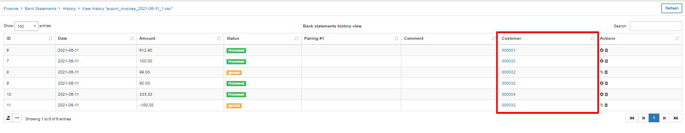

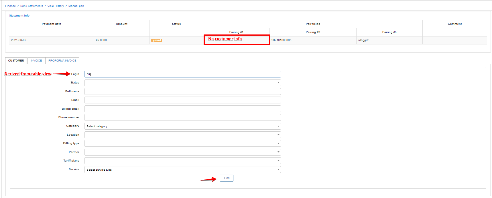

You can also search by entering the Invoice number or the Proforma Invoice number in the Invoice section or Proforma Invoice section of the table or check all invoices/proforma invoices for a particular period.

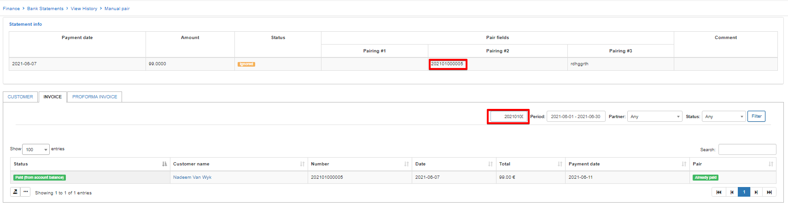

When you find a customer who's payment needs to be paired, click on the *Manual pair* icon <icon class="image-icon"></icon> in the Pair column of the table. The window will appear where you will confirm the paring.

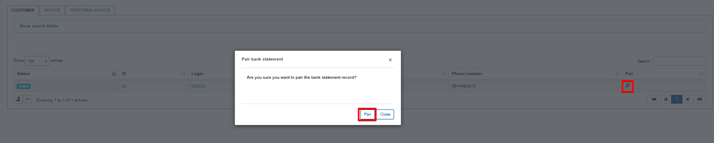

Once the manual paring is done, the status of the payment in a Bank statements history view (`Finance → Bank Statements → View History`) will be marked as *Manually paired*.
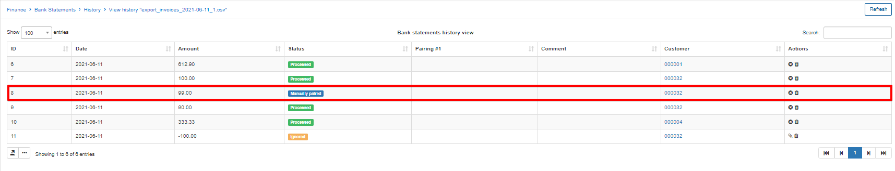
