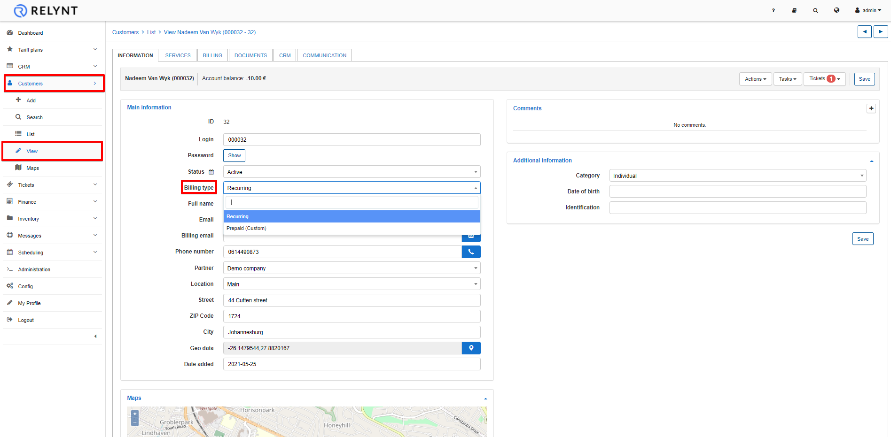
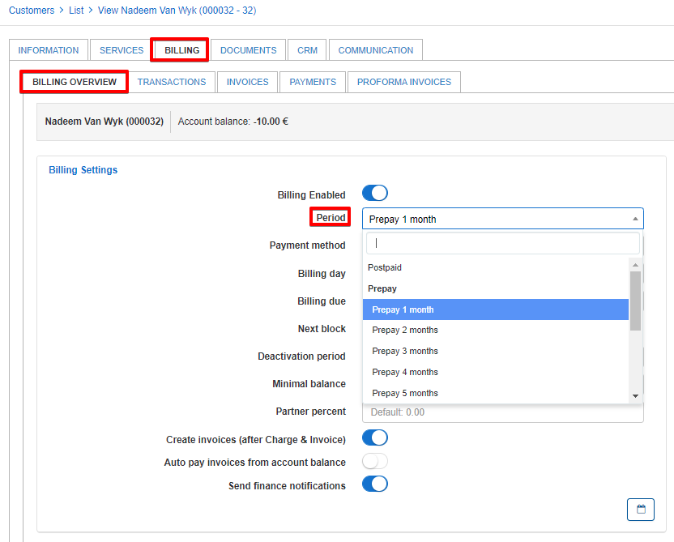
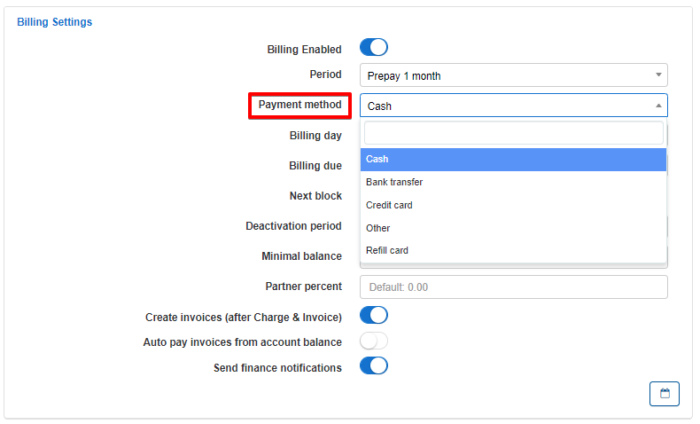
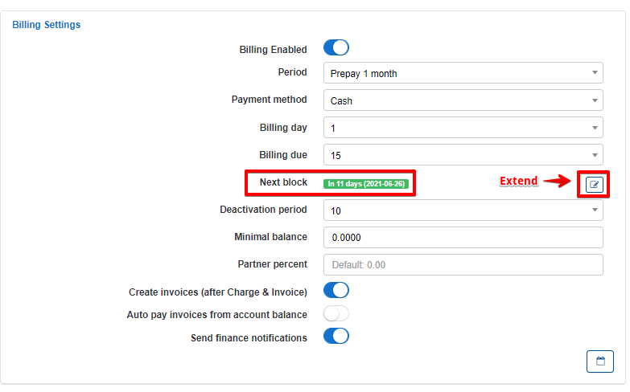
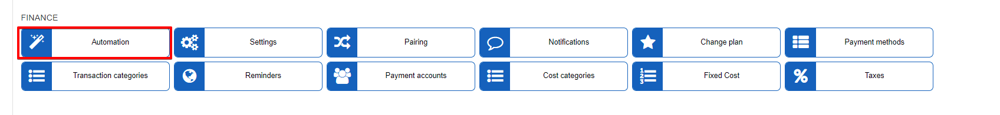
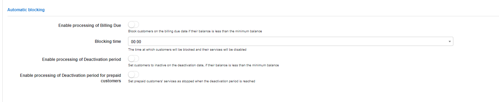
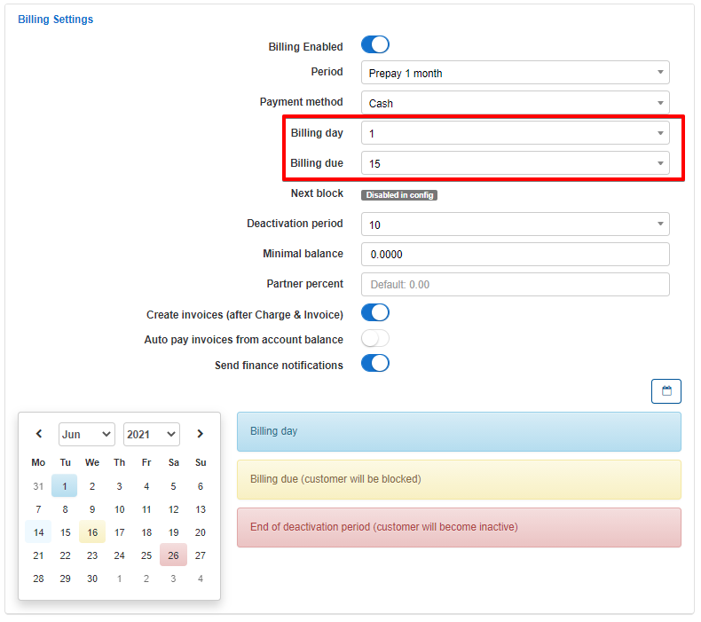
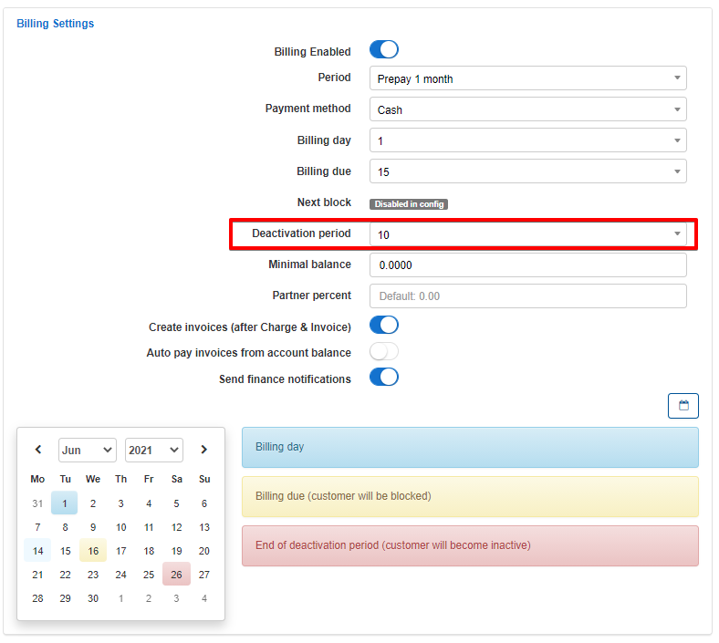
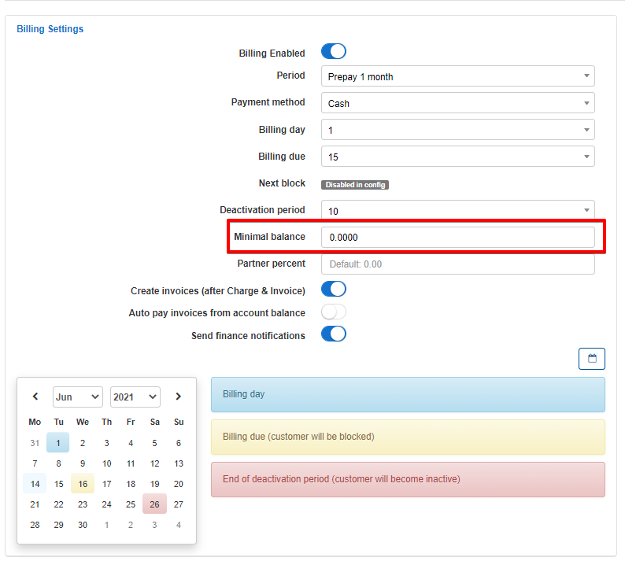

## Recurring billing engine

Recurring billing is the best solution for business charging customers' a fixed price on a recurring basis, typically at the beginning of the billing cycle. The Recurring type of billing is selected by default in the Relynt global configuration.

You can select the **recurring billing** type for a customer in the Customer Information section (`Customers → View`), by clicking on *Type of billing* option and choosing *recurring billing* as a type of billing.

---------
**Recurring Invoices** can be issued every month in advance by selecting *Prepay* in the period parameter or at the end of the month with *Postpaid* Mode.

The logic around prepay is, for example, on the 1st of May, Relynt will generate invoices for the period of 1 - 31 of May.

Postpaid means that Relynt will generate invoices on the 1st of May for the period of 1-30 of April.

Customers using the recurring billing type can be set to use Postpaid or Prepaid mode, by navigate to `Customers → View → Billing → Billing overview`.

In Billing settings, click on the "Period" drop-down parameter and select between Postpaid or Prepay mode with options to pay up to 12 months in advance in the prepay mode.

Choose a *Payment Method* for recurring billing, options available are Cash, Bank Transfer, Credit Card, other, or Refill Card, If the system has been integrated with any payment system or accounting platform those will be available in the list to select as well.

---------
The next step of setting up "Recurring billing" is to select the *Billing day*, *Billing due day* and an optional *Deactivation period*.

* **Billing day** - the day invoices will be generated automatically by the system. Options are 1-28 to account for the month of February without causing any issues in automation.

* **Billing due day** - the amount of days after the billing day the customer has to make payments before being blocked automatically.

* **Next Block** - this field will show you how many days the customer has left to make a payment after an invoice has been issued. This count derives from the billing due parameter and can be extended with the button provided:

* **Deactivation period** - the number of days after the billing due until the system will automatically mark the customer status as inactive and
In our example, we choose the 1st day of the month as the billing day and 15 days thereafter, as the Billing due day. This means that invoices will be generated on 1st day of the month and if the customer fails to make a payment before or on the 15th day of the month, the customer will be blocked and his services will be suspended.

***Please note that it is important to enable billing due and deactivation period processing under Config / Finance / Automation, for your automated blocking and deactivation periods to work as expected***:

* **Minimal balance** - the minimum amount funds to be available in the customer's account at all times, even after service charges, to avoid being blocked, this field is 0.0000 by default.

Bear in mind, although the customer is blocked and their services suspended, the system will still account for the services from a billing perspective.

The system will only stop accounting for customer billing when the status has changed to **inactive**.

These parameters can be specified per individual customer, however, it is possible to these paramaeters globally on the system un *Config / Finance / Settings*
