Invoices
==========

An invoice is a  document that specifies a transaction between a buyer and a seller.
If products or services were purchased on credit, the invoice usually specifies the terms of the deal, and provides information on the available methods of payment.
An invoice is also commonly referred to as a bill or sales invoice.

Relynt provides the ability to work with or without invoices.
Without issuing invoices, Relynt just receives payments and charges customers each invoice period without creating an official document. When invoicing is required, Relynt is able to generate invoices automatically, or an administrator can issue invoices manually.

Invoices can be created collectively or separately. Invoices are fully customizable in HTML handled in [templates](configuration/system/templates/templates.md) to produce PDF documents.

All documents generated in Relynt can be exported in different formats for printing or sending to the end-users.

* **All issued Invoices** can be found in `Finance → Invoices`. By using the filter provided, it is possible to display invoices by Period of time, Partner or Status (Any, Paid, Unpaid, Deleted). Beneath the list/table of invoices you'll find a totals table that displays a total of all invoices by their status, the number of invoices in each status and the total amount of money paid and unpaid in each status of invoices.

  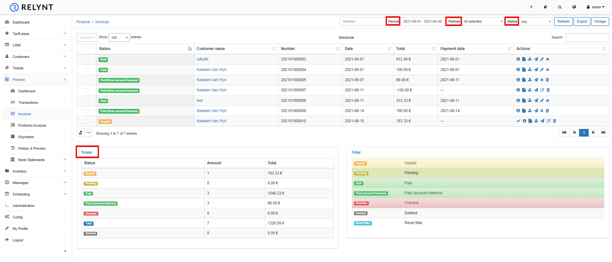

* **To print or to export the list of invoices** for accounting purposes, go to `Finance → Invoices` and click on `Export`.

  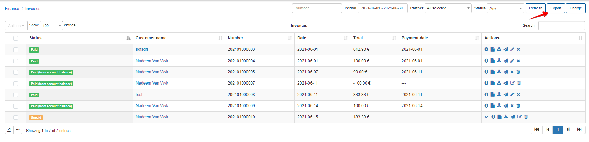

---
In the export window, you can choose the period of time and the export type/format (PDF, CSV, external handler, etc.).

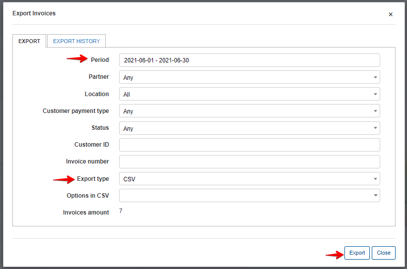

* There are a number of operations that can be executed with the icons in the "Actions" column, <icon class="image-icon">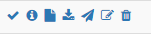</icon>.
* To view an invoice in a PDF format with the view icon<icon class="image-icon"></icon>, it is necessary to configure an invoice template first in `Config → System → Templates` and also to specify the use of the selected/modified template in `Config → System → Company information`.

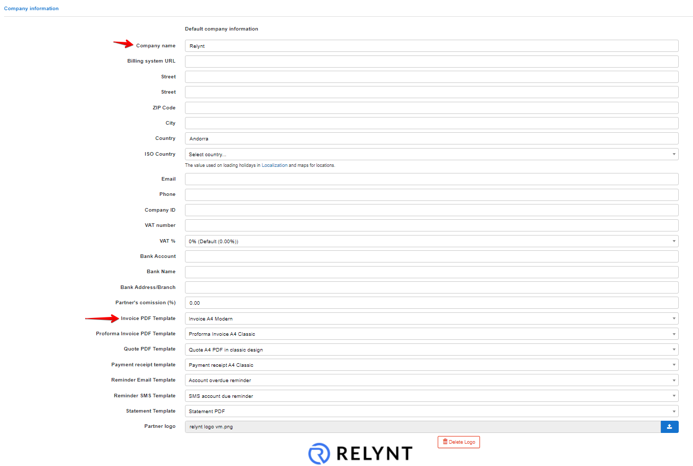

On the  **Company information** page, we define the partner and the PDF template (Invoice PDF example by default).
Once the PDF template is defined, it will be possible to view the invoice in PDF format.

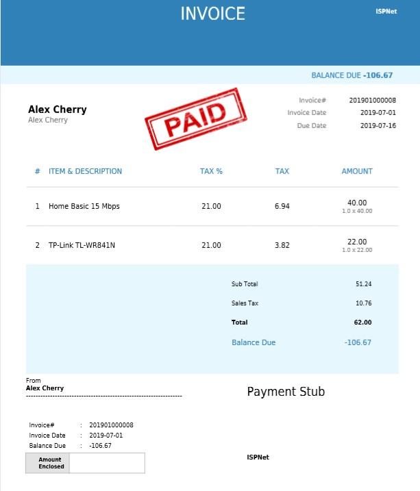

---

Finance formats displayed can be customized on the system, simply navigate to `Config → Main → Localization`,  to define the currency and other finance settings.

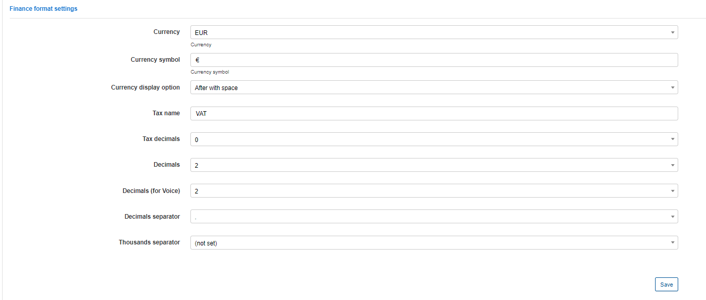

All templates on the system can be customized, by navigating to `Config / Templates /` Choose the type of templates to display/work with and simply edit or add a new template you wish to use:

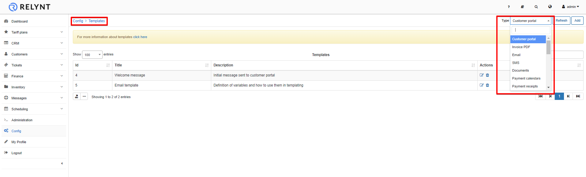

---
**Global billing settings** of invoices for all customers can be found in `Config → Finance → Settings`.

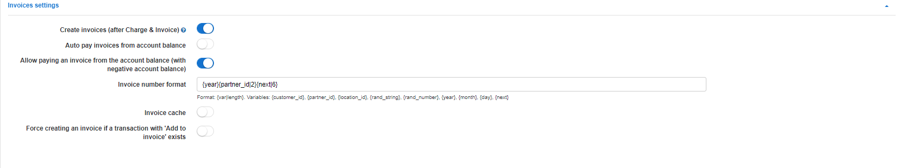

## Parameter descriptions:

* **Create Invoices(after Charge&iInvoice)** - with this option enabled Invoices will be issued automatically after charging the customer using the "Charge&Invoice" button in the billing overview tab of the customer;

* **Auto pay Invoices from account balance** - enables/disables the automatic paying of services from the customers account balance, you can enable this option if customers' payments are regularly made from their account balance;

* **Allow pay invoice from account balance(with negative account balance)** - enables/disables the ability to pay invoices from the customer's account balance when the customers balance is on or will be on a negative amount;

* **Invoice number pattern** - you can set up an Invoice number pattern here;

* **Invoice cache** - enables/disables invoice caching on the system, with this option enabled, all changes made will be visible only in new invoices, old Invoices will remain without changes;

* **Force create invoice if transaction "To invoice" exists** - enables/disables the creation of invoices from transactions with the "to invoice" option enabled.

_**Create Invoices(after Charge&iInvoice)** - with this option enabled Invoices will be issued automatically after charging the customer using the "Charge&Invoice" button in the billing overview tab of the customer;_

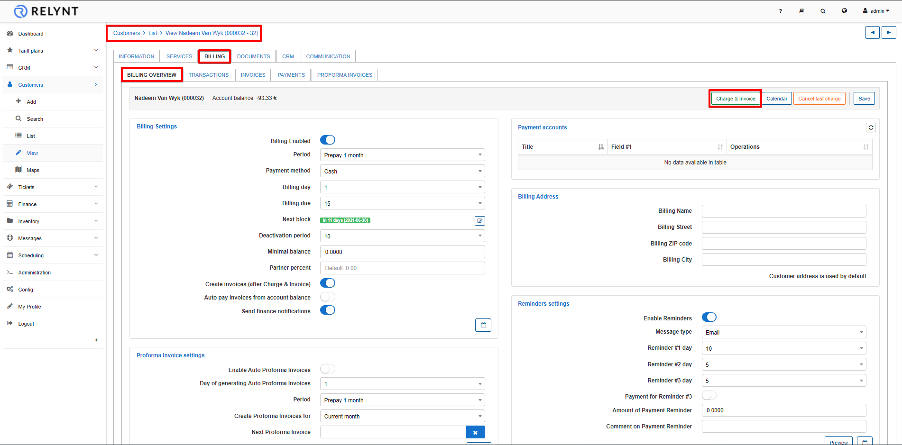

In Finance [Automation](configuration/finance/automation/automation.md) and [Notifications](configuration/finance/notifications/notifications.md) Settings it is also possible **to set invoice issuing automatically** and other parameters.

When the option *"Create Invoices (after charge & invoice)"* is not selected in Finance settings, this means the transaction is excluded from invoice creation and you will have to create invoices manually by firstly editing the transaction created when charging the customer, and enabling the to invoice option in the Transactions tab under `Billing → Transactions`:

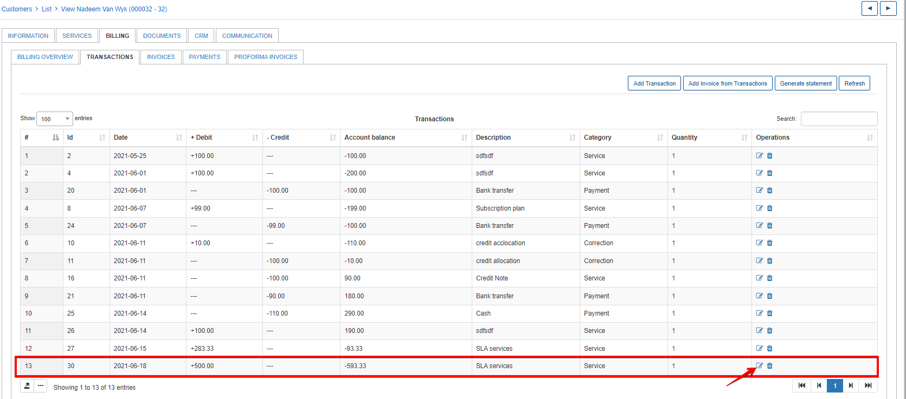

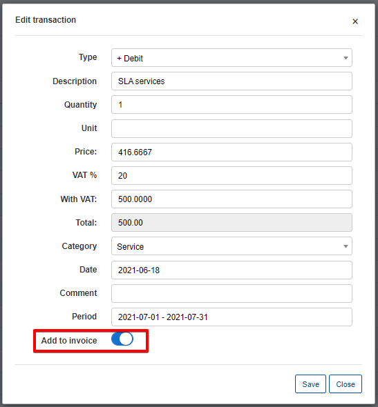

Then when clicking on *"Add Invoice from transaction"* in the Transactions tab under `Billing → Transactions` the transaction creating when charging the customer will automatically appear on the invoice.

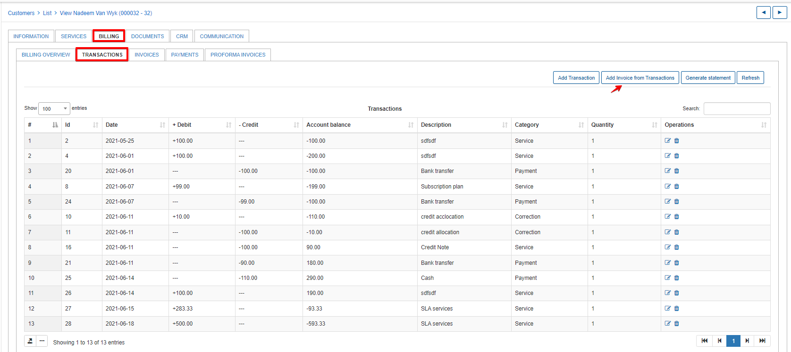

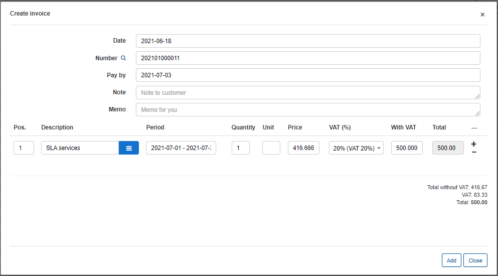

---
Other ways to **create Invoices** is to use the *Add One-Time invoice* or *Add recurring invoice* buttons in `Billing → Invoices`, where you can enable the **Use transactions** option, type a description and period of service, an optional note for the customer or memo for yourself. The recurring invoice option allows the creation of an invoice the will be issued on a recurring basis, separately from the global billing cycle.

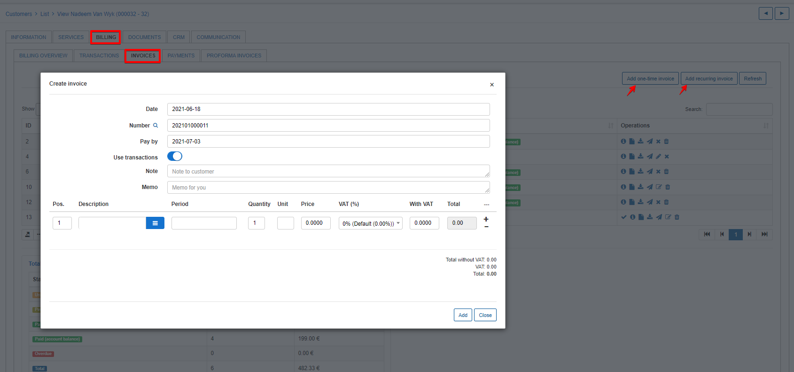

To edit an invoice with the <icon class="image-icon"></icon> icon, click on the tab `Billing → Invoices`.

It is also possible to send invoices via email with the <icon class="image-icon"></icon> icon (if the email server is [configured](configuration/main_configuration/email_config/email_config.md)) in `Billing → Invoices`.
You can write a message body or choose a template to populate it.

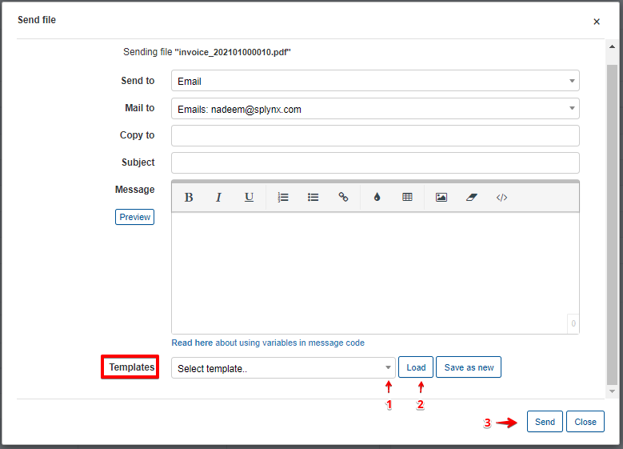

You can also type a new message body and save it as a new template.

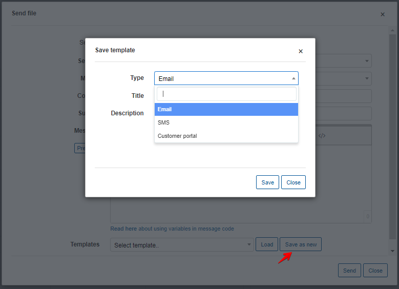
