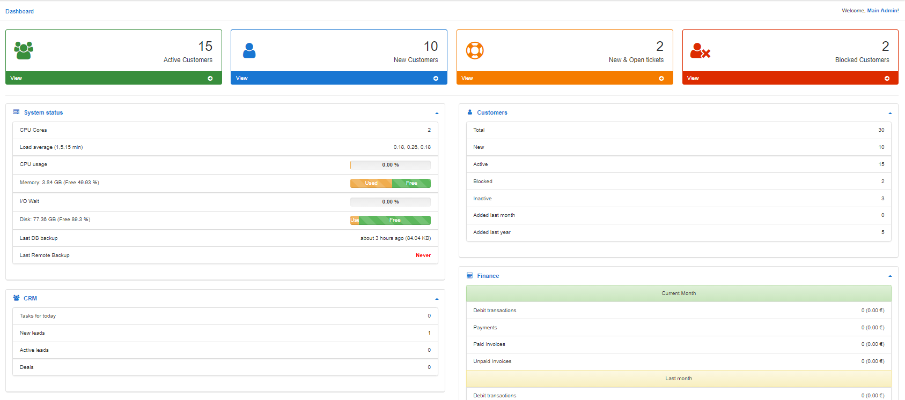
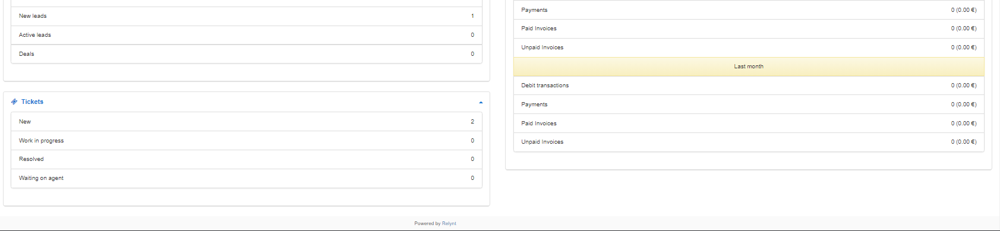
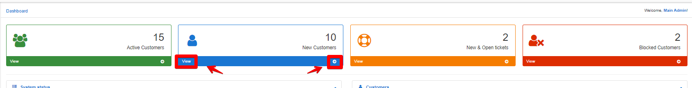
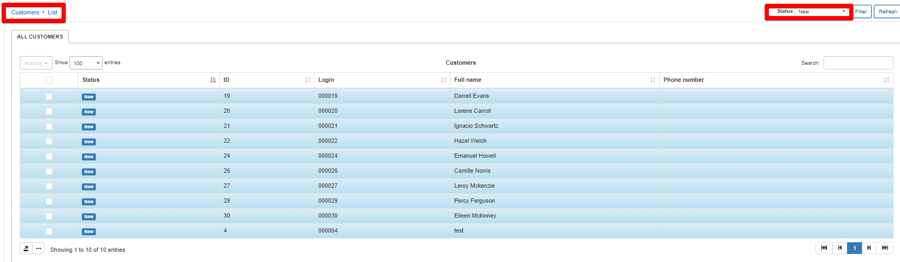
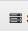
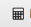

Dashboard
=========

The Dashboard in Relynt is a quick overview of the system with useful statistics on each of the modules.

At the top of the live dashboard you are presented with the number of Active customers, the number of new customers, new and open tickets, as well as the number of blocked customers. This information is summarized and displayed on info boxes and if you need more detailed lists of the data provided in the boxes, we've conveniently added view buttons to the boxes so you can quickly navigate to the full lists.

The **Live dashboard** is divided into 5 main sections:

_System status_ <icon class="image-icon"></icon> - displays information on free memory, last DB backup, last remote backup, etc.

_Customers_ <icon class="image-icon"></icon> - displays statistics about new, active, online, online today, blocked customers, etc.

_Finance_ <icon class="image-icon"></icon> - provides statistics of unpaid/ paid, debit transactions and payments for the current and last month.

_CRM_ <icon class="image-icon"></icon> - displays a count of all leads, quotes and deals on the system.

_Tickets_ <icon class="image-icon"></icon> - provides a quick list of tickets grouped by their status.

The navigation pane located on the left side of the page presents following modules:

[Tariffs](configuring_tariff_plans/configuring_tariff_plans.md) - The home of all your services and products in the system.

[CRM](crm/crm.md) - Your prospective client management platform.

[Customers](customer_management/customer_management.md) - Your customizable list off all customers in the system.

[Tickets](tickets/tickets.md) - Your in-house ticketing system and the home of your support communications.

[Finance](finance/finance.md) - Your business in a financial aspect.

[Inventory](inventory/inventory.md) - Physical products and equipment is managed here.

[Messages](support_messages/support_messages.md) - Your support communications system for all your customers.

[Scheduling](scheduling/scheduling.md) - Your technical staff manager.

[Administration](administration/administration.md) - The administrative page of your relyntserver.

[Config](configuration/configuration.md) - Where all configurations for each module is done.

[My profile](my_profile/my_profile.md) - A profile page of the administrator currently logged into the system.

Logout - Logout from the system.
