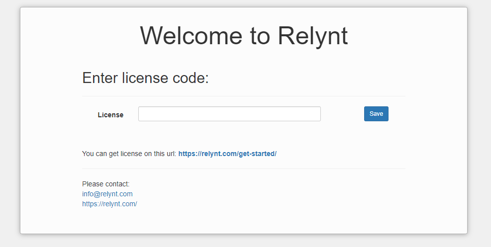

Install Relynt 
============================

**Base requirements:**

**_Clear_ Ubuntu server.**

**Supported OS: Ubuntu 20.04 (server)**

Login to your server via CLI, as root:

For Ubuntu, use the following command to gain root access:

```bash
sudo su
```

Timezone configuration:

```
dpkg-reconfigure tzdata
```

Install:

```
wget -qO- https://deb.relynt.com/setup_3_1 | bash -
apt-get install relynt
```

To Update CA certificates for HTTPS, use the following commands:

```bash
apt-get install ca-certificates
update-ca-certificates
```


To finish the installation process, please type the following order of URL in a browser - http://ip_address/admin (where ip_address is, replace it with the IP address of your Relynt server), add your license key and save it



After applying your license, you will be redirected to the "Finish setup" menu (you can skip this part but we highly recommend completing these steps to complete the initial set up of your Relynt server):


To Update your server:

**Upgrade:** Supported OS for upgrade: Ubuntu 20.04 (server) (relynt version 3.1)

```
apt update
apt install relynt-7.4
```
**Update:**

```bash
apt-get update
apt-get dist-upgrade
```

#### Important notice!

If you make an error when entering your license code, or mysql root password you can re-enter it with:

```bash
dpkg-reconfigure relynt
```

Video tutorial:

<iframe frameborder=0 height=270 width=350 allowfullscreen src="https://www.youtube.com/embed/0IdjPwPT9Mo">Video on youtube</iframe>
