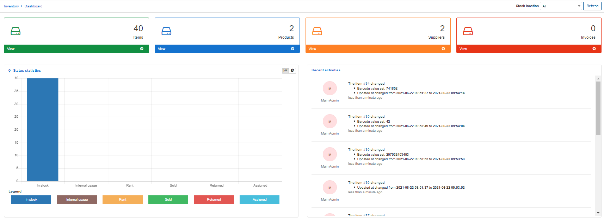

Inventory Dashboard
==========

The Inventory dashboard provides an overview of all activities within the module.

Quick access boxes for - **Items**, **Products**, **Suppliers**, **Invoices** is provided, which, upon clicking, will direct you to the appropriate sections. The numbers on these boxes show the number of elements in the corresponding sections.

The **Recent Activities** stream shows us live information about changes statuses and change the number of products.

A bar/pie chart - **Status statistics** displays us information about the item's statuses of products.

The entire dashboard can be filtered by Stock location as well.

