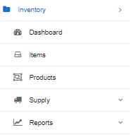

Inventory
=======

Our built-in inventory feature allows you to store and account for information about equipment and other products. It stores the information about your suppliers and product vendors.

The inventory enables you to track the movement of your inventory items and always be able to locate where its is, who it was sold to, rented to or simply supplied to.

This system is divided into:
 
* Products and Items:
 

* [ Dashboard](inventory/dashboard/dashboard.md)

* [ Items](inventory/items/items.md)

* [ Products](inventory/products/products.md)
 
* Supply:
 
* [ Suppliers](inventory/suppliers/suppliers.md)

* [ Supplier invoices](inventory/supplier_invoices/supplier_invoices.md)

* [ Vendors](inventory/vendors/vendors.md)

* [Reports](inventory/reports/reports.md)

