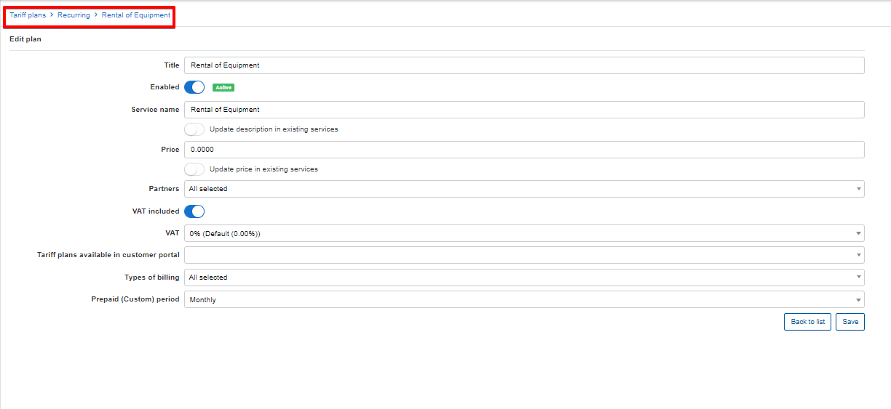

Items (of products)
==========

This is the home of each individual item of all of your products, where we can manage them and add new one items.

You can edit or add additional information by clicking on the edit button in the actions column.

While editing you can change Stock location, add or edit Barcodes and serials.
If you add some photo for the item, it will override a «global» photo of a product (if product has it).
You can to even change the cost price of the item and add/edit Notes.

To add a new item just press the button "Add" and select the needed option for one or multiple items.

If you wish to manage/interact with an(s) – Simply select it <icon class="image-icon"></icon> and click on the **"Actions"** button <icon class="image-icon"></icon> to select one of the desired options.

* **Internal usage** – the item is used by your organization. You can assign it to an administrator who will be responsible for the stock and any notes relative.

* **Sell** – sell the item to the customer. If Toggle "Add invoice" is on you will add the transaction and invoice at the same time. If Toggle "Add invoice" is off you will add only the transaction. This transaction will be included in the invoice that is generated once per period with other services.
Choose the customer, edit what you need and press «Sell»

* **Rent** – rent the item to a customer.
Before you can rent an item to a customer – it is necessary to create a recurring tariff for this service! (`Tariff plans/Recurring/Add plan`)

Then to rent an item – return to the items list, select it, click the actions<icon class="image-icon"></icon> buttons and select  «Rent».

1. Choose the customer;
2. Select rent plan;
3. Edit any if the fields for as per your requirements and click on «Rent»

The Rental service will be added to the selected customer's services tab and it will appear in the hardware section on the main information page:

* **Return** – return the item to the stock

You can return the item to the stock if it has status «in usage» (rent, sold, internal usage).
If you need, you can select statuses (New, Broken).
Select item(s) choose status and press «Return».

  

* **Move to other stock location** - simply assign the s=item to a different stock location. Stock locations can be configured under [Stock locations](configuration/inventory/stock_locations/stock_locations.md)

* **Enter Barcodes** - this step can be done at a later stage if it was missed initially when adding the item

* **Enter serial numbers** - this step can be done at a later stage if it was missed initially when adding the item

All possible statuses of items are: `In stock, Internal usage, Sold, Rent, Assigned to customer`
You can also view the history of each item. To do this simply click on the history button <icon class="image-icon"></icon> in the actions column.

For an video tutorial of inventory kindly follow the link below::
<iframe frameborder=0 height=270 width=350 allowfullscreen src="https://www.youtube.com/embed/KY_Qq-1VxMg?wmode=opaque">Video on youtube</iframe>
