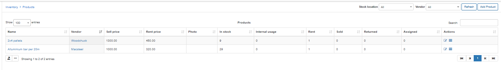
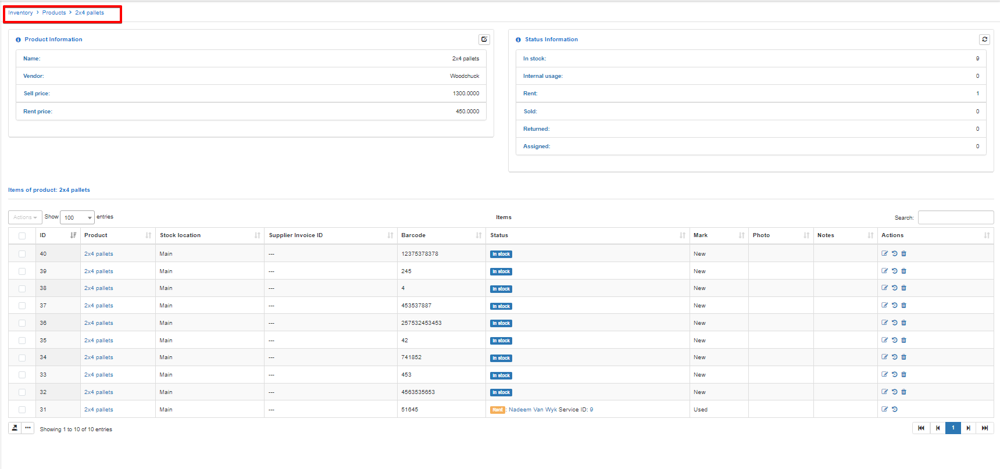
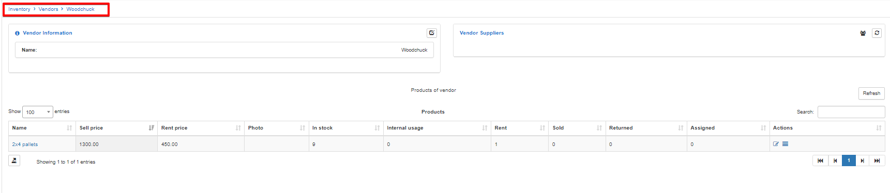
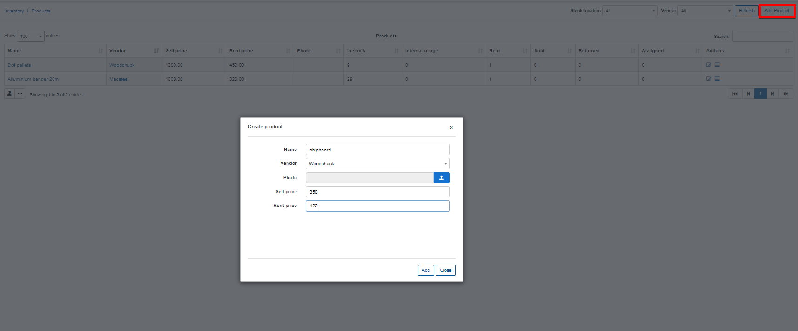

Products
==========

This section displays all the products that are in the system, and the ability to add a new product as well.
The table can be filtered by Stock location and Vendor filter.

If you click on a specific product, you will be redirected to the Product page.

If you click to a specific product vendor, you will redirect to the Vendor page.

You can create a new product by clicking on the «Add Product» button on the section

* **Name** – specify the product’s name
* **Vendor** – specify the vendor of the product. (if a relative one has already been created)
* **Photo** – upload a photo of the product. It will appear in the list of items
* **Sell price** – specify the default price for the sale of this product to customers.
* **Rent price** – specify the default price for the rental of this product to customers.
