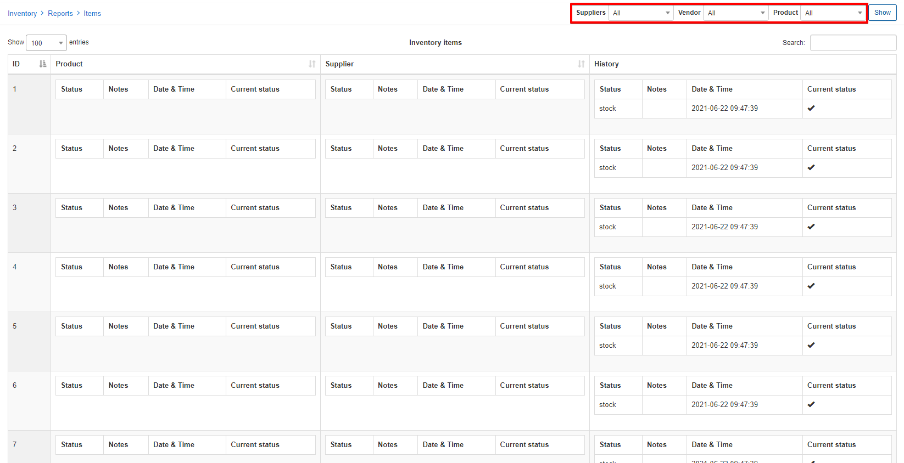

Reports
==============

Reports under the inventory module displays simple reports on sold and rented items as well as a quick report of all items on the system.

Rented and Sold items will give you a report on all sold and rented items according to the parameters you specify:

Items will give you a detailed report of all items in the system according to the parameters specified in the filter:

Each of these tables can be exported in a format of your choice from those available with the export button found at the bottom of each table:

