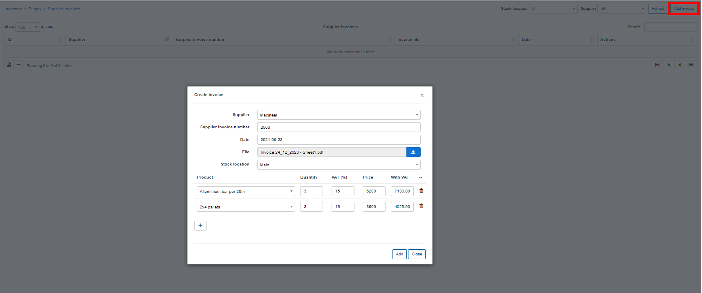
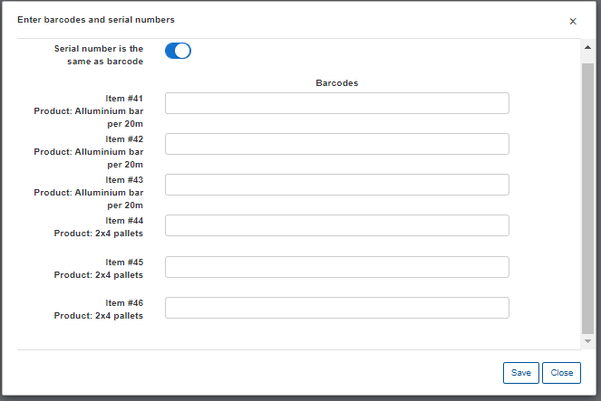
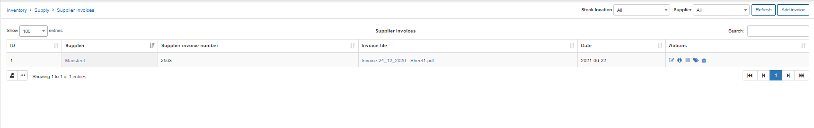
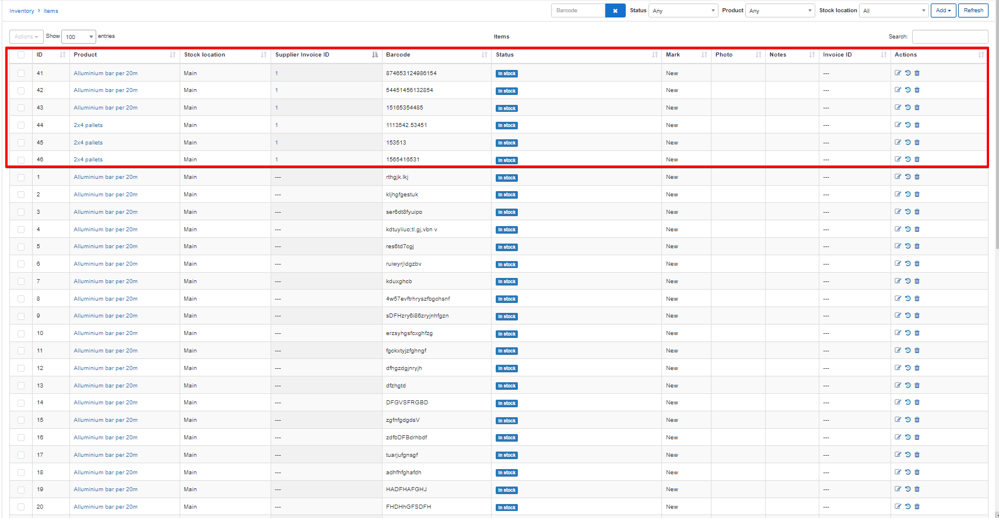

Supplier invoices
==========

Together with taking account of your costs, products/items can be added to the system using supplier invoices.

Simply click on the «Add invoice» button and specify the relative data in the fields provided fields.

* **Supplier** – select a supplier. This is obligatory.
* **Supplier invoice number** – specify the Invoice number from supplier. (Not necessary)
* **File** – if you have the invoice file (an image or a document) you can upload it here. It’ll be downloaded to the system upon completing the Add supplier invoice process, you can view or download it as per your requirements.
* **Product** – select an existing product. Or you can type new product name and product will be created automatically.
* **Quantity** – specify the number of items to add to the system
* **Price** – specify the cost price of these products/items.

Upon clicking on add, a new window will appear for you to enter the barcodes/serials for each of the items of the invoice.

This can be entered by manually typing or using a plug and play barcode scanner.

After creating the invoice and specifying the barcodes the items of selected products will be added to the system with an **In stock** status, and the invoice will be recorded under the Supplier invoices menu:

