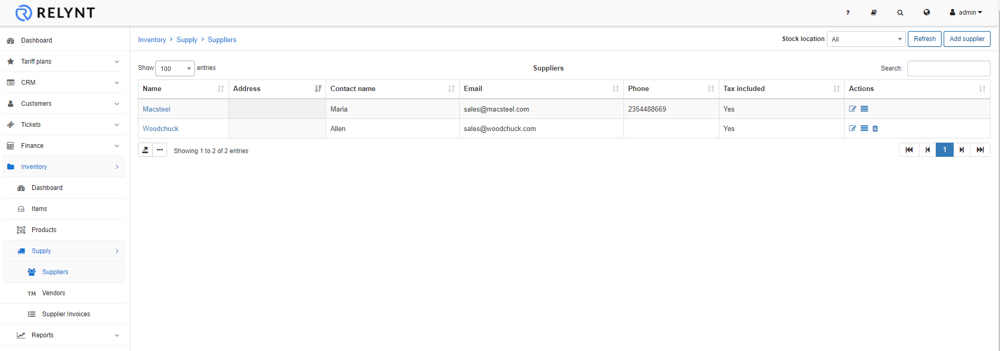
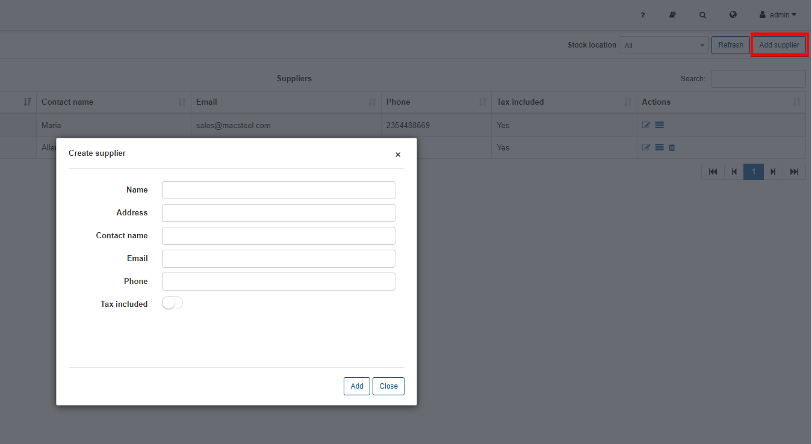
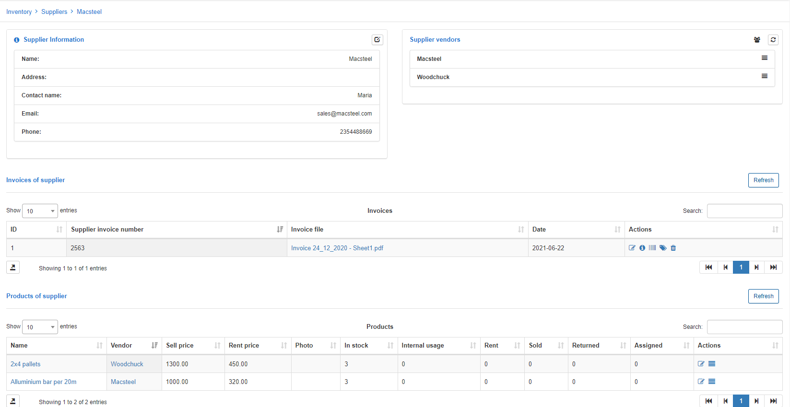

Suppliers
==========

In this section we can display add all suppliers of inventory to your business.

You can create a new supplier by clicking on the *«Add supplier»* button:

You can then specify the details of the supplier and simply click on add.
The name field is the only mandatory field to complete and you can also select whether tax is included or not for any invoice that will be added for this supplier

If you click on a specific supplier you will be redirected to the Supplier page, where you can see the supplier details, vendors, supplier invoices and products.

   

Once a supplier has been added and products has been added from the supplier, you will not be able to delete the supplier. All products/items will first have to be removed to delete a supplier.
