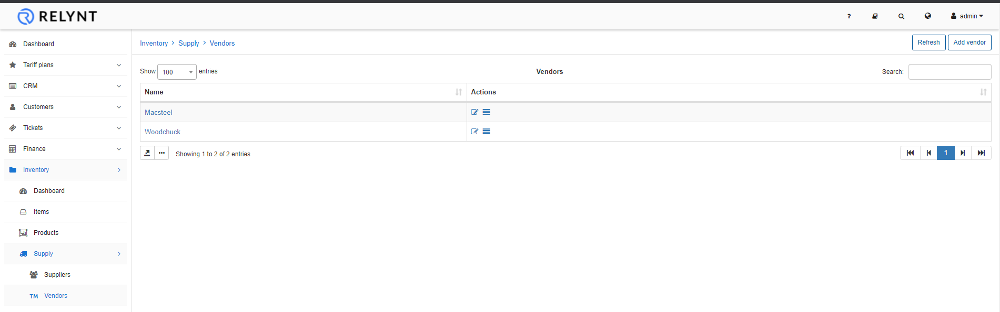
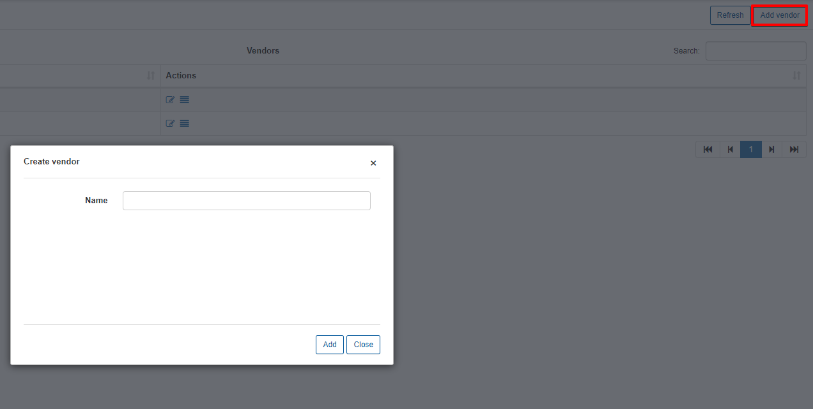
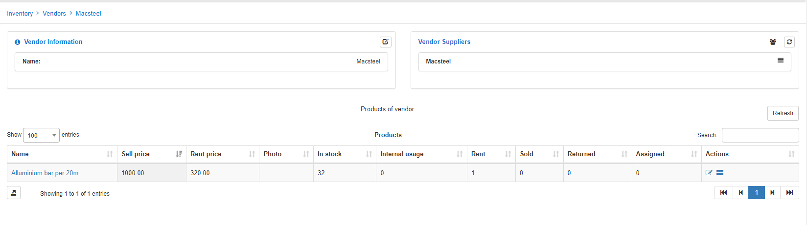

## Vendors

This section shows you all vendors and allows you to add new Vendors.

You can create a new vendor by clicking on the «Add vendor» button

Simply type the name of the vendor and click «Add»

Vendors cannot be removed if it has Items assigned to it on the system.

If you click on the Vendor's name, you will be redirected to the Vendors page. On this page you can see the products of the vendor as well as the Suppliers that sell the Vendors product.

