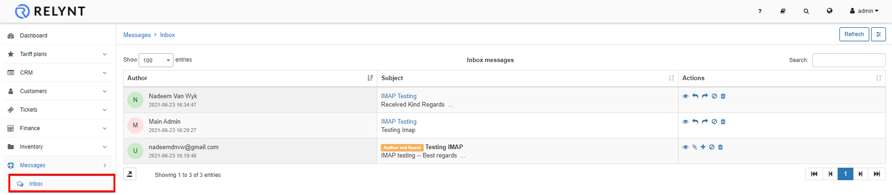
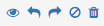
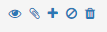

Inbox
=========

The inbox section of the Messages module will display all incoming mails of the current administrator **only if the IMAP** section of the administrator in the **My Profile** menu has been configured.

For more information on configuration IMAP, click - [here](my_profile/imap/imap.md)

All inbox messages can be interacted with the icons in the actions column.

Actions available for **registered** emails are:

* *View message*
* *Reply*
* *Forward*
* *Block sender*
* *Deleted message*

Actions available for **unregistered** emails are:

* *View message*
* *Pair to existing customer*
* *Add as new customer or lead*
* *Block sender*
* *Deleted message*
