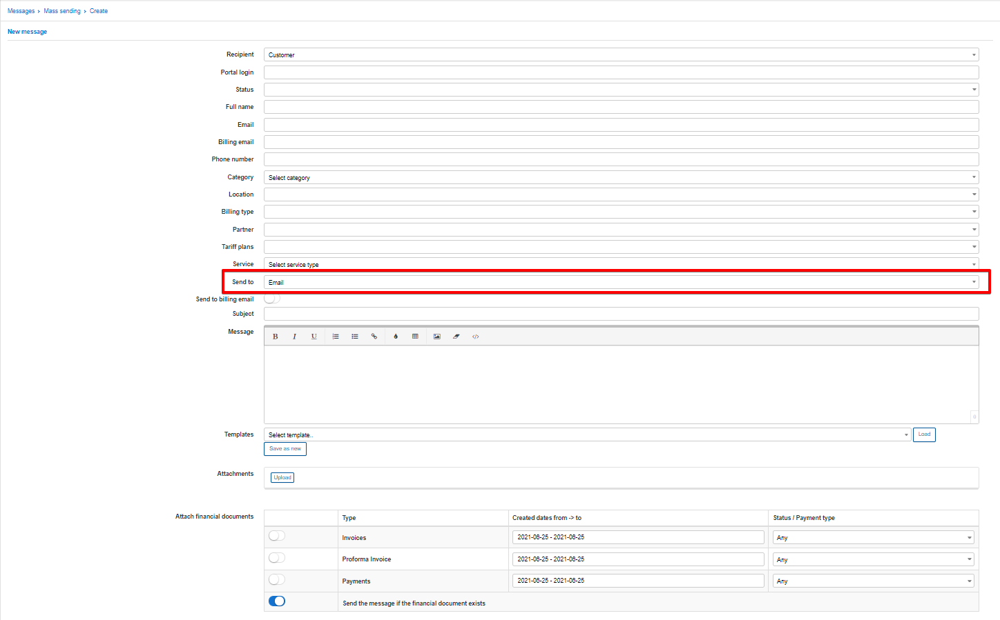
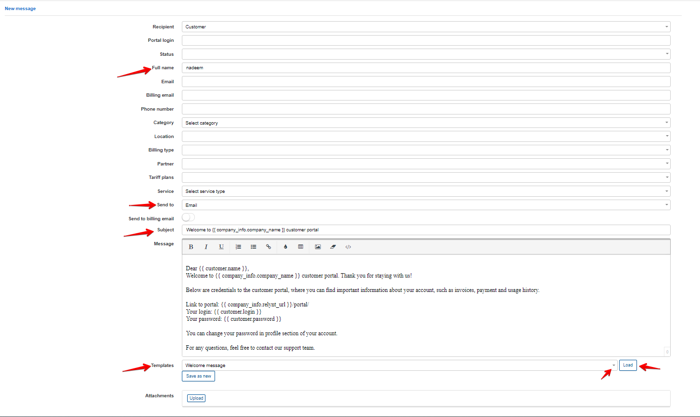
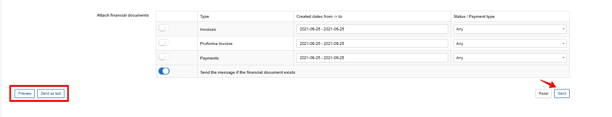
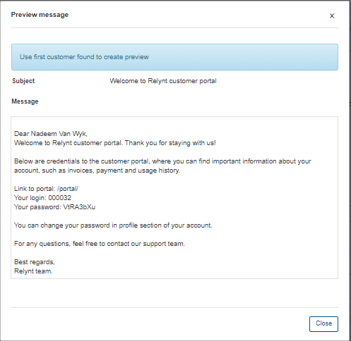
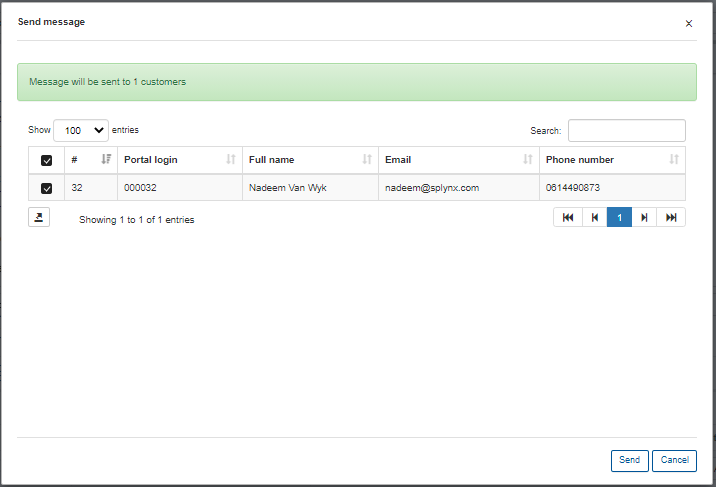
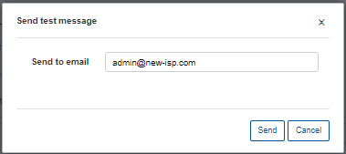
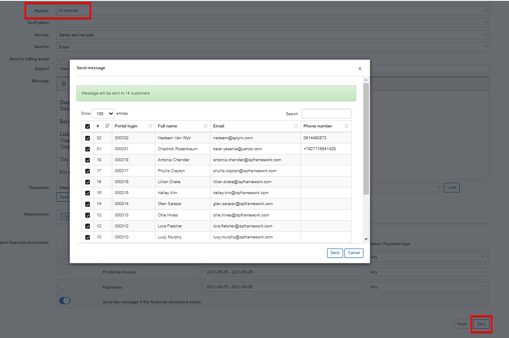
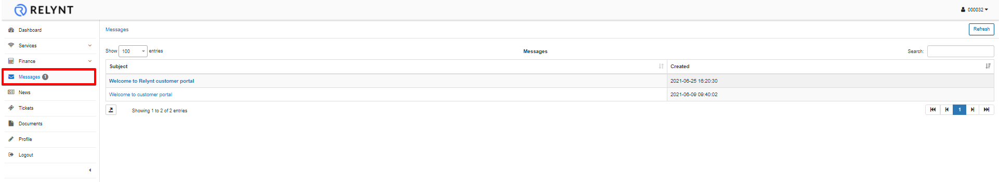
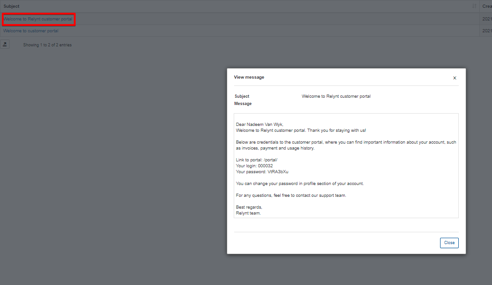
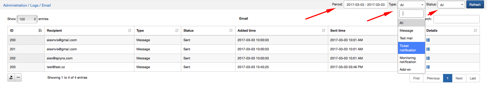

Email messages
==============

To send and email message, simply select email as the value in the **Send to** field as shown below:

It is necessary to configure email sending on the system first under `Config → Main Configuration → Mail` to be able to send emails to customers. For more information on email configuration click - [here](configuration/main_configuration/email_config/email_config.md).

Parameters

* **Recipient** - select the type of recipients options are *Customer or Lead*

* **Portal Login** - customer login for the portal

* **Status** - select a status (New, Active, Inactive, Blocked) of the customer(s)

* **Full name** - full name of the customer

* **Email** - email of the customer

* **Billing email** - email of the customer specified and used for billing purposes

* **Phone number** - phone number of the customer

* **Category** -  could be Private person or Company

* **Location** - location of the customer

* **Billing Type** - select between Recurring or Prepaid

* **Partner** - partner, service provider of the customer

* **Tariff plans** - all available tariff plans in tariffs

* **Service** - select a service type

* **Send to** - the options are: Email, Customer portal, Customer portal & Email, SMS

* **Send to billing email** - select to send specifically to the billing email address of customers

* **Subject** - Subject of the email

* **Message** - Body of the message

* **Templates** - Templates of Customer portal and Mail templates can be used.

* **Attachments** - individual attachments

* **Attach financial documents** - Invoices, Proforma Invoices and Payments from Relynt.

It is not necessary to fill in all fields to send an email to the customer. The easiest way is to enter the customer's name(s), select the "Send to" option, type a Subject and write a message.

 You can also populate the message body from templates. You can also type your own message and save it as a new template by clicking on "Save as new". There is also an option to attach financial documents of the customer (invoices, proforma invoices and payments receipts).

You can view your messages before sending it by clicking on the Preview option at the bottom of the page.

When you click on the Send button, a window will appear with the confirmation details of the recipient.

If you click on Send as test, a window will appear where the email address, number or customer has to be entered according to the send to selection.

There is also an option of mass sending, for example, you can choose particular recipients by Partner or Location.

If you choose the sending option as Send to Customer portal or Customer Portal & email, customers will be able to read the email in their portal in the Messages section, where all incoming emails will be shown.

By clicking on the Subject of the message, the can read the message with the attachment enclosed, if any.

All messages that were sent in Relynt via the messages function can be viewed under `  Messages → Mass sending → History`.

Relynt keeps a full record of emails sent by the system, with customer IDs and Email addresses in `Administration → Logs → Email`, where you can select a particular period, type of email message or status of data to display.

