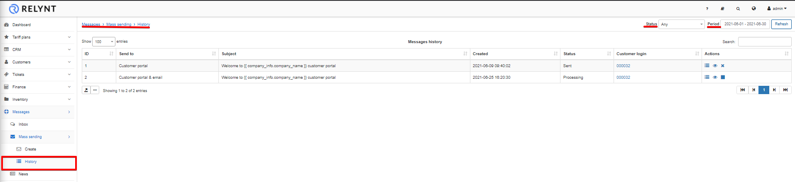
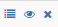
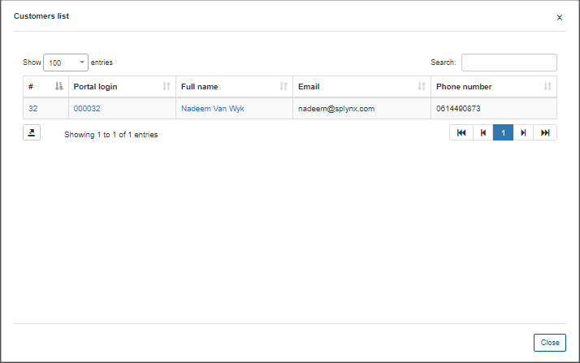

History
==============

It is possible to track all messages that were sent in Relynt via the messages function by navigating to `  Messages → Mass sending → History`. You can sort all items by their status (Any, New, Processing, Sent, Cancelled, Removed, Sent with error) or a period of time (Today, Yesterday, Last 7 days, This month, Last month, Custom Range).

By clicking on the actions buttons <icon class="image-icon"></icon>, you'll be able to see the list customers' (in case of mass sending it will be a full list with customers' names), view the email or delete it.

