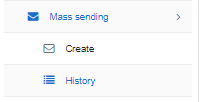

Mass sending
============

Relynt integrates with Email servers and SMS gateways for communication. In this section we can create individual, specified or mass sending of Email or SMS messages to customers.
We can also view the history of all communications sent out via the mass sending feature.

Messages sent to customers can be typed manually or by using different templates and attaching financial, or other documents in the system.

Please follow the links below for more details of each section respectively:

* [Email messages](messages/mass_sending/email_messages/email_messages.md)

* [SMS messages](messages/mass_sending/sms_messages/sms_messages.md)

* [History](messages/mass_sending/history/history.md)
