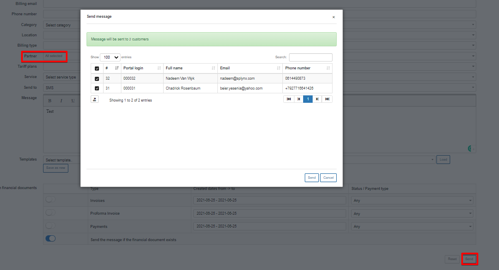

SMS messages
============

To send messages via SMS, simply select SMS in the **Send to** parameter

It is necessary to configure SMS sending on the system first under `Config → Main Configuration → SMS` to be able tp send SMS's to customers. For more information on SMS configuration click - [here](configuration/main_configuration/sms_config/sms_config.md).

* **Recipient** - select the type of recipients options are *Customer or Lead*

* **Portal Login** - customer login for the portal

* **Status** - select a status (New, Active, Inactive, Blocked) of the customer(s)

* **Full name** - full name of the customer

* **Email** - email of the customer

* **Billing email** - email of the customer specified and used for billing purposes

* **Phone number** - phone number of the customer

* **Category** -  could be Private person or Company

* **Location** - location of the customer

* **Billing Type** - select between Recurring or Prepaid

* **Partner** - partner, service provider of the customer

* **Tariff plans** - all available tariff plans in tariffs

* **Service** - select a service type

* **Send to** - the options are: Email, Customer portal, Customer portal & Email, SMS

* **Subject** - Subject of the email

* **Message** - Body of the message

* **Templates** - Templates of Customer portal and Mail templates can be used.

* **Attachments** - individual attachments

* **Attach financial documents** - Invoices, Proforma Invoices and Payments from Relynt.

It is not necessary to fill in all fields to send an SMS to the customer. The easiest way is to enter the customer's name(s), select the "Send to" option, type a Subject and write a message.

 You can also populate the message body from templates. You can also type your own message and save it as a new template by clicking on "Save as new". There is also an option to attach financial documents of the customer (invoices, proforma invoices and payments receipts).

You can check your SMS message before sending by clicking on the Preview option at the bottom of the page.

When you click on the Send button, a window will appear with the confirmation details of the recipient.

If you click on 'Send as test'  a window will appear where customer's Phone number has to be entered.

There is an option to send mass SMS's, for example, you can choose particular recipients by Partner or Location.

All messages that were sent in Relynt via the messages function can be viewed under `  Messages → Mass sending → History`.

Relynt keeps a log of all SMS's sent on the system listed by customer names and Phone numbers in Administration → Logs → SMS, where you can set a particular period, type of SMS or status of data to display (New, Sending, Sent, Error, Expired).

