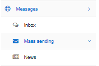

Message
============================

The messages module in Relynt is used for communication with customers. This where mass messaging can be executed to notify all customers or customers of a particular criteria for any relevant reason. Incoming messages can also be viewed and interacted with here, when inboxes are configured. We always have the ability to create news letters to publish to customers via the customer portal.

Descriptions of each section can be found on the links below:

* [Inbox](messages/inbox/inbox.md)

* [Mass sending](messages/mass_sending/mass_sending.md)

* [ News](messages/news/news.md)
