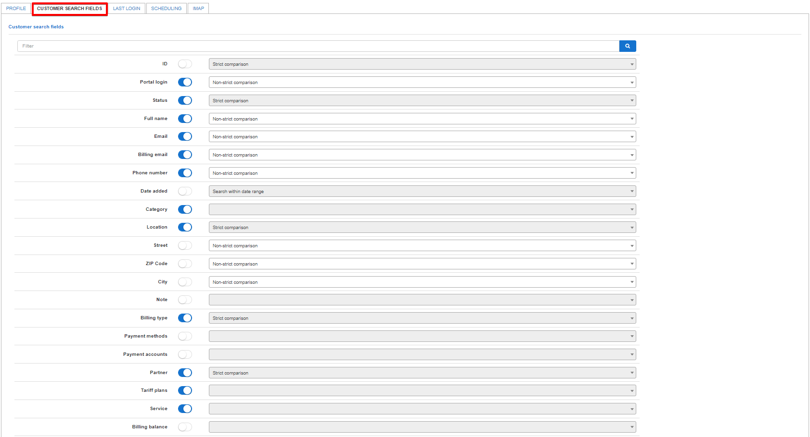

This section allows administrators to customize which fields are available to use when searching for customer's with the search function under the Customers module.

By simply enabling or disabling the provided fields, the configuration of these fields will determine if it will be included or excluded in the search function.

Selected fields can also be made to have a strict comparison to the details entered when searching.

If any changes were made here, please remember to save configurations so that it can be applied.
