Personal IMAP / SMTP configuration
====

This feature allows an administrator to send emails to customers/leads as personal messages while syncing the communication on the system. The conversation between the administrator and the customer/lead will only be visible to the sender/admin and none of other administrators will be able to see this conversation in Relynt, unless the sender/admin of the inbox has granted access.

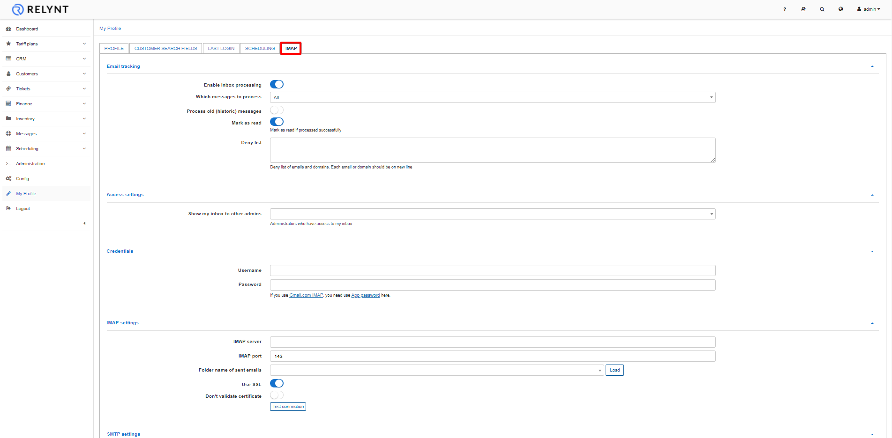

Below are the configurations available for personal mail syncing:

#### Email tracking

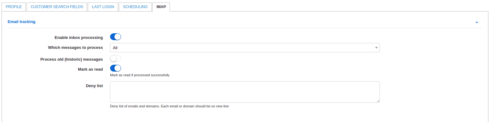

* **Enable inbox processing** - enable/disable synchronization of incoming emails between the configured email account and Relynt;

* **Which messages to process** - select which messages to process, options are _All_ or _Unread_ ;

* **Process old(historical) messages** - when enabled, this option allows you to select a date from which Relynt will try to process email messages. If disabled - Relynt will only process emails when the configuration has been executed successfully and a connection is established;

* **Mark as read** - select whether or not to mark emails as read within the email inbox, if the email has been processed successfully in Relynt;

* **Deny list** - you can list emails and domains which will be ignored (won't be synced) by Relynt. Each email/domain should be on a new line within the provided box;

#### Access settings

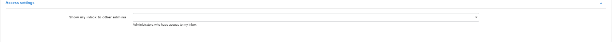

Here is where the administrator syncing their email can specify which other administrators on the system will be able to see emails being synced from the email address. Make sure you only specify the administrators you wish you give this privilege to, to ensure your privacy.

#### Credentials

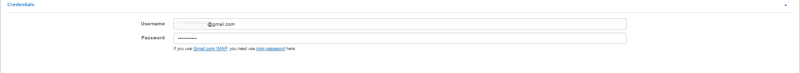

This is where you need to configure the username and password of your email account that you will be syncing emails from. In this case we will use a Gmail account login/password. (When using gmail, an App password is required)

#### IMAP settings

These parameters will be specific to your email domain's incoming details, in our example we are using Gmail, therefore, the details are relevant to a Gmail account.

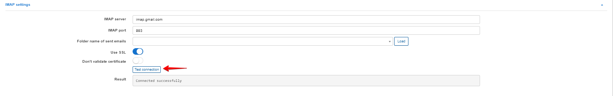

* **IMAP server** - the address of your IMAP server;

* **IMAP port** - specify the IMAP port(usually 143 or 993);

* **Folder name of sent emails** - this is where you specify which folder within the email account will be synced for sent emails. We have to click on the "Load" button first and after this a folder should be selected automatically. It should be the folder of sent emails and not any other folder.

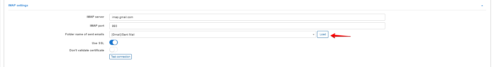

* **Use SSL** - enable/disable using of SSL when connecting to IMAP server;

* **Don't validate certificate** - enable/disable validation of certificate.

When all these settings are configured, click on "Test connection" to ensure that connection between Relynt and the mail server is active, if the connection is unsuccessful - double-check your settings.

#### SMTP settings

These parameters will be specific to your email domain's outgoing details, in our example we are using Gmail, therefore, the details are relevant to a Gmail account.

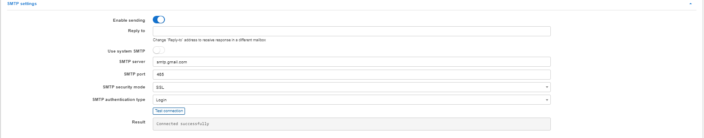

* **Enable sending** - enable/disable sending of emails from the admin's account;

* **Reply to** - specify an email address to reply to (if different);

* **Use system SMTP** - send messages to a customer using system email configuration under _Config/Main/Email_. If enabled, the parameters for _SMTP server_, _SMTP port_, _SMTP security mode_ and _SMTP authentication type_ will be copied from the system settings;

* **SMTP server** - specify the email server address;

* **SMTP port** - specify the email server port(usually 25, 465 or 587);

* **SMTP security mode** - mail server security type(none, TLS or SSL);

* **SMTP authentication type** - type of authentication on mail server.

Don't forget to test connection and send a test email to ensure the functionality.

### How it works. Example.

Once we have configured IMAP and SMTP under _My profile_ we can test with a customer account.

We'll test one instance by sending a message directly to the configured email account in the IMAP settings from an unregistered email in Relynt:

The message will appear in Relynt under _Messages / Inbox_

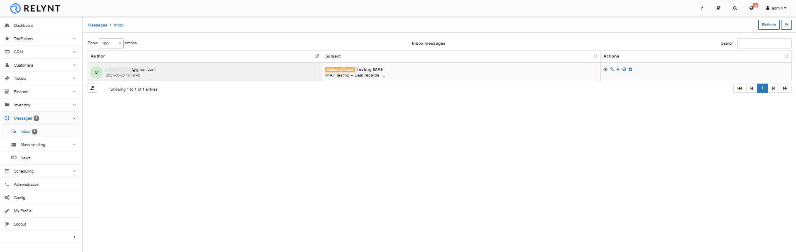

The same message can be seen on the Gmail account:

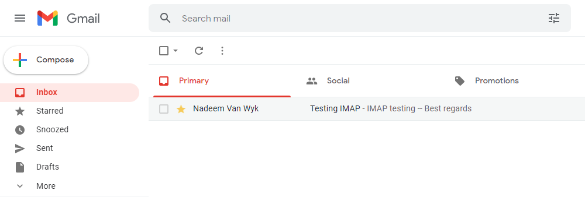

As you can see under _Messages / Inbox_ we received a message with the mark "Author not found"/"U" with options to interact with in the "Actions", these options are:
1. View message;
2. Pair to a customer;
3. Add a customer with this email address;
4. Block email;
5. Delete message.

Now let's test with a registered customer.

To create a personal message to a customer navigate to the "Communication" tab of the customer and click on "Send email":

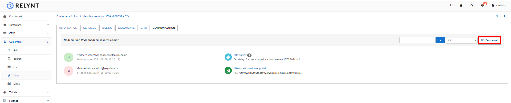

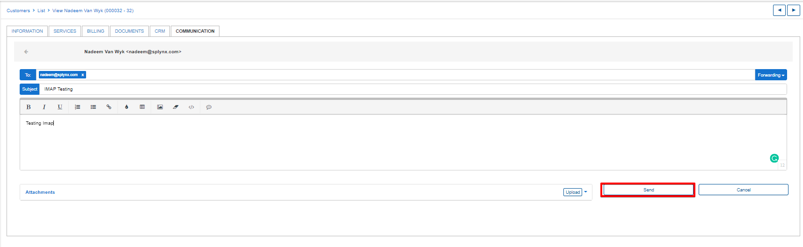

The customer receives the message and responds to it:

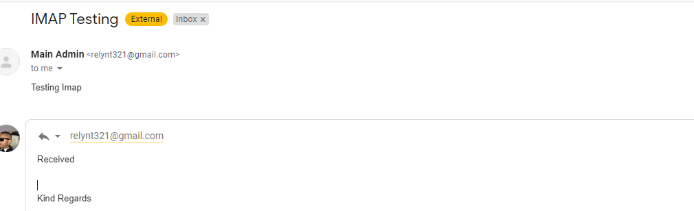

Once the customer replied - the admin will see this message under Communication tab:

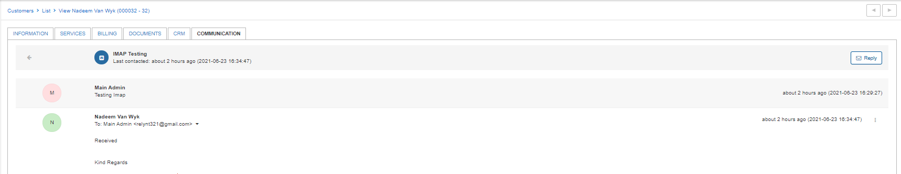
