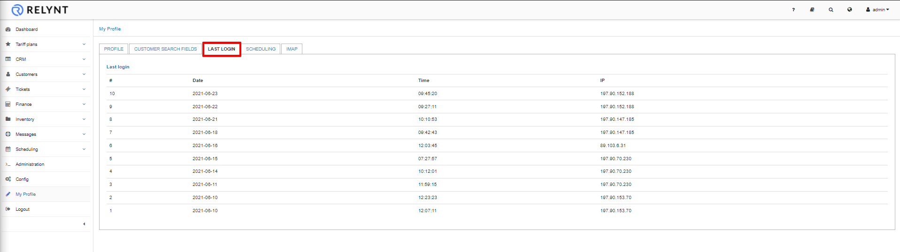

Administrators can keep track of the times they've logged in and the number of times they logged in with the dates for each session as well as the IP address(s) they used to log in from.

This section provides a record of all the login sessions of the administrator.

The list displays the number of the sessions (relevant to the amount of times the admin logged in), the date & time, as well as the IP address that accessed the system.

