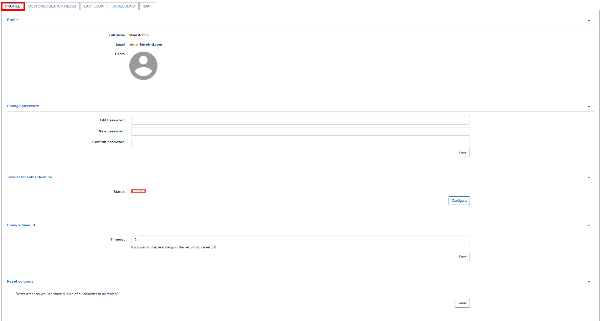
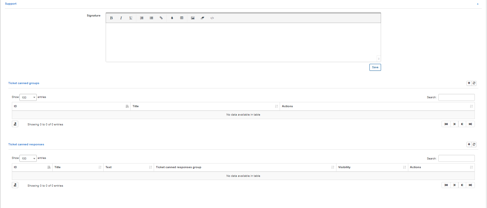
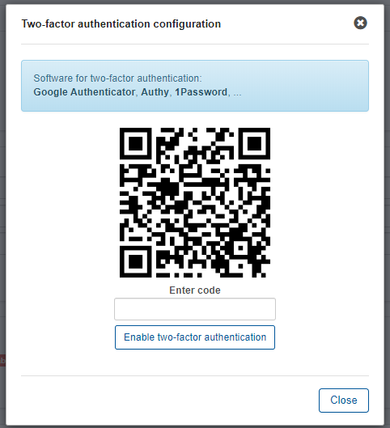
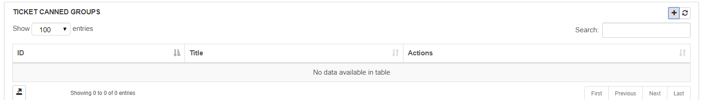
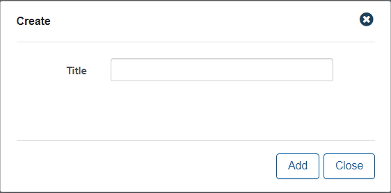
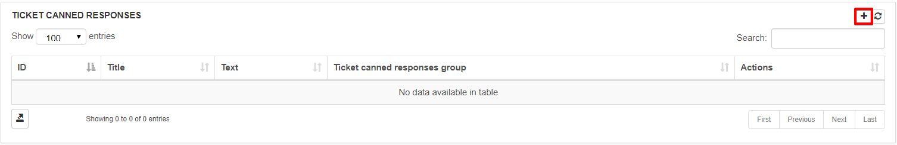
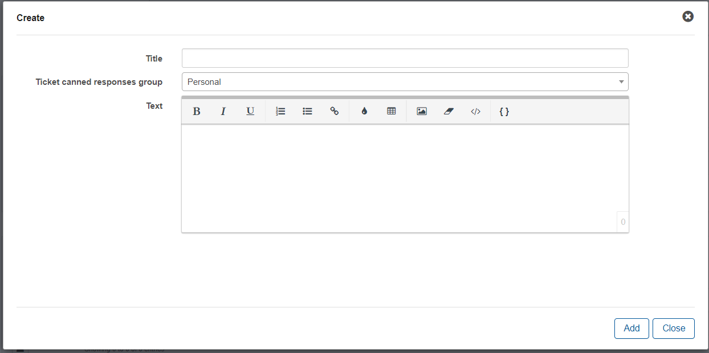

Profile
=============

In this section administrators can customize their profile details like login passwords and signatures can be personalized, saved column preferences can be reset, tickets canned responses and groups can be configured here for the admin as well.

**Profile** - Displays the full name and email of the administrator and a photo can be added by clocking on the photo icon.

**Change Password** - the current password of the administrator can be changed here, the old password will have to be entered first and then a new password can be set and confirmed with the fields provided.

**Two-Factor-Authentication** - For enhanced security, administrators can choose to enable and configure two-factor-authentication to log into their profile. All platforms are supported.

**Change Timeout** - You can choose to enable auto-logging out of the system by setting a desired timeout period or simply leave the value on 0 to disable this function.

**Reset Columns** - All columns that were added to the default view of any table by the current administrator, within Relynt, can be reset to the default view with this function.

**Support** - The email signature used  when the administrator responds in tickets can be configured here.

**Ticket canned groups** - Groups for canned responses can be created here to organize and group canned responses. Simply click on the + add button to create a new group.

**Ticket canned responses** - pre-configured responses for tickets can be created and saved here to optimize response time and improve efficiency. Simply click on the + add button to add a new response.

