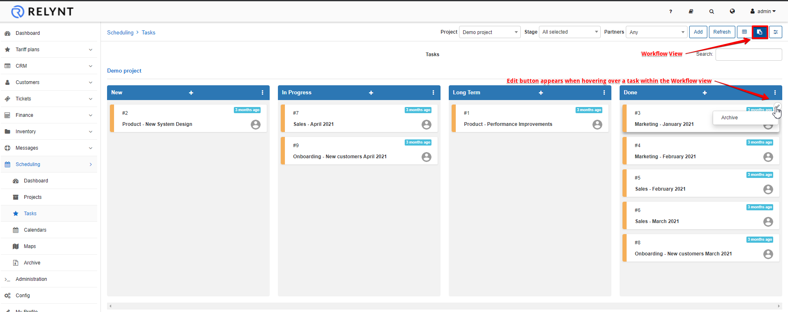
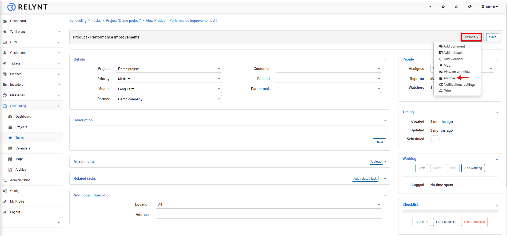
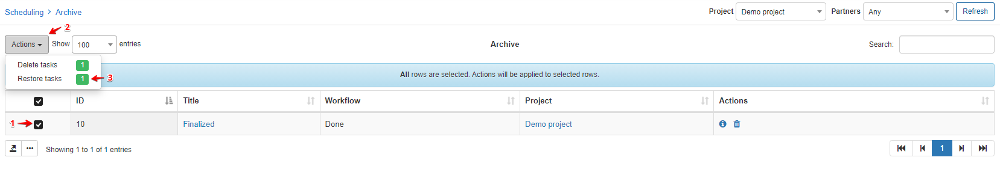
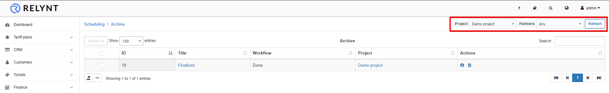

Archive
======

All completed tasks of projects can be moved to the Archive section of scheduling from the Workflow view or by using the **Actions** button within the task window. It is a convenient method of keeping a record of tasks completed as well as a storage facility to restore any archived tasks if and when necessary.

Archive from Workflow view:

Archive within Task view:

You can always restore tasks from the archive in case of a necessity. Simply select the task, click on the **Actions** button and click on **Restore**.

The same steps can be follow to **delete** tasks from the Archive if desired, simply click on **Delete** in the Action selection.

The list of archived tasks displayed can be filtered by partner or project.

