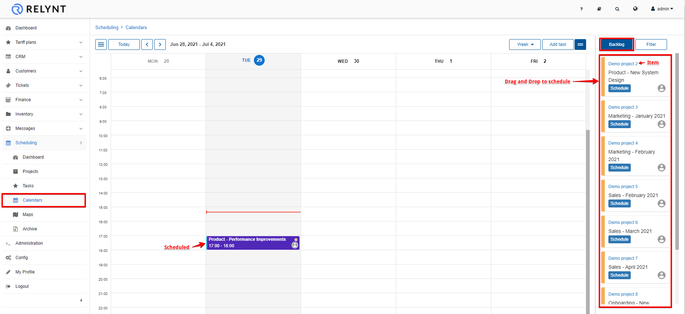
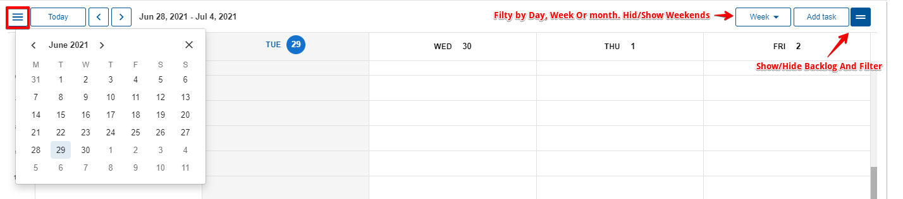
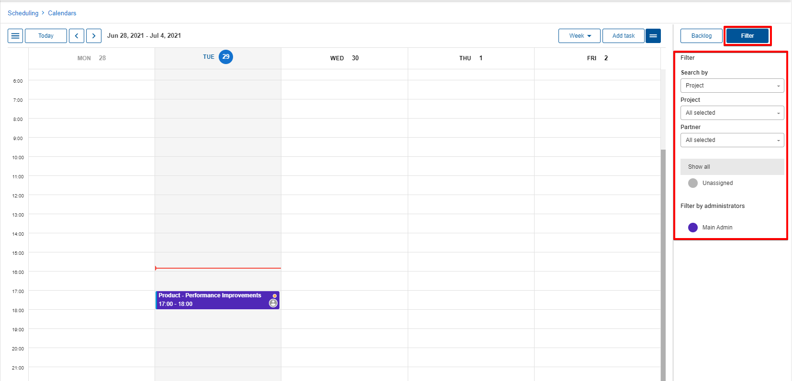
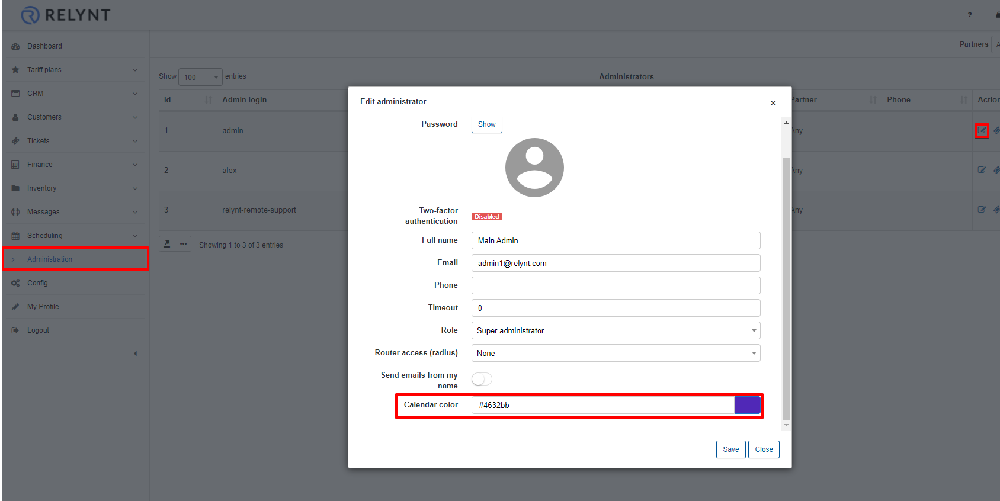
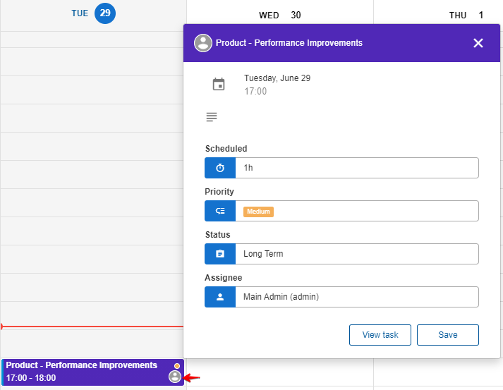

Calendars
=====

The calendar in Scheduling displays all the project tasks on a the date and time it was scheduled for, if it was scheduled. Unscheduled Tasks will be listed in the backlog section with the ability to drag and drop the task on the relevant date and time you wish to schedule it for, tasks in the backlog can be accessed by simply clicking on the item title of the task.

The calendar view can be set to display the whole month, week or day. With the ability to scroll through the month, days or weeks, and to add tasks directly.

The filter on the left allows you to display tasks of specific projects, team projects, Tasks of specific partners, and which administrator the task is assigned to will be represented by the color.

Colors for administrators can be selected in _Administration / Administrators / Edit profile_.

It is possible to edit tasks, change it's priority and status directly from the calendar. Simply click on the profile icon and choose the option needed in the pop-up window.

