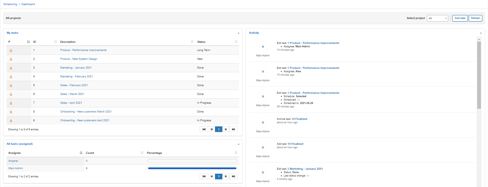
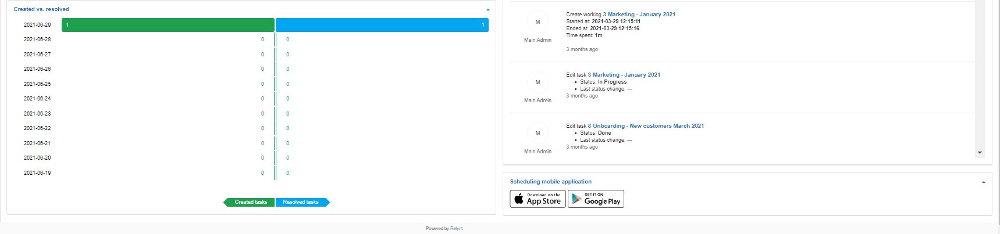
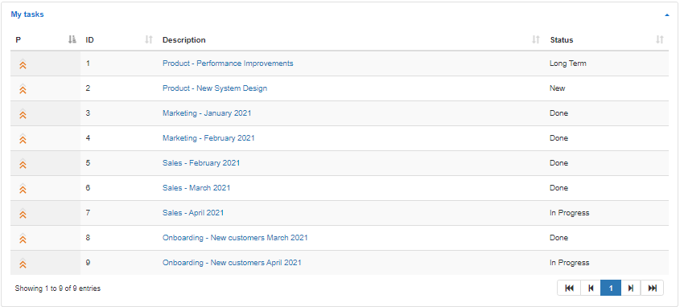
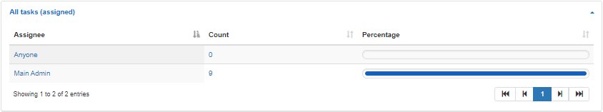
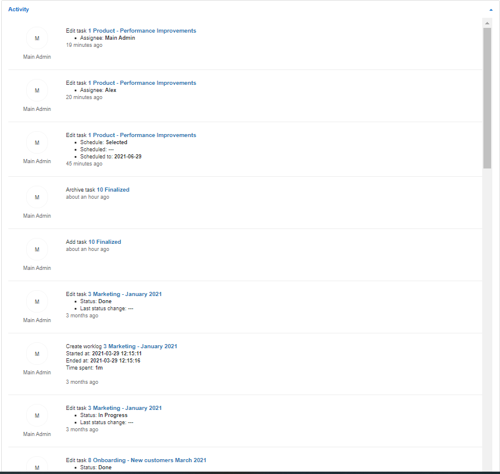
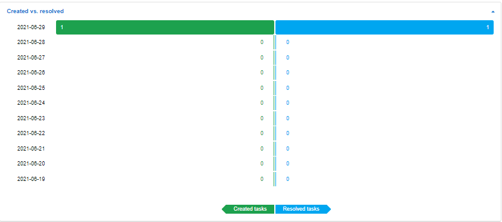
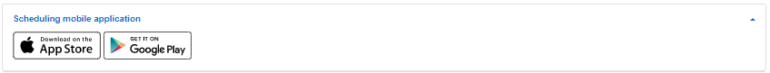

Scheduling Dashboard
=========
Our scheduling dashboard provides a convenient overview of all scheduling related data.

It is our centralized monitoring page to manage your scheduling module and quickly access your different sub-modules.

Here we can see our Tasks assigned to the current administrator, all tasks, activities within the scheduling module and some statistic of tasks created VS resolved tasks.

My tasks
========
This table displays the tasks assigned to the administrator currently logged into the system. Displaying the priority in terms of an icon, an ID of the task itself, a description of the tasks as well as the status of the task.

All Tasks (Assigned)
========
This is a table displaying tasks assigned to each specific administrator or team as well as unassigned tasks, conveniently displaying how many tasks are assigned to each administrator or team as well as the percentage of all tasks assigned to the respective admin/team.

Activities
========

This is a real time list of activities of all admins related to all tasks in the system. Displaying current and historical actions taken by all admins for all tasks.

Created vs Resolved
=====

This is a table representing statistical data of all tasks created against all tasks resolved. Providing a convenient way to track progress of all tasks.

The Dashboard also provides quick access links to the scheduling application on Google Play store and Apple App store.

